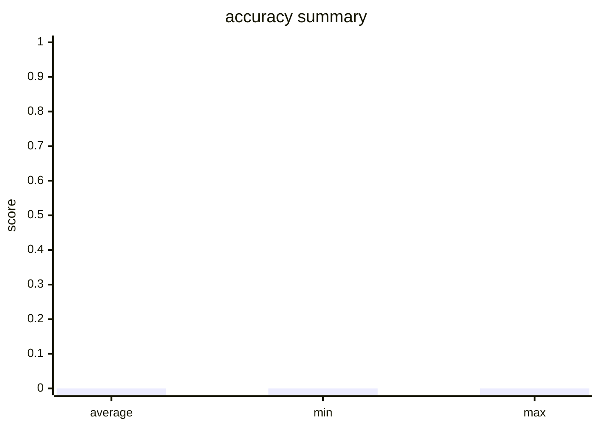

# Evaluation Report

- Total Evaluators: 1
- Total Samples: 1

## Evaluator: accuracy

- Metric: accuracy
- Total Samples: 1
- Average Score: 0.0000
- Min Score: 0.0000
- Max Score: 0.0000

### Summary

- hit_count: 0
- hit_rate: 0.0

### Score Distribution

### Details

**Sample 1** (Score: 0.0)
- **Question**: Question:  A 28-year-old male presents to trauma surgery clinic after undergoing an exploratory laparotomy, femoral intramedullary nail, and femoral artery vascular repair 3 months ago. He suffered multiple gunshot wounds as a victim of a drive-by shooting. He is progressing well with well-healed surgical incisions on examination. He states during his clinic visit that he has been experiencing 6 weeks of nightmares where he "relives the day he was shot." The patient also endorses 6 weeks of flashbacks to "the shooter pointing the gun at him" during the daytime as well. He states that he has had difficulty sleeping and cannot concentrate when performing tasks. Which of the following is the most likely diagnosis? A. Acute stress disorder B. Normal reaction to trauma C. Post-traumatic stress disorder (PTSD) D. Schizophrenia E. Schizophreniform disorder 
- **LLM Prediction**: {'success': False, 'answer': ''}
- **Ground Truth**: {'answer': 'C'}
