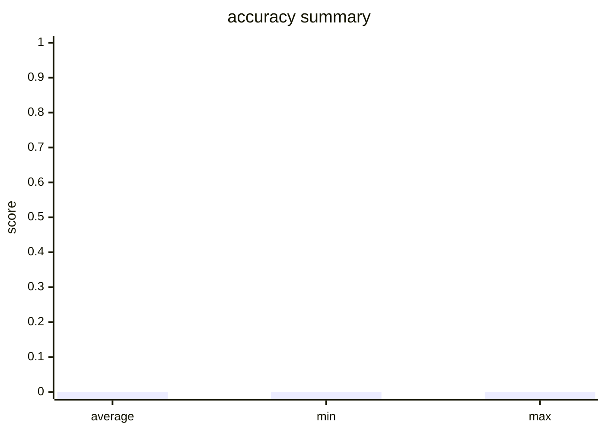

# Evaluation Report

- Total Evaluators: 1
- Total Samples: 2

## Evaluator: accuracy

- Metric: accuracy
- Total Samples: 2
- Average Score: 0.0000
- Min Score: 0.0000
- Max Score: 0.0000

### Summary

- hit_count: 0
- hit_rate: 0.0

### Score Distribution

### Details

**Sample 1** (Score: 0.0)
- **Question**: Question:  A 30-year-old woman, gravida 1, para 0, at 30 weeks' gestation is brought to the emergency department because of progressive upper abdominal pain for the past hour. The patient vomited once on her way to the hospital. She said she initially had dull, generalized stomach pain about 6 hours prior, but now the pain is located in the upper abdomen and is more severe. There is no personal or family history of any serious illnesses. She is sexually active with her husband. She does not smoke or drink alcohol. Medications include folic acid and a multivitamin. Her temperature is 38.5°C (101.3°F), pulse is 100/min, and blood pressure is 130/80 mm Hg. Physical examination shows right upper quadrant tenderness. The remainder of the examination shows no abnormalities. Laboratory studies show a leukocyte count of 12,000/mm3. Urinalysis shows mild pyuria. Which of the following is the most appropriate definitive treatment in the management of this patient? A. Appendectomy B. Cefoxitin and azithromycin C. Biliary drainage D. Intramuscular ceftriaxone followed by cephalexin E. Laparoscopic removal of ovarian cysts 
- **LLM Prediction**: {'answer': 'C', 'success': True}
- **Ground Truth**: {'answer': 'A'}

**Sample 2** (Score: 0.0)
- **Question**: Question:  A 34-year-old man comes to the physician for a follow-up examination. He has a 3-month history of a nonproductive cough. He has been treated with diphenhydramine since his last visit 2 weeks ago, but his symptoms have persisted. He does not smoke. He drinks 3 beers on the weekends. He is 177 cm (5 ft 10 in) tall and weighs 100 kg (220.46 lbs); BMI is 35.1 kg/m2. His temperature is 37.1°C (98.8°F), pulse is 78/min, respirations are 14/min, and blood pressure is 130/80 mm Hg. Pulse oximetry on room air shows an oxygen saturation of 97%. Physical examination and an x-ray of the chest show no abnormalities. Which of the following is the most appropriate next step in management? A. Azithromycin therapy B. Pulmonary function testing C. Omeprazole therapy D. Oral corticosteroid therapy E. CT scan of the chest 
- **LLM Prediction**: {'answer': 'C', 'success': True}
- **Ground Truth**: {'answer': 'B'}
