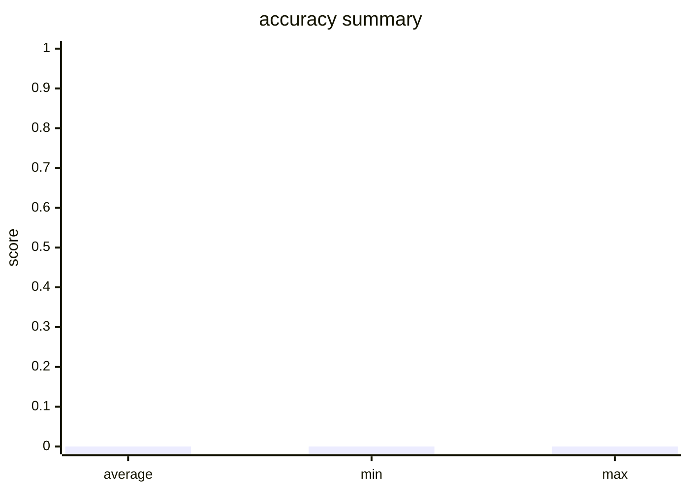

# Evaluation Report

- Total Evaluators: 1
- Total Samples: 1

## Evaluator: accuracy

- Metric: accuracy
- Total Samples: 1
- Average Score: 0.0000
- Min Score: 0.0000
- Max Score: 0.0000

### Summary

- hit_count: 0
- hit_rate: 0.0

### Score Distribution

