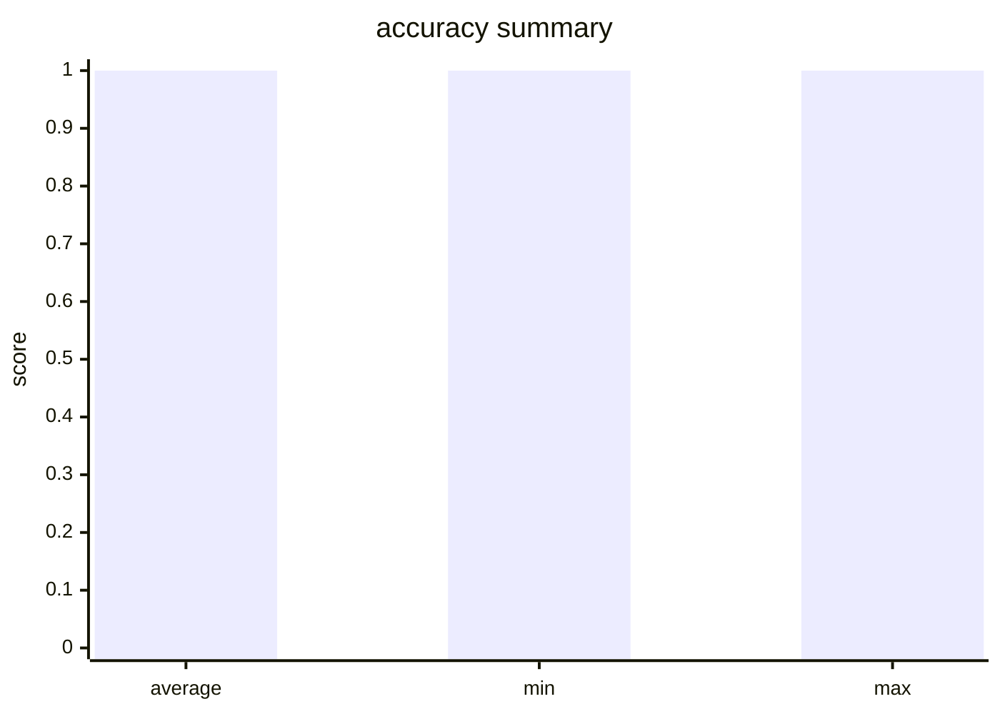

# Evaluation Report

- Total Evaluators: 1
- Total Samples: 4

## Evaluator: accuracy

- Metric: accuracy
- Total Samples: 4
- Average Score: 1.0000
- Min Score: 1.0000
- Max Score: 1.0000

### Summary

- hit_count: 4
- hit_rate: 1.0

### Score Distribution

### Details

**Sample 1** (Score: 1.0)
- **Question**: Question:  A 49-year-old man presents to his primary care physician for leg pain. He states that when he goes for walks with his dog, he starts feeling calf pain. He either has to stop or sit down before the pain resolves. He used to be able to walk at least a mile, and now he starts feeling the pain after 8 blocks. His medical history includes hyperlipidemia and hypertension. He takes lisinopril, amlodipine, and atorvastatin, but he admits that he takes them inconsistently. His blood pressure is 161/82 mmHg, pulse is 87/min, and respirations are 16/min. On physical exam, his skin is cool to touch and distal pulses are faint. His bilateral calves are smooth and hairless. There are no open wounds or ulcers. Dorsi- and plantarflexion of bilateral ankles are 5/5 in strength. Ankle-brachial indices are obtained, which are 0.8 on the left and 0.6 on the right. In addition to lifestyle modifications, which of the following is the next best step in management? A. Angioplasty B. Arteriography C. Bed rest D. Clopidogrel E. Electromyography 
- **LLM Prediction**: {'answer': 'D', 'success': True}
- **Ground Truth**: {'answer': 'D'}

**Sample 2** (Score: 1.0)
- **Question**: Question:  A 12-year-old boy is brought in by his mother for a routine checkup. The patient’s mother says he is frequently fatigued and looks pale. She also claims that he has recently become “much quieter” than normal and is no longer interested in playing baseball with his friends. The patient’s mother believes it may just be “growing pains.” The patient has no significant medical history. He is the 90th percentile for height and weight and has been meeting all developmental milestones. The patient is afebrile, and his vital signs are within normal limits. Physical examination reveals several small bruises on the patient’s right arm and on both thighs. Laboratory findings are significant for the following: Sodium 140 mEq/L Potassium 4.2 mEq/L Chloride 101 mEq/L Bicarbonate 27 mEq/L BUN 16 mg/dL Creatinine 1.2 mg/dL Glucose (fasting) 111 mg/dL   WBC 3,400/mm3 RBC 4.20 x 106/mm3 Hematocrit 22% Hemoglobin 7.1 g/dL Platelet count 109,000/mm3 A peripheral blood smear reveals myeloblasts. Which of the following is the next best step in the management of this patient? A. Referral to social services B. Administration of oral ferrous sulfate C. Packed red blood cell transfusion D. Bone marrow biopsy E. Chest radiograph 
- **LLM Prediction**: {'answer': 'D', 'success': True}
- **Ground Truth**: {'answer': 'D'}

**Sample 3** (Score: 1.0)
- **Question**: Question:  A 43-year-old Caucasian woman is admitted to the hospital with acute onset right upper quadrant (RUQ) pain. The pain started 6 hours ago after the patient had a large meal at a birthday party and has progressively worsened. She recalls having similar pain before but not so intense. No significant past medical history. Current medications are only oral contraceptive. Vitals are blood pressure 140/80 mm Hg, heart rate 79/min, respiratory rate 14/min, and temperature 37.6℃ (99.7℉). The patient’s BMI is 36.3 kg/m2. On exam, the patient appears slightly jaundiced. Her cardiac and respiratory examinations are within normal limits. Abdominal palpation reveals tenderness to palpation in the RUQ with no rebound or guarding, and there is an inspiratory arrest on deep palpation in this region. The remainder of the examination is within normal limits. Laboratory tests are significant for the following: RBC count 4.1 million/mm3 Hb 13.4 mg/dL Leukocyte count 11,200/mm3 ESR 22 mm/hr Platelet count 230,000/mm3 Total bilirubin 2 mg/dL Direct bilirubin 1.1 mg/dL ALT 20 IU/L AST 18 IU/L Amylase 33 IU/L Ultrasound of the abdomen shows the following result (see image): The common bile duct (CBD) (not shown in the image) is not dilated. Which of the following procedures is most appropriate for the treatment of this patient? A. Open cholecystectomy B. Endoscopic retrograde cholangiopancreatography C. Laparoscopic cholecystectomy D. Percutaneous cholecystostomy E. Shock wave lithotripsy 
- **LLM Prediction**: {'answer': 'C', 'success': True}
- **Ground Truth**: {'answer': 'C'}

**Sample 4** (Score: 1.0)
- **Question**: Question:  A 72-year-old man with chronic lymphocytic leukemia (CLL) comes to the physician with a 2-day history of severe fatigue and dyspnea. He regularly visits his primary care physician and has not required any treatment for his underlying disease. His temperature is 36.7°C (98.1°F), pulse is 105/min, respiratory rate is 22/min, and blood pressure is 125/70 mm Hg. The conjunctivae are pale. Examination of the heart and lungs shows no abnormalities. The spleen is palpable 3 cm below the costal margin. No lymphadenopathy is palpated. Laboratory studies show: Hemoglobin 7 g/dL Mean corpuscular volume 105 μm3 Leukocyte count 80,000/mm3 Platelet count 350,000/mm3 Serum   Bilirubin Total // Direct 6 mg/dL / 0.8 mg/dL Lactate dehydrogenase 650 U/L (Normal: 45–90 U/L) Based on these findings, this patient’s recent condition is most likely attributable to which of the following? A. Autoimmune hemolytic anemia B. Bone marrow involvement C. Diffuse large B cell lymphoma D. Evan’s syndrome E. Splenomegaly 
- **LLM Prediction**: {'answer': 'A', 'success': True}
- **Ground Truth**: {'answer': 'A'}
