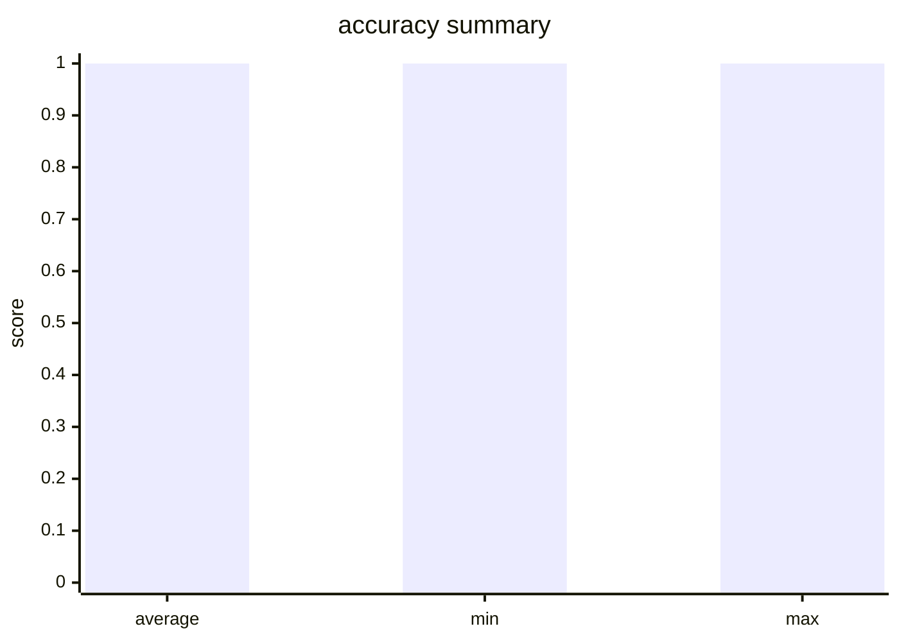

Running workflow...

Initializing dataset inlet...

Executing workflows for each question...

Initialized PoeClient with API key from env var 'POE_KEY'

Calling Poe API...

Calling Poe API...

Calling Poe API...

Calling Poe API...

Calling Poe API...

Calling Poe API...

Calling Poe API...

Calling Poe API...

Calling Poe API...

Calling Poe API...

Calling Poe API...

Calling Poe API...

Calling Poe API...

Calling Poe API...

Calling Poe API...

Calling Poe API...

All workflows executed. Starting evaluation...

=== Evaluation Results ===


=============== 📊 Evaluator: accuracy ===============

Average Score: 1.0000

Summary:

  - hit_count: 4

  - hit_rate: 1.0

==========================================


Evaluation Report Generated:
# Evaluation Report

- Total Evaluators: 1
- Total Samples: 4

## Evaluator: accuracy

- Metric: accuracy
- Total Samples: 4
- Average Score: 1.0000
- Min Score: 1.0000
- Max Score: 1.0000

### Summary

- hit_count: 4
- hit_rate: 1.0

### Score Distribution



### Details

**Sample 1** (Score: 1.0)
- **Question**: Question:  A 49-year-old man presents to his primary care physician for leg pain. He states that when he goes for walks with his dog, he starts feeling calf pain. He either has to stop or sit down before the pain resolves. He used to be able to walk at least a mile, and now he starts feeling the pain after 8 blocks. His medical history includes hyperlipidemia and hypertension. He takes lisinopril, amlodipine, and atorvastatin, but he admits that he takes them inconsistently. His blood pressure is 161/82 mmHg, pulse is 87/min, and respirations are 16/min. On physical exam, his skin is cool to touch and distal pulses are faint. His bilateral calves are smooth and hairless. There are no open wounds or ulcers. Dorsi- and plantarflexion of bilateral ankles are 5/5 in strength. Ankle-brachial indices are obtained, which are 0.8 on the left and 0.6 on the right. In addition to lifestyle modifications, which of the following is the next best step in management? A. Angioplasty B. Arteriography C. Bed rest D. Clopidogrel E. Electromyography 
- **LLM Prediction**: {'answer': 'D', 'success': True}
- **Ground Truth**: {'answer': 'D'}

**Sample 2** (Score: 1.0)
- **Question**: Question:  A 12-year-old boy is brought in by his mother for a routine checkup. The patient’s mother says he is frequently fatigued and looks pale. She also claims that he has recently become “much quieter” than normal and is no longer interested in playing baseball with his friends. The patient’s mother believes it may just be “growing pains.” The patient has no significant medical history. He is the 90th percentile for height and weight and has been meeting all developmental milestones. The patient is afebrile, and his vital signs are within normal limits. Physical examination reveals several small bruises on the patient’s right arm and on both thighs. Laboratory findings are significant for the following: Sodium 140 mEq/L Potassium 4.2 mEq/L Chloride 101 mEq/L Bicarbonate 27 mEq/L BUN 16 mg/dL Creatinine 1.2 mg/dL Glucose (fasting) 111 mg/dL   WBC 3,400/mm3 RBC 4.20 x 106/mm3 Hematocrit 22% Hemoglobin 7.1 g/dL Platelet count 109,000/mm3 A peripheral blood smear reveals myeloblasts. Which of the following is the next best step in the management of this patient? A. Referral to social services B. Administration of oral ferrous sulfate C. Packed red blood cell transfusion D. Bone marrow biopsy E. Chest radiograph 
- **LLM Prediction**: {'answer': 'D', 'success': True}
- **Ground Truth**: {'answer': 'D'}

**Sample 3** (Score: 1.0)
- **Question**: Question:  A 43-year-old Caucasian woman is admitted to the hospital with acute onset right upper quadrant (RUQ) pain. The pain started 6 hours ago after the patient had a large meal at a birthday party and has progressively worsened. She recalls having similar pain before but not so intense. No significant past medical history. Current medications are only oral contraceptive. Vitals are blood pressure 140/80 mm Hg, heart rate 79/min, respiratory rate 14/min, and temperature 37.6℃ (99.7℉). The patient’s BMI is 36.3 kg/m2. On exam, the patient appears slightly jaundiced. Her cardiac and respiratory examinations are within normal limits. Abdominal palpation reveals tenderness to palpation in the RUQ with no rebound or guarding, and there is an inspiratory arrest on deep palpation in this region. The remainder of the examination is within normal limits. Laboratory tests are significant for the following: RBC count 4.1 million/mm3 Hb 13.4 mg/dL Leukocyte count 11,200/mm3 ESR 22 mm/hr Platelet count 230,000/mm3 Total bilirubin 2 mg/dL Direct bilirubin 1.1 mg/dL ALT 20 IU/L AST 18 IU/L Amylase 33 IU/L Ultrasound of the abdomen shows the following result (see image): The common bile duct (CBD) (not shown in the image) is not dilated. Which of the following procedures is most appropriate for the treatment of this patient? A. Open cholecystectomy B. Endoscopic retrograde cholangiopancreatography C. Laparoscopic cholecystectomy D. Percutaneous cholecystostomy E. Shock wave lithotripsy 
- **LLM Prediction**: {'answer': 'C', 'success': True}
- **Ground Truth**: {'answer': 'C'}

**Sample 4** (Score: 1.0)
- **Question**: Question:  A 72-year-old man with chronic lymphocytic leukemia (CLL) comes to the physician with a 2-day history of severe fatigue and dyspnea. He regularly visits his primary care physician and has not required any treatment for his underlying disease. His temperature is 36.7°C (98.1°F), pulse is 105/min, respiratory rate is 22/min, and blood pressure is 125/70 mm Hg. The conjunctivae are pale. Examination of the heart and lungs shows no abnormalities. The spleen is palpable 3 cm below the costal margin. No lymphadenopathy is palpated. Laboratory studies show: Hemoglobin 7 g/dL Mean corpuscular volume 105 μm3 Leukocyte count 80,000/mm3 Platelet count 350,000/mm3 Serum   Bilirubin Total // Direct 6 mg/dL / 0.8 mg/dL Lactate dehydrogenase 650 U/L (Normal: 45–90 U/L) Based on these findings, this patient’s recent condition is most likely attributable to which of the following? A. Autoimmune hemolytic anemia B. Bone marrow involvement C. Diffuse large B cell lymphoma D. Evan’s syndrome E. Splenomegaly 
- **LLM Prediction**: {'answer': 'A', 'success': True}
- **Ground Truth**: {'answer': 'A'}


Final evaluation report generated: evaluation_report.md


🌟🌟🌟🌟🌟🌟🌟🌟🌟🌟🌟🌟🌟🌟🌟🌟🌟🌟🌟🌟🌟🌟🌟🌟🌟🌟🌟🌟🌟🌟 WORKFLOW EXECUTION RECORDS 🌟🌟🌟🌟🌟🌟🌟🌟🌟🌟🌟🌟🌟🌟🌟🌟🌟🌟🌟🌟🌟🌟🌟🌟🌟🌟🌟🌟🌟🌟


🌀🌀🌀🌀🌀🌀🌀🌀🌀🌀🌀🌀🌀🌀🌀🌀🌀🌀🌀🌀 WORKFLOW '460d194a-88fd-4e37-beb2-afe9395dab3a' BEGIN 🌀🌀🌀🌀🌀🌀🌀🌀🌀🌀🌀🌀🌀🌀🌀🌀🌀🌀🌀🌀


🔽🔽🔽🔽🔽🔽🔽🔽🔽🔽🔽🔽🔽🔽🔽🔽🔽🔽🔽🔽🔽🔽🔽🔽🔽🔽🔽🔽🔽🔽 NEW TASK 🔽🔽🔽🔽🔽🔽🔽🔽🔽🔽🔽🔽🔽🔽🔽🔽🔽🔽🔽🔽🔽🔽🔽🔽🔽🔽🔽🔽🔽🔽

🚀 Task ID: 1c6aa9ac-f961-434e-8d20-824a2e670af8  |  Type: [plain_text]

========================================================================


🟢🟢🟢🟢🟢🟢🟢🟢🟢🟢🟢🟢🟢🟢🟢🟢🟢🟢🟢🟢 TASK INPUT MESSAGES 🟢🟢🟢🟢🟢🟢🟢🟢🟢🟢🟢🟢🟢🟢🟢🟢🟢🟢🟢🟢


🔵🔵🔵🔵🔵🔵🔵🔵🔵🔵🔵🔵🔵🔵🔵🔵🔵🔵🔵🔵 TASK OUTPUT MESSAGES 🔵🔵🔵🔵🔵🔵🔵🔵🔵🔵🔵🔵🔵🔵🔵🔵🔵🔵🔵🔵

━━━━━━━━━━━━━━━━━━━━ [Output Message 1: USER] ━━━━━━━━━━━━━━━━━━━━
Question: 
A 49-year-old man presents to his primary care physician for leg pain. He states that when he goes for walks with his dog, he starts feeling calf pain. He either has to stop or sit down before the pain resolves. He used to be able to walk at least a mile, and now he starts feeling the pain after 8 blocks. His medical history includes hyperlipidemia and hypertension. He takes lisinopril, amlodipine, and atorvastatin, but he admits that he takes them inconsistently. His blood pressure is 161/82 mmHg, pulse is 87/min, and respirations are 16/min. On physical exam, his skin is cool to touch and distal pulses are faint. His bilateral calves are smooth and hairless. There are no open wounds or ulcers. Dorsi- and plantarflexion of bilateral ankles are 5/5 in strength. Ankle-brachial indices are obtained, which are 0.8 on the left and 0.6 on the right. In addition to lifestyle modifications, which of the following is the next best step in management?
A. Angioplasty
B. Arteriography
C. Bed rest
D. Clopidogrel
E. Electromyography


🔼🔼🔼🔼🔼🔼🔼🔼🔼🔼🔼🔼🔼🔼🔼🔼🔼🔼🔼🔼🔼🔼🔼🔼🔼🔼🔼🔼🔼🔼 TASK END 🔼🔼🔼🔼🔼🔼🔼🔼🔼🔼🔼🔼🔼🔼🔼🔼🔼🔼🔼🔼🔼🔼🔼🔼🔼🔼🔼🔼🔼🔼


🔽🔽🔽🔽🔽🔽🔽🔽🔽🔽🔽🔽🔽🔽🔽🔽🔽🔽🔽🔽🔽🔽🔽🔽🔽🔽🔽🔽🔽🔽 NEW TASK 🔽🔽🔽🔽🔽🔽🔽🔽🔽🔽🔽🔽🔽🔽🔽🔽🔽🔽🔽🔽🔽🔽🔽🔽🔽🔽🔽🔽🔽🔽

🚀 Task ID: 903d8090-56ff-44ed-a567-c8ed140a9045  |  Type: [single_agent]

========================================================================


🟢🟢🟢🟢🟢🟢🟢🟢🟢🟢🟢🟢🟢🟢🟢🟢🟢🟢🟢🟢 TASK INPUT MESSAGES 🟢🟢🟢🟢🟢🟢🟢🟢🟢🟢🟢🟢🟢🟢🟢🟢🟢🟢🟢🟢

━━━━━━━━━━━━━━━━━━━━ [Input Message 1: USER] ━━━━━━━━━━━━━━━━━━━━
Question: 
A 49-year-old man presents to his primary care physician for leg pain. He states that when he goes for walks with his dog, he starts feeling calf pain. He either has to stop or sit down before the pain resolves. He used to be able to walk at least a mile, and now he starts feeling the pain after 8 blocks. His medical history includes hyperlipidemia and hypertension. He takes lisinopril, amlodipine, and atorvastatin, but he admits that he takes them inconsistently. His blood pressure is 161/82 mmHg, pulse is 87/min, and respirations are 16/min. On physical exam, his skin is cool to touch and distal pulses are faint. His bilateral calves are smooth and hairless. There are no open wounds or ulcers. Dorsi- and plantarflexion of bilateral ankles are 5/5 in strength. Ankle-brachial indices are obtained, which are 0.8 on the left and 0.6 on the right. In addition to lifestyle modifications, which of the following is the next best step in management?
A. Angioplasty
B. Arteriography
C. Bed rest
D. Clopidogrel
E. Electromyography


━━━━━━━━━━━━━━━━━━━━ [Input Message 2: USER] ━━━━━━━━━━━━━━━━━━━━
You are the “Clue Representation” agent in a clinical reasoning workflow.Your job is not to answer the question directly, but to convert the input patient case (in form of medical question) into a structured clinical clue representation for downstream agents.You can find the input patient case in previous messages.


🔵🔵🔵🔵🔵🔵🔵🔵🔵🔵🔵🔵🔵🔵🔵🔵🔵🔵🔵🔵 TASK OUTPUT MESSAGES 🔵🔵🔵🔵🔵🔵🔵🔵🔵🔵🔵🔵🔵🔵🔵🔵🔵🔵🔵🔵

━━━━━━━━━━━━━━━━━━━━ [Output Message 1: USER] ━━━━━━━━━━━━━━━━━━━━
## Clinical Clue Representation (Structured)

### Patient Profile
- **Age/Sex:** 49-year-old man  
- **Chief complaint:** Leg pain with walking (episodic)
- **PMH:** Hyperlipidemia, Hypertension
- **Meds (adherence):**  
  - Lisinopril (inconsistent)  
  - Amlodipine (inconsistent)  
  - Atorvastatin (inconsistent)

### Symptom Characteristics
- **Trigger:** Walking (calf pain begins after a certain distance)
- **Location:** **Calves (bilateral)**
- **Pattern:**  
  - Worse with exertion  
  - **Relieved by stopping/sitting**  
- **Progression:**  
  - Previously could walk **≥ 1 mile**  
  - Now limited to **~8 blocks**
- **Diagnosis direction (suggested):** Exertional, reversible calf pain → likely **claudication**

### Vitals / Perfusion Findings
- **BP:** 161/82 mmHg (hypertensive)
- **Pulse:** 87/min
- **RR:** 16/min
- **Skin:** cool to touch
- **Distal pulses:** **faint**
- **Skin trophic changes:** calves **smooth and hairless**
- **No wounds/ulcers:** absent (no open lesions)

### Focused Musculoskeletal/Neurologic Exam
- **Strength:** ankle dorsiflexion/plantarflexion **5/5 bilaterally**
- **Implication:** less supportive of neuropathy/spinal cord causes

### Vascular Studies
- **ABI (Ankle-Brachial Index):**
  - **Left: 0.8**
  - **Right: 0.6**
- **Interpretation direction:** ABI < 0.9 supports **peripheral arterial disease (PAD)**; lower on right indicates more severe disease.

### Condition to Encode (Working Diagnosis)
- **Most consistent syndrome:** **Peripheral arterial disease with intermittent claudication**
- **Laterality severity:** Right worse than left (ABI 0.6 vs 0.8)

### Management Context
- **Already included:** “In addition to lifestyle modifications…”
- **Next step options given:**
  - A. Angioplasty
  - B. Arteriography
  - C. Bed rest
  - D. Clopidogrel
  - E. Electromyography

### Key Discriminating Clues (Reasoning Signals for Downstream Agents)
1. **Exertional calf pain relieved by rest** → classic intermittent claudication.
2. **Faint distal pulses + cool skin** → decreased limb perfusion.
3. **Smooth/hairless calves** → chronic ischemia/trophic change from PAD.
4. **ABI abnormal (0.8, 0.6)** → objective PAD evidence.
5. **No ulceration and no neurologic weakness** → less consistent with critical limb ischemia needing immediate revascularization or with neurogenic claudication.
6. **Next-step question** likely tests **medical therapy vs invasive vascular studies** and/or antiplatelet choice.

### Question Type Tag
- **Topic:** PAD with intermittent claudication—next management step after lifestyle changes.
- **Decision area:** Pharmacologic therapy (antiplatelet) vs procedure/imaging vs non-indicated tests (EMG).


🔼🔼🔼🔼🔼🔼🔼🔼🔼🔼🔼🔼🔼🔼🔼🔼🔼🔼🔼🔼🔼🔼🔼🔼🔼🔼🔼🔼🔼🔼 TASK END 🔼🔼🔼🔼🔼🔼🔼🔼🔼🔼🔼🔼🔼🔼🔼🔼🔼🔼🔼🔼🔼🔼🔼🔼🔼🔼🔼🔼🔼🔼


🔽🔽🔽🔽🔽🔽🔽🔽🔽🔽🔽🔽🔽🔽🔽🔽🔽🔽🔽🔽🔽🔽🔽🔽🔽🔽🔽🔽🔽🔽 NEW TASK 🔽🔽🔽🔽🔽🔽🔽🔽🔽🔽🔽🔽🔽🔽🔽🔽🔽🔽🔽🔽🔽🔽🔽🔽🔽🔽🔽🔽🔽🔽

🚀 Task ID: 7f218c34-4de1-45f0-b836-ba20fa181410  |  Type: [single_agent]

========================================================================


🟢🟢🟢🟢🟢🟢🟢🟢🟢🟢🟢🟢🟢🟢🟢🟢🟢🟢🟢🟢 TASK INPUT MESSAGES 🟢🟢🟢🟢🟢🟢🟢🟢🟢🟢🟢🟢🟢🟢🟢🟢🟢🟢🟢🟢

━━━━━━━━━━━━━━━━━━━━ [Input Message 1: USER] ━━━━━━━━━━━━━━━━━━━━
## Clinical Clue Representation (Structured)

### Patient Profile
- **Age/Sex:** 49-year-old man  
- **Chief complaint:** Leg pain with walking (episodic)
- **PMH:** Hyperlipidemia, Hypertension
- **Meds (adherence):**  
  - Lisinopril (inconsistent)  
  - Amlodipine (inconsistent)  
  - Atorvastatin (inconsistent)

### Symptom Characteristics
- **Trigger:** Walking (calf pain begins after a certain distance)
- **Location:** **Calves (bilateral)**
- **Pattern:**  
  - Worse with exertion  
  - **Relieved by stopping/sitting**  
- **Progression:**  
  - Previously could walk **≥ 1 mile**  
  - Now limited to **~8 blocks**
- **Diagnosis direction (suggested):** Exertional, reversible calf pain → likely **claudication**

### Vitals / Perfusion Findings
- **BP:** 161/82 mmHg (hypertensive)
- **Pulse:** 87/min
- **RR:** 16/min
- **Skin:** cool to touch
- **Distal pulses:** **faint**
- **Skin trophic changes:** calves **smooth and hairless**
- **No wounds/ulcers:** absent (no open lesions)

### Focused Musculoskeletal/Neurologic Exam
- **Strength:** ankle dorsiflexion/plantarflexion **5/5 bilaterally**
- **Implication:** less supportive of neuropathy/spinal cord causes

### Vascular Studies
- **ABI (Ankle-Brachial Index):**
  - **Left: 0.8**
  - **Right: 0.6**
- **Interpretation direction:** ABI < 0.9 supports **peripheral arterial disease (PAD)**; lower on right indicates more severe disease.

### Condition to Encode (Working Diagnosis)
- **Most consistent syndrome:** **Peripheral arterial disease with intermittent claudication**
- **Laterality severity:** Right worse than left (ABI 0.6 vs 0.8)

### Management Context
- **Already included:** “In addition to lifestyle modifications…”
- **Next step options given:**
  - A. Angioplasty
  - B. Arteriography
  - C. Bed rest
  - D. Clopidogrel
  - E. Electromyography

### Key Discriminating Clues (Reasoning Signals for Downstream Agents)
1. **Exertional calf pain relieved by rest** → classic intermittent claudication.
2. **Faint distal pulses + cool skin** → decreased limb perfusion.
3. **Smooth/hairless calves** → chronic ischemia/trophic change from PAD.
4. **ABI abnormal (0.8, 0.6)** → objective PAD evidence.
5. **No ulceration and no neurologic weakness** → less consistent with critical limb ischemia needing immediate revascularization or with neurogenic claudication.
6. **Next-step question** likely tests **medical therapy vs invasive vascular studies** and/or antiplatelet choice.

### Question Type Tag
- **Topic:** PAD with intermittent claudication—next management step after lifestyle changes.
- **Decision area:** Pharmacologic therapy (antiplatelet) vs procedure/imaging vs non-indicated tests (EMG).

━━━━━━━━━━━━━━━━━━━━ [Input Message 2: USER] ━━━━━━━━━━━━━━━━━━━━
You are the “Hypothesis Generation” agent in a clinical reasoning workflow. Based on the previous Problem Representation result, you must propose 3–6 plausible diagnostic/mechanistic hypotheses and provide key supporting and contradicting evidence for each, producing a candidate list for downstream evaluation.
You can find the input patient case and Problem Representation result in previous messages


🔵🔵🔵🔵🔵🔵🔵🔵🔵🔵🔵🔵🔵🔵🔵🔵🔵🔵🔵🔵 TASK OUTPUT MESSAGES 🔵🔵🔵🔵🔵🔵🔵🔵🔵🔵🔵🔵🔵🔵🔵🔵🔵🔵🔵🔵

━━━━━━━━━━━━━━━━━━━━ [Output Message 1: USER] ━━━━━━━━━━━━━━━━━━━━
## Candidate Hypotheses (3–6)

### 1) **Peripheral arterial disease (PAD) with intermittent claudication** *(most likely overarching mechanism)*
**Supporting evidence**
- **Classic exertional pattern:** calf pain begins after a walking distance and **relieves with stopping/sitting**.
- **Perfusion signs:** **cool skin**, **faint distal pulses**.
- **Trophic changes:** **smooth/hairless calves** consistent with chronic ischemia.
- **Objective testing:** **ABI 0.8 (L)** and **0.6 (R)** → both abnormal; **right worse**, matching symptoms.
- **Neuro exam relatively preserved:** strength 5/5; less supportive of neuropathic causes.

**Contradicting / limitations**
- ABI can be less reliable in some populations with **medial arterial calcification** (more common in diabetes/CKD—case doesn’t mention these).
- Symptoms are bilateral but progression asymmetry (R worse) still fits PAD, but would be worth correlating with vascular distribution.

---

### 2) **Neurogenic claudication due to lumbar spinal stenosis** *(mechanism: compression of nerve roots causing exertional leg pain)*
**Supporting evidence**
- Exertional leg pain that limits walking could mimic claudication.
- Bilateral symptoms are possible in stenosis.

**Contradicting evidence**
- **Relief with stopping/sitting** is also present in neurogenic claudication, but the case emphasizes **cool skin, faint pulses, and trophic hairless calves**, which strongly support vascular insufficiency rather than spine-driven symptoms.
- **No neurologic weakness** (5/5 strength) and no sensory findings provided; neuropathic/stensosis presentations often include sensory symptoms and/or reflex changes (not described).
- **ABI abnormalities (0.8/0.6)** provide objective PAD evidence that neurogenic claudication alone would not explain.

---

### 3) **Chronic venous insufficiency or venous claudication** *(mechanism: impaired venous return causing exertional discomfort; classically calf pain/burning)*
**Supporting evidence**
- Calf symptoms with walking can occur in venous disorders.

**Contradicting evidence**
- Case shows **arterial hypoperfusion markers**: **faint distal pulses**, **cool skin**, abnormal **ABI**—not typical for primarily venous disease.
- **No mention of dependent edema, varicosities, hyperpigmentation, or venous ulcers**, and there are **no wounds/ulcers** (though absence of ulcers doesn’t exclude venous disease).
- Claudication relieved by rest is vascular-classic; venous pain more typically worsens with standing and improves with elevation (not specified).

---

### 4) **Critical limb ischemia or evolving PAD with threatened limb** *(mechanism: more severe arterial insufficiency, possibly resting pain/ischemic tissue changes)*
**Supporting evidence**
- ABI values are **significantly abnormal**, especially **R = 0.6**.
- **Cool skin** and faint distal pulses suggest significant ischemia.

**Contradicting evidence**
- Symptoms are described as **episodic and exertional**, **relieved by stopping/sitting** → points toward **intermittent claudication** rather than critical limb ischemia.
- **No wounds/ulcers** and no mention of **rest pain** or ischemic lesions.
- “Smooth/hairless calves” suggests chronic ischemic trophic change, but critical limb ischemia typically includes more severe manifestations (rest pain, ulceration, gangrene).

---

### 5) **Musculoskeletal etiology (e.g., exertional compartment syndrome, tendon/soft tissue pathology)** *(mechanism: exertional ischemia or mechanical pain not primarily vascular)*
**Supporting evidence**
- Exertional leg pain with walking could be musculoskeletal.

**Contradicting evidence**
- **Bilateral calf trophic changes + faint distal pulses + cool skin** are not typical for isolated compartment or musculoskeletal problems.
- **ABI abnormalities** are objective vascular evidence.
- Strength is normal (5/5), making major neurologic or motor deficit less likely, but musculoskeletal issues can still occur—however the perfusion findings weigh strongly against a purely mechanical cause.

---

## Summary Candidate List for Downstream Evaluation
1. **PAD with intermittent claudication** (ABI-correlated; right worse than left) — *top hypothesis*
2. **Lumbar spinal stenosis–related neurogenic claudication** — mimic, but contradicted by perfusion/trophic + ABI
3. **Venous claudication/venous insufficiency** — less consistent with faint pulses/cool skin/ABI
4. **Critical limb ischemia (more severe PAD)** — suggested by severity markers, but symptoms are exertional and no lesions/rest pain
5. **Musculoskeletal/mechanical or compartment syndrome** — contradicted by objective PAD findings

If you want, I can also translate these hypotheses into **what downstream tests/findings would most efficiently discriminate** them (e.g., neurologic sensory/reflex exam targets vs vascular imaging/lifestyle/antiplatelet decisions).


🔼🔼🔼🔼🔼🔼🔼🔼🔼🔼🔼🔼🔼🔼🔼🔼🔼🔼🔼🔼🔼🔼🔼🔼🔼🔼🔼🔼🔼🔼 TASK END 🔼🔼🔼🔼🔼🔼🔼🔼🔼🔼🔼🔼🔼🔼🔼🔼🔼🔼🔼🔼🔼🔼🔼🔼🔼🔼🔼🔼🔼🔼


🔽🔽🔽🔽🔽🔽🔽🔽🔽🔽🔽🔽🔽🔽🔽🔽🔽🔽🔽🔽🔽🔽🔽🔽🔽🔽🔽🔽🔽🔽 NEW TASK 🔽🔽🔽🔽🔽🔽🔽🔽🔽🔽🔽🔽🔽🔽🔽🔽🔽🔽🔽🔽🔽🔽🔽🔽🔽🔽🔽🔽🔽🔽

🚀 Task ID: 7abcab13-16b1-4c44-a256-cb02c08944e3  |  Type: [single_agent]

========================================================================


🟢🟢🟢🟢🟢🟢🟢🟢🟢🟢🟢🟢🟢🟢🟢🟢🟢🟢🟢🟢 TASK INPUT MESSAGES 🟢🟢🟢🟢🟢🟢🟢🟢🟢🟢🟢🟢🟢🟢🟢🟢🟢🟢🟢🟢

━━━━━━━━━━━━━━━━━━━━ [Input Message 1: USER] ━━━━━━━━━━━━━━━━━━━━
## Clinical Clue Representation (Structured)

### Patient Profile
- **Age/Sex:** 49-year-old man  
- **Chief complaint:** Leg pain with walking (episodic)
- **PMH:** Hyperlipidemia, Hypertension
- **Meds (adherence):**  
  - Lisinopril (inconsistent)  
  - Amlodipine (inconsistent)  
  - Atorvastatin (inconsistent)

### Symptom Characteristics
- **Trigger:** Walking (calf pain begins after a certain distance)
- **Location:** **Calves (bilateral)**
- **Pattern:**  
  - Worse with exertion  
  - **Relieved by stopping/sitting**  
- **Progression:**  
  - Previously could walk **≥ 1 mile**  
  - Now limited to **~8 blocks**
- **Diagnosis direction (suggested):** Exertional, reversible calf pain → likely **claudication**

### Vitals / Perfusion Findings
- **BP:** 161/82 mmHg (hypertensive)
- **Pulse:** 87/min
- **RR:** 16/min
- **Skin:** cool to touch
- **Distal pulses:** **faint**
- **Skin trophic changes:** calves **smooth and hairless**
- **No wounds/ulcers:** absent (no open lesions)

### Focused Musculoskeletal/Neurologic Exam
- **Strength:** ankle dorsiflexion/plantarflexion **5/5 bilaterally**
- **Implication:** less supportive of neuropathy/spinal cord causes

### Vascular Studies
- **ABI (Ankle-Brachial Index):**
  - **Left: 0.8**
  - **Right: 0.6**
- **Interpretation direction:** ABI < 0.9 supports **peripheral arterial disease (PAD)**; lower on right indicates more severe disease.

### Condition to Encode (Working Diagnosis)
- **Most consistent syndrome:** **Peripheral arterial disease with intermittent claudication**
- **Laterality severity:** Right worse than left (ABI 0.6 vs 0.8)

### Management Context
- **Already included:** “In addition to lifestyle modifications…”
- **Next step options given:**
  - A. Angioplasty
  - B. Arteriography
  - C. Bed rest
  - D. Clopidogrel
  - E. Electromyography

### Key Discriminating Clues (Reasoning Signals for Downstream Agents)
1. **Exertional calf pain relieved by rest** → classic intermittent claudication.
2. **Faint distal pulses + cool skin** → decreased limb perfusion.
3. **Smooth/hairless calves** → chronic ischemia/trophic change from PAD.
4. **ABI abnormal (0.8, 0.6)** → objective PAD evidence.
5. **No ulceration and no neurologic weakness** → less consistent with critical limb ischemia needing immediate revascularization or with neurogenic claudication.
6. **Next-step question** likely tests **medical therapy vs invasive vascular studies** and/or antiplatelet choice.

### Question Type Tag
- **Topic:** PAD with intermittent claudication—next management step after lifestyle changes.
- **Decision area:** Pharmacologic therapy (antiplatelet) vs procedure/imaging vs non-indicated tests (EMG).

━━━━━━━━━━━━━━━━━━━━ [Input Message 2: USER] ━━━━━━━━━━━━━━━━━━━━
## Candidate Hypotheses (3–6)

### 1) **Peripheral arterial disease (PAD) with intermittent claudication** *(most likely overarching mechanism)*
**Supporting evidence**
- **Classic exertional pattern:** calf pain begins after a walking distance and **relieves with stopping/sitting**.
- **Perfusion signs:** **cool skin**, **faint distal pulses**.
- **Trophic changes:** **smooth/hairless calves** consistent with chronic ischemia.
- **Objective testing:** **ABI 0.8 (L)** and **0.6 (R)** → both abnormal; **right worse**, matching symptoms.
- **Neuro exam relatively preserved:** strength 5/5; less supportive of neuropathic causes.

**Contradicting / limitations**
- ABI can be less reliable in some populations with **medial arterial calcification** (more common in diabetes/CKD—case doesn’t mention these).
- Symptoms are bilateral but progression asymmetry (R worse) still fits PAD, but would be worth correlating with vascular distribution.

---

### 2) **Neurogenic claudication due to lumbar spinal stenosis** *(mechanism: compression of nerve roots causing exertional leg pain)*
**Supporting evidence**
- Exertional leg pain that limits walking could mimic claudication.
- Bilateral symptoms are possible in stenosis.

**Contradicting evidence**
- **Relief with stopping/sitting** is also present in neurogenic claudication, but the case emphasizes **cool skin, faint pulses, and trophic hairless calves**, which strongly support vascular insufficiency rather than spine-driven symptoms.
- **No neurologic weakness** (5/5 strength) and no sensory findings provided; neuropathic/stensosis presentations often include sensory symptoms and/or reflex changes (not described).
- **ABI abnormalities (0.8/0.6)** provide objective PAD evidence that neurogenic claudication alone would not explain.

---

### 3) **Chronic venous insufficiency or venous claudication** *(mechanism: impaired venous return causing exertional discomfort; classically calf pain/burning)*
**Supporting evidence**
- Calf symptoms with walking can occur in venous disorders.

**Contradicting evidence**
- Case shows **arterial hypoperfusion markers**: **faint distal pulses**, **cool skin**, abnormal **ABI**—not typical for primarily venous disease.
- **No mention of dependent edema, varicosities, hyperpigmentation, or venous ulcers**, and there are **no wounds/ulcers** (though absence of ulcers doesn’t exclude venous disease).
- Claudication relieved by rest is vascular-classic; venous pain more typically worsens with standing and improves with elevation (not specified).

---

### 4) **Critical limb ischemia or evolving PAD with threatened limb** *(mechanism: more severe arterial insufficiency, possibly resting pain/ischemic tissue changes)*
**Supporting evidence**
- ABI values are **significantly abnormal**, especially **R = 0.6**.
- **Cool skin** and faint distal pulses suggest significant ischemia.

**Contradicting evidence**
- Symptoms are described as **episodic and exertional**, **relieved by stopping/sitting** → points toward **intermittent claudication** rather than critical limb ischemia.
- **No wounds/ulcers** and no mention of **rest pain** or ischemic lesions.
- “Smooth/hairless calves” suggests chronic ischemic trophic change, but critical limb ischemia typically includes more severe manifestations (rest pain, ulceration, gangrene).

---

### 5) **Musculoskeletal etiology (e.g., exertional compartment syndrome, tendon/soft tissue pathology)** *(mechanism: exertional ischemia or mechanical pain not primarily vascular)*
**Supporting evidence**
- Exertional leg pain with walking could be musculoskeletal.

**Contradicting evidence**
- **Bilateral calf trophic changes + faint distal pulses + cool skin** are not typical for isolated compartment or musculoskeletal problems.
- **ABI abnormalities** are objective vascular evidence.
- Strength is normal (5/5), making major neurologic or motor deficit less likely, but musculoskeletal issues can still occur—however the perfusion findings weigh strongly against a purely mechanical cause.

---

## Summary Candidate List for Downstream Evaluation
1. **PAD with intermittent claudication** (ABI-correlated; right worse than left) — *top hypothesis*
2. **Lumbar spinal stenosis–related neurogenic claudication** — mimic, but contradicted by perfusion/trophic + ABI
3. **Venous claudication/venous insufficiency** — less consistent with faint pulses/cool skin/ABI
4. **Critical limb ischemia (more severe PAD)** — suggested by severity markers, but symptoms are exertional and no lesions/rest pain
5. **Musculoskeletal/mechanical or compartment syndrome** — contradicted by objective PAD findings

If you want, I can also translate these hypotheses into **what downstream tests/findings would most efficiently discriminate** them (e.g., neurologic sensory/reflex exam targets vs vascular imaging/lifestyle/antiplatelet decisions).

━━━━━━━━━━━━━━━━━━━━ [Input Message 3: USER] ━━━━━━━━━━━━━━━━━━━━
You are the “Hypothesis Evaluation” agent in a clinical reasoning workflow. Your job is to compare and evaluate the candidate hypotheses and map them to the provided answer options, then select the final best answer. Make sure that the final answer you output strictly follows the provided answer options text. You can find the Problem Representation result and Hypothesis Generation result in previous messages.


🔵🔵🔵🔵🔵🔵🔵🔵🔵🔵🔵🔵🔵🔵🔵🔵🔵🔵🔵🔵 TASK OUTPUT MESSAGES 🔵🔵🔵🔵🔵🔵🔵🔵🔵🔵🔵🔵🔵🔵🔵🔵🔵🔵🔵🔵

━━━━━━━━━━━━━━━━━━━━ [Output Message 1: USER] ━━━━━━━━━━━━━━━━━━━━
### Step 1: Compare candidate hypotheses to the problem representation

**Most consistent overall syndrome**
- **Peripheral arterial disease (PAD) with intermittent claudication** best matches:
  - **Exertional calf pain relieved by stopping/sitting** (classic intermittent claudication)
  - **Faint distal pulses + cool skin** (reduced perfusion)
  - **Smooth/hairless calves** (chronic ischemic/trophic change)
  - **ABI abnormal** (**L 0.8, R 0.6**), with **right worse** aligning with worse functional limitation
  - No wounds/ulcers and no neuro weakness, making neurogenic causes and advanced limb threat less likely

**Less consistent / ruled down by key discriminators**
- **Neurogenic claudication (lumbar stenosis):** can mimic exertional leg pain relieved by sitting, but the presence of **cool skin, faint pulses, trophic changes, and abnormal ABI** strongly supports a vascular etiology instead.
- **Venous claudication/venous insufficiency:** would not explain **abnormal ABI** or **faint distal pulses/cool skin**.
- **Critical limb ischemia:** ABI is abnormal, but the presentation is **episodic exertional and relieved by rest**, without rest pain or ulceration → more consistent with **intermittent claudication** than threatened limb/CLI.
- **Musculoskeletal/comparative mechanical causes:** do not explain **objective PAD evidence** (ABI + perfusion signs).

### Step 2: Map the best hypothesis to the answer options

The question context indicates: **“next management step after lifestyle modifications”** for PAD with intermittent claudication.

Evaluate options:
- **A. Angioplasty** → usually reserved for patients with **lifestyle/medical therapy failure** or more severe disease; not the immediate next step implied by the “next after lifestyle” framing.
- **B. Arteriography** → an invasive diagnostic procedure; not typically the immediate next step when **ABI already supports PAD**.
- **C. Bed rest** → not appropriate; claudication management emphasizes **exercise therapy** and medical therapy, not bed rest.
- **D. Clopidogrel** → **antiplatelet therapy** is a standard next-step medication after lifestyle modifications in PAD (to reduce cardiovascular events; claudication symptom management includes supervised exercise and risk-factor control).
- **E. Electromyography** → for neurogenic causes; not appropriate given the strong vascular evidence including ABI.

### Final best answer
**D. Clopidogrel**


🔼🔼🔼🔼🔼🔼🔼🔼🔼🔼🔼🔼🔼🔼🔼🔼🔼🔼🔼🔼🔼🔼🔼🔼🔼🔼🔼🔼🔼🔼 TASK END 🔼🔼🔼🔼🔼🔼🔼🔼🔼🔼🔼🔼🔼🔼🔼🔼🔼🔼🔼🔼🔼🔼🔼🔼🔼🔼🔼🔼🔼🔼


🔽🔽🔽🔽🔽🔽🔽🔽🔽🔽🔽🔽🔽🔽🔽🔽🔽🔽🔽🔽🔽🔽🔽🔽🔽🔽🔽🔽🔽🔽 NEW TASK 🔽🔽🔽🔽🔽🔽🔽🔽🔽🔽🔽🔽🔽🔽🔽🔽🔽🔽🔽🔽🔽🔽🔽🔽🔽🔽🔽🔽🔽🔽

🚀 Task ID: 0d748fe4-017e-4037-bdf0-17f40fac5445  |  Type: [smart_extractor]

========================================================================


🟢🟢🟢🟢🟢🟢🟢🟢🟢🟢🟢🟢🟢🟢🟢🟢🟢🟢🟢🟢 TASK INPUT MESSAGES 🟢🟢🟢🟢🟢🟢🟢🟢🟢🟢🟢🟢🟢🟢🟢🟢🟢🟢🟢🟢

━━━━━━━━━━━━━━━━━━━━ [Input Message 1: USER] ━━━━━━━━━━━━━━━━━━━━
Question: 
A 49-year-old man presents to his primary care physician for leg pain. He states that when he goes for walks with his dog, he starts feeling calf pain. He either has to stop or sit down before the pain resolves. He used to be able to walk at least a mile, and now he starts feeling the pain after 8 blocks. His medical history includes hyperlipidemia and hypertension. He takes lisinopril, amlodipine, and atorvastatin, but he admits that he takes them inconsistently. His blood pressure is 161/82 mmHg, pulse is 87/min, and respirations are 16/min. On physical exam, his skin is cool to touch and distal pulses are faint. His bilateral calves are smooth and hairless. There are no open wounds or ulcers. Dorsi- and plantarflexion of bilateral ankles are 5/5 in strength. Ankle-brachial indices are obtained, which are 0.8 on the left and 0.6 on the right. In addition to lifestyle modifications, which of the following is the next best step in management?
A. Angioplasty
B. Arteriography
C. Bed rest
D. Clopidogrel
E. Electromyography


━━━━━━━━━━━━━━━━━━━━ [Input Message 2: USER] ━━━━━━━━━━━━━━━━━━━━
### Step 1: Compare candidate hypotheses to the problem representation

**Most consistent overall syndrome**
- **Peripheral arterial disease (PAD) with intermittent claudication** best matches:
  - **Exertional calf pain relieved by stopping/sitting** (classic intermittent claudication)
  - **Faint distal pulses + cool skin** (reduced perfusion)
  - **Smooth/hairless calves** (chronic ischemic/trophic change)
  - **ABI abnormal** (**L 0.8, R 0.6**), with **right worse** aligning with worse functional limitation
  - No wounds/ulcers and no neuro weakness, making neurogenic causes and advanced limb threat less likely

**Less consistent / ruled down by key discriminators**
- **Neurogenic claudication (lumbar stenosis):** can mimic exertional leg pain relieved by sitting, but the presence of **cool skin, faint pulses, trophic changes, and abnormal ABI** strongly supports a vascular etiology instead.
- **Venous claudication/venous insufficiency:** would not explain **abnormal ABI** or **faint distal pulses/cool skin**.
- **Critical limb ischemia:** ABI is abnormal, but the presentation is **episodic exertional and relieved by rest**, without rest pain or ulceration → more consistent with **intermittent claudication** than threatened limb/CLI.
- **Musculoskeletal/comparative mechanical causes:** do not explain **objective PAD evidence** (ABI + perfusion signs).

### Step 2: Map the best hypothesis to the answer options

The question context indicates: **“next management step after lifestyle modifications”** for PAD with intermittent claudication.

Evaluate options:
- **A. Angioplasty** → usually reserved for patients with **lifestyle/medical therapy failure** or more severe disease; not the immediate next step implied by the “next after lifestyle” framing.
- **B. Arteriography** → an invasive diagnostic procedure; not typically the immediate next step when **ABI already supports PAD**.
- **C. Bed rest** → not appropriate; claudication management emphasizes **exercise therapy** and medical therapy, not bed rest.
- **D. Clopidogrel** → **antiplatelet therapy** is a standard next-step medication after lifestyle modifications in PAD (to reduce cardiovascular events; claudication symptom management includes supervised exercise and risk-factor control).
- **E. Electromyography** → for neurogenic causes; not appropriate given the strong vascular evidence including ABI.

### Final best answer
**D. Clopidogrel**

━━━━━━━━━━━━━━━━━━━━ [Input Message 3: USER] ━━━━━━━━━━━━━━━━━━━━
Extract the final answer from the previous assistant response.Output ONLY valid JSON without markdown and without additional text.
Expected JSON schema:
{
  "answer": "<The exact option letter/index of the final answer, e.g. 'A' or '1'>"
}


🔵🔵🔵🔵🔵🔵🔵🔵🔵🔵🔵🔵🔵🔵🔵🔵🔵🔵🔵🔵 TASK OUTPUT MESSAGES 🔵🔵🔵🔵🔵🔵🔵🔵🔵🔵🔵🔵🔵🔵🔵🔵🔵🔵🔵🔵

━━━━━━━━━━━━━━━━━━━━ [Output Message 1: USER] ━━━━━━━━━━━━━━━━━━━━
{"answer":"D"}


🔼🔼🔼🔼🔼🔼🔼🔼🔼🔼🔼🔼🔼🔼🔼🔼🔼🔼🔼🔼🔼🔼🔼🔼🔼🔼🔼🔼🔼🔼 TASK END 🔼🔼🔼🔼🔼🔼🔼🔼🔼🔼🔼🔼🔼🔼🔼🔼🔼🔼🔼🔼🔼🔼🔼🔼🔼🔼🔼🔼🔼🔼


🛑🛑🛑🛑🛑🛑🛑🛑🛑🛑🛑🛑🛑🛑🛑🛑🛑🛑🛑🛑 WORKFLOW '460d194a-88fd-4e37-beb2-afe9395dab3a' END 🛑🛑🛑🛑🛑🛑🛑🛑🛑🛑🛑🛑🛑🛑🛑🛑🛑🛑🛑🛑


🌀🌀🌀🌀🌀🌀🌀🌀🌀🌀🌀🌀🌀🌀🌀🌀🌀🌀🌀🌀 WORKFLOW '460d194a-88fd-4e37-beb2-afe9395dab3a' BEGIN 🌀🌀🌀🌀🌀🌀🌀🌀🌀🌀🌀🌀🌀🌀🌀🌀🌀🌀🌀🌀


🔽🔽🔽🔽🔽🔽🔽🔽🔽🔽🔽🔽🔽🔽🔽🔽🔽🔽🔽🔽🔽🔽🔽🔽🔽🔽🔽🔽🔽🔽 NEW TASK 🔽🔽🔽🔽🔽🔽🔽🔽🔽🔽🔽🔽🔽🔽🔽🔽🔽🔽🔽🔽🔽🔽🔽🔽🔽🔽🔽🔽🔽🔽

🚀 Task ID: 8e4e2be3-4b86-4eef-a678-168de1384423  |  Type: [plain_text]

========================================================================


🟢🟢🟢🟢🟢🟢🟢🟢🟢🟢🟢🟢🟢🟢🟢🟢🟢🟢🟢🟢 TASK INPUT MESSAGES 🟢🟢🟢🟢🟢🟢🟢🟢🟢🟢🟢🟢🟢🟢🟢🟢🟢🟢🟢🟢


🔵🔵🔵🔵🔵🔵🔵🔵🔵🔵🔵🔵🔵🔵🔵🔵🔵🔵🔵🔵 TASK OUTPUT MESSAGES 🔵🔵🔵🔵🔵🔵🔵🔵🔵🔵🔵🔵🔵🔵🔵🔵🔵🔵🔵🔵

━━━━━━━━━━━━━━━━━━━━ [Output Message 1: USER] ━━━━━━━━━━━━━━━━━━━━
Question: 
A 12-year-old boy is brought in by his mother for a routine checkup. The patient’s mother says he is frequently fatigued and looks pale. She also claims that he has recently become “much quieter” than normal and is no longer interested in playing baseball with his friends. The patient’s mother believes it may just be “growing pains.” The patient has no significant medical history. He is the 90th percentile for height and weight and has been meeting all developmental milestones. The patient is afebrile, and his vital signs are within normal limits. Physical examination reveals several small bruises on the patient’s right arm and on both thighs. Laboratory findings are significant for the following:
Sodium 140 mEq/L
Potassium 4.2 mEq/L
Chloride 101 mEq/L
Bicarbonate 27 mEq/L
BUN 16 mg/dL
Creatinine 1.2 mg/dL
Glucose (fasting) 111 mg/dL
  WBC 3,400/mm3
RBC 4.20 x 106/mm3
Hematocrit 22%
Hemoglobin 7.1 g/dL
Platelet count 109,000/mm3
A peripheral blood smear reveals myeloblasts. Which of the following is the next best step in the management of this patient?
A. Referral to social services
B. Administration of oral ferrous sulfate
C. Packed red blood cell transfusion
D. Bone marrow biopsy
E. Chest radiograph


🔼🔼🔼🔼🔼🔼🔼🔼🔼🔼🔼🔼🔼🔼🔼🔼🔼🔼🔼🔼🔼🔼🔼🔼🔼🔼🔼🔼🔼🔼 TASK END 🔼🔼🔼🔼🔼🔼🔼🔼🔼🔼🔼🔼🔼🔼🔼🔼🔼🔼🔼🔼🔼🔼🔼🔼🔼🔼🔼🔼🔼🔼


🔽🔽🔽🔽🔽🔽🔽🔽🔽🔽🔽🔽🔽🔽🔽🔽🔽🔽🔽🔽🔽🔽🔽🔽🔽🔽🔽🔽🔽🔽 NEW TASK 🔽🔽🔽🔽🔽🔽🔽🔽🔽🔽🔽🔽🔽🔽🔽🔽🔽🔽🔽🔽🔽🔽🔽🔽🔽🔽🔽🔽🔽🔽

🚀 Task ID: 903d8090-56ff-44ed-a567-c8ed140a9045  |  Type: [single_agent]

========================================================================


🟢🟢🟢🟢🟢🟢🟢🟢🟢🟢🟢🟢🟢🟢🟢🟢🟢🟢🟢🟢 TASK INPUT MESSAGES 🟢🟢🟢🟢🟢🟢🟢🟢🟢🟢🟢🟢🟢🟢🟢🟢🟢🟢🟢🟢

━━━━━━━━━━━━━━━━━━━━ [Input Message 1: USER] ━━━━━━━━━━━━━━━━━━━━
Question: 
A 12-year-old boy is brought in by his mother for a routine checkup. The patient’s mother says he is frequently fatigued and looks pale. She also claims that he has recently become “much quieter” than normal and is no longer interested in playing baseball with his friends. The patient’s mother believes it may just be “growing pains.” The patient has no significant medical history. He is the 90th percentile for height and weight and has been meeting all developmental milestones. The patient is afebrile, and his vital signs are within normal limits. Physical examination reveals several small bruises on the patient’s right arm and on both thighs. Laboratory findings are significant for the following:
Sodium 140 mEq/L
Potassium 4.2 mEq/L
Chloride 101 mEq/L
Bicarbonate 27 mEq/L
BUN 16 mg/dL
Creatinine 1.2 mg/dL
Glucose (fasting) 111 mg/dL
  WBC 3,400/mm3
RBC 4.20 x 106/mm3
Hematocrit 22%
Hemoglobin 7.1 g/dL
Platelet count 109,000/mm3
A peripheral blood smear reveals myeloblasts. Which of the following is the next best step in the management of this patient?
A. Referral to social services
B. Administration of oral ferrous sulfate
C. Packed red blood cell transfusion
D. Bone marrow biopsy
E. Chest radiograph


━━━━━━━━━━━━━━━━━━━━ [Input Message 2: USER] ━━━━━━━━━━━━━━━━━━━━
You are the “Clue Representation” agent in a clinical reasoning workflow.Your job is not to answer the question directly, but to convert the input patient case (in form of medical question) into a structured clinical clue representation for downstream agents.You can find the input patient case in previous messages.


🔵🔵🔵🔵🔵🔵🔵🔵🔵🔵🔵🔵🔵🔵🔵🔵🔵🔵🔵🔵 TASK OUTPUT MESSAGES 🔵🔵🔵🔵🔵🔵🔵🔵🔵🔵🔵🔵🔵🔵🔵🔵🔵🔵🔵🔵

━━━━━━━━━━━━━━━━━━━━ [Output Message 1: USER] ━━━━━━━━━━━━━━━━━━━━
```yaml
patient_case:
  demographics:
    age_years: 12
    sex: male
  chief_complaints:
    - "fatigue"
    - "pale appearance"
    - "behavioral change: quieter, withdrawn"
    - "loss of interest in previously enjoyed activity (baseball)"
  history:
    duration: "recent"
    past_medical_history: "none significant"
    developmental_history: "meeting all milestones"
    growth_percentiles: 
      height: 90th
      weight: 90th
    family_reported_origin_of_symptoms: "growing pains (per mother)"
  vitals:
    fever: false
    vital_signs: "within normal limits"
  physical_exam:
    bruising:
      locations:
        - "right arm"
        - "both thighs"
      description: "several small bruises"
  lab_data:
    electrolytes:
      sodium_mEq_L: 140
      potassium_mEq_L: 4.2
      chloride_mEq_L: 101
      bicarbonate_mEq_L: 27
    renal:
      BUN_mg_dL: 16
      creatinine_mg_dL: 1.2
    glucose:
      fasting_mg_dL: 111
    CBC:
      WBC_per_mm3: 3400
      RBC_x10e6_per_mm3: 4.20
      hematocrit_percent: 22
      hemoglobin_g_dL: 7.1
      platelet_count_per_mm3: 109000
    peripheral_blood_smear:
      key_finding: "myeloblasts"
  clinical_impression_clues:
    - "anemia (Hgb 7.1, Hct 22%)"
    - "leukopenia (WBC 3400)"
    - "mild thrombocytopenia (platelets 109k)"
    - "bruising/bleeding tendency"
    - "peripheral blood with myeloblasts -> concern for acute leukemia"
  question:
    stem_prompt: "Next best step in management"
    options:
      - "A. Referral to social services"
      - "B. Administration of oral ferrous sulfate"
      - "C. Packed red blood cell transfusion"
      - "D. Bone marrow biopsy"
      - "E. Chest radiograph"
  problem_type: "oncology/hematology—diagnosis confirmation and immediate management"
```


🔼🔼🔼🔼🔼🔼🔼🔼🔼🔼🔼🔼🔼🔼🔼🔼🔼🔼🔼🔼🔼🔼🔼🔼🔼🔼🔼🔼🔼🔼 TASK END 🔼🔼🔼🔼🔼🔼🔼🔼🔼🔼🔼🔼🔼🔼🔼🔼🔼🔼🔼🔼🔼🔼🔼🔼🔼🔼🔼🔼🔼🔼


🔽🔽🔽🔽🔽🔽🔽🔽🔽🔽🔽🔽🔽🔽🔽🔽🔽🔽🔽🔽🔽🔽🔽🔽🔽🔽🔽🔽🔽🔽 NEW TASK 🔽🔽🔽🔽🔽🔽🔽🔽🔽🔽🔽🔽🔽🔽🔽🔽🔽🔽🔽🔽🔽🔽🔽🔽🔽🔽🔽🔽🔽🔽

🚀 Task ID: 7f218c34-4de1-45f0-b836-ba20fa181410  |  Type: [single_agent]

========================================================================


🟢🟢🟢🟢🟢🟢🟢🟢🟢🟢🟢🟢🟢🟢🟢🟢🟢🟢🟢🟢 TASK INPUT MESSAGES 🟢🟢🟢🟢🟢🟢🟢🟢🟢🟢🟢🟢🟢🟢🟢🟢🟢🟢🟢🟢

━━━━━━━━━━━━━━━━━━━━ [Input Message 1: USER] ━━━━━━━━━━━━━━━━━━━━
```yaml
patient_case:
  demographics:
    age_years: 12
    sex: male
  chief_complaints:
    - "fatigue"
    - "pale appearance"
    - "behavioral change: quieter, withdrawn"
    - "loss of interest in previously enjoyed activity (baseball)"
  history:
    duration: "recent"
    past_medical_history: "none significant"
    developmental_history: "meeting all milestones"
    growth_percentiles: 
      height: 90th
      weight: 90th
    family_reported_origin_of_symptoms: "growing pains (per mother)"
  vitals:
    fever: false
    vital_signs: "within normal limits"
  physical_exam:
    bruising:
      locations:
        - "right arm"
        - "both thighs"
      description: "several small bruises"
  lab_data:
    electrolytes:
      sodium_mEq_L: 140
      potassium_mEq_L: 4.2
      chloride_mEq_L: 101
      bicarbonate_mEq_L: 27
    renal:
      BUN_mg_dL: 16
      creatinine_mg_dL: 1.2
    glucose:
      fasting_mg_dL: 111
    CBC:
      WBC_per_mm3: 3400
      RBC_x10e6_per_mm3: 4.20
      hematocrit_percent: 22
      hemoglobin_g_dL: 7.1
      platelet_count_per_mm3: 109000
    peripheral_blood_smear:
      key_finding: "myeloblasts"
  clinical_impression_clues:
    - "anemia (Hgb 7.1, Hct 22%)"
    - "leukopenia (WBC 3400)"
    - "mild thrombocytopenia (platelets 109k)"
    - "bruising/bleeding tendency"
    - "peripheral blood with myeloblasts -> concern for acute leukemia"
  question:
    stem_prompt: "Next best step in management"
    options:
      - "A. Referral to social services"
      - "B. Administration of oral ferrous sulfate"
      - "C. Packed red blood cell transfusion"
      - "D. Bone marrow biopsy"
      - "E. Chest radiograph"
  problem_type: "oncology/hematology—diagnosis confirmation and immediate management"
```

━━━━━━━━━━━━━━━━━━━━ [Input Message 2: USER] ━━━━━━━━━━━━━━━━━━━━
You are the “Hypothesis Generation” agent in a clinical reasoning workflow. Based on the previous Problem Representation result, you must propose 3–6 plausible diagnostic/mechanistic hypotheses and provide key supporting and contradicting evidence for each, producing a candidate list for downstream evaluation.
You can find the input patient case and Problem Representation result in previous messages


🔵🔵🔵🔵🔵🔵🔵🔵🔵🔵🔵🔵🔵🔵🔵🔵🔵🔵🔵🔵 TASK OUTPUT MESSAGES 🔵🔵🔵🔵🔵🔵🔵🔵🔵🔵🔵🔵🔵🔵🔵🔵🔵🔵🔵🔵

━━━━━━━━━━━━━━━━━━━━ [Output Message 1: USER] ━━━━━━━━━━━━━━━━━━━━
## Candidate diagnostic/mechanistic hypotheses (3–6)

### 1) **Acute leukemia (most consistent: AML)**
**Key supporting evidence**
- **Peripheral blood smear: “myeloblasts”** → strongly suggests an acute myeloid process with circulating blasts.
- **Cytopenias affecting multiple lines**:  
  - Anemia: **Hgb 7.1 / Hct 22%**  
  - Leukopenia: **WBC 3400**  
  - Thrombocytopenia: **platelets 109,000**
- **Clinical bleeding tendency/bruising** (right arm, both thighs) fits thrombocytopenia and bone marrow failure.
- Age (12) is compatible with acute leukemia presentations (though ALL is also common in pediatrics).

**Key contradicting/lessening evidence**
- The case lacks explicit mention of **circulating blasts count**, **differential**, or classic AML smear features (e.g., Auer rods) and does not provide **flow cytometry/immunophenotype**.
- “Leukopenia” could occur in both AML/ALL, but some ALL/AML patients present with marked leukocytosis (not required).

---

### 2) **High-risk neuroblastoma or other malignancy with bone marrow infiltration (leukemia mimic)**
**Key supporting evidence**
- **Bone marrow infiltration can produce anemia + thrombocytopenia and circulating immature cells**.
- Systemic **fatigue, pallor, behavioral change** are nonspecific but consistent with malignancy.

**Key contradicting/lessening evidence**
- Smear finding is specifically **myeloblasts**, which more directly supports primary hematologic malignancy rather than metastatic infiltration.
- No “red flag” symptoms provided for neuroblastoma (e.g., bone pain, abdominal mass), though the case doesn’t exclude them.
- The exam/labs don’t show a characteristic alternative pattern (e.g., different immature cell lineage).

---

### 3) **Aplastic anemia / bone marrow failure syndrome**
**Key supporting evidence**
- **Pancytopenia-like picture** (anemia + leukopenia + mild thrombocytopenia) could reflect global marrow suppression.

**Key contradicting/lessening evidence**
- **Peripheral smear with “myeloblasts”** is not typical for aplastic anemia (which usually shows reduced hematopoiesis without an increase in blasts).
- Bruising/bleeding can occur in aplastic anemia due to thrombocytopenia, but the “myeloblasts” finding pushes away from marrow failure and toward malignant infiltration.
- No mention of exposures/medications/infections associated with aplastic anemia.

---

### 4) **Myelodysplastic syndrome (MDS) / treatment-related marrow dysplasia**
**Key supporting evidence**
- Can cause **cytopenias** and abnormal morphology.

**Key contradicting/lessening evidence**
- **Age 12** makes primary MDS less likely (much rarer in children).
- MDS typically does **not** present with “myeloblasts in the peripheral blood” to the same degree as acute leukemia (though overlap exists).
- No prior chemo/radiation or known marrow predisposition is provided.

---

### 5) **Transient marrow suppression from infection or toxin (reactive causes)**
**Key supporting evidence**
- Viral illness can produce transient cytopenias and constitutional symptoms.

**Key contradicting/lessening evidence**
- **Hemoglobin 7.1** with **multiple-line cytopenias** and **myeloblasts on smear** is not typical of simple viral suppression.
- Fever is explicitly **absent**, though infection without fever can occur.
- “Myeloblasts” is a decisive abnormality arguing for malignant pathology rather than reactive suppression.

---

## Summary “most plausible” shortlist for downstream evaluation
1. **Acute leukemia (AML favored given explicit “myeloblasts”)**
2. **Bone marrow infiltration by another malignancy (less likely)**
3. **Aplastic anemia / bone marrow failure (unlikely due to blasts)**
4. **MDS (unlikely due to age + blasts)**
5. **Reactive/transient marrow suppression (unlikely due to blasts)**


🔼🔼🔼🔼🔼🔼🔼🔼🔼🔼🔼🔼🔼🔼🔼🔼🔼🔼🔼🔼🔼🔼🔼🔼🔼🔼🔼🔼🔼🔼 TASK END 🔼🔼🔼🔼🔼🔼🔼🔼🔼🔼🔼🔼🔼🔼🔼🔼🔼🔼🔼🔼🔼🔼🔼🔼🔼🔼🔼🔼🔼🔼


🔽🔽🔽🔽🔽🔽🔽🔽🔽🔽🔽🔽🔽🔽🔽🔽🔽🔽🔽🔽🔽🔽🔽🔽🔽🔽🔽🔽🔽🔽 NEW TASK 🔽🔽🔽🔽🔽🔽🔽🔽🔽🔽🔽🔽🔽🔽🔽🔽🔽🔽🔽🔽🔽🔽🔽🔽🔽🔽🔽🔽🔽🔽

🚀 Task ID: 7abcab13-16b1-4c44-a256-cb02c08944e3  |  Type: [single_agent]

========================================================================


🟢🟢🟢🟢🟢🟢🟢🟢🟢🟢🟢🟢🟢🟢🟢🟢🟢🟢🟢🟢 TASK INPUT MESSAGES 🟢🟢🟢🟢🟢🟢🟢🟢🟢🟢🟢🟢🟢🟢🟢🟢🟢🟢🟢🟢

━━━━━━━━━━━━━━━━━━━━ [Input Message 1: USER] ━━━━━━━━━━━━━━━━━━━━
```yaml
patient_case:
  demographics:
    age_years: 12
    sex: male
  chief_complaints:
    - "fatigue"
    - "pale appearance"
    - "behavioral change: quieter, withdrawn"
    - "loss of interest in previously enjoyed activity (baseball)"
  history:
    duration: "recent"
    past_medical_history: "none significant"
    developmental_history: "meeting all milestones"
    growth_percentiles: 
      height: 90th
      weight: 90th
    family_reported_origin_of_symptoms: "growing pains (per mother)"
  vitals:
    fever: false
    vital_signs: "within normal limits"
  physical_exam:
    bruising:
      locations:
        - "right arm"
        - "both thighs"
      description: "several small bruises"
  lab_data:
    electrolytes:
      sodium_mEq_L: 140
      potassium_mEq_L: 4.2
      chloride_mEq_L: 101
      bicarbonate_mEq_L: 27
    renal:
      BUN_mg_dL: 16
      creatinine_mg_dL: 1.2
    glucose:
      fasting_mg_dL: 111
    CBC:
      WBC_per_mm3: 3400
      RBC_x10e6_per_mm3: 4.20
      hematocrit_percent: 22
      hemoglobin_g_dL: 7.1
      platelet_count_per_mm3: 109000
    peripheral_blood_smear:
      key_finding: "myeloblasts"
  clinical_impression_clues:
    - "anemia (Hgb 7.1, Hct 22%)"
    - "leukopenia (WBC 3400)"
    - "mild thrombocytopenia (platelets 109k)"
    - "bruising/bleeding tendency"
    - "peripheral blood with myeloblasts -> concern for acute leukemia"
  question:
    stem_prompt: "Next best step in management"
    options:
      - "A. Referral to social services"
      - "B. Administration of oral ferrous sulfate"
      - "C. Packed red blood cell transfusion"
      - "D. Bone marrow biopsy"
      - "E. Chest radiograph"
  problem_type: "oncology/hematology—diagnosis confirmation and immediate management"
```

━━━━━━━━━━━━━━━━━━━━ [Input Message 2: USER] ━━━━━━━━━━━━━━━━━━━━
## Candidate diagnostic/mechanistic hypotheses (3–6)

### 1) **Acute leukemia (most consistent: AML)**
**Key supporting evidence**
- **Peripheral blood smear: “myeloblasts”** → strongly suggests an acute myeloid process with circulating blasts.
- **Cytopenias affecting multiple lines**:  
  - Anemia: **Hgb 7.1 / Hct 22%**  
  - Leukopenia: **WBC 3400**  
  - Thrombocytopenia: **platelets 109,000**
- **Clinical bleeding tendency/bruising** (right arm, both thighs) fits thrombocytopenia and bone marrow failure.
- Age (12) is compatible with acute leukemia presentations (though ALL is also common in pediatrics).

**Key contradicting/lessening evidence**
- The case lacks explicit mention of **circulating blasts count**, **differential**, or classic AML smear features (e.g., Auer rods) and does not provide **flow cytometry/immunophenotype**.
- “Leukopenia” could occur in both AML/ALL, but some ALL/AML patients present with marked leukocytosis (not required).

---

### 2) **High-risk neuroblastoma or other malignancy with bone marrow infiltration (leukemia mimic)**
**Key supporting evidence**
- **Bone marrow infiltration can produce anemia + thrombocytopenia and circulating immature cells**.
- Systemic **fatigue, pallor, behavioral change** are nonspecific but consistent with malignancy.

**Key contradicting/lessening evidence**
- Smear finding is specifically **myeloblasts**, which more directly supports primary hematologic malignancy rather than metastatic infiltration.
- No “red flag” symptoms provided for neuroblastoma (e.g., bone pain, abdominal mass), though the case doesn’t exclude them.
- The exam/labs don’t show a characteristic alternative pattern (e.g., different immature cell lineage).

---

### 3) **Aplastic anemia / bone marrow failure syndrome**
**Key supporting evidence**
- **Pancytopenia-like picture** (anemia + leukopenia + mild thrombocytopenia) could reflect global marrow suppression.

**Key contradicting/lessening evidence**
- **Peripheral smear with “myeloblasts”** is not typical for aplastic anemia (which usually shows reduced hematopoiesis without an increase in blasts).
- Bruising/bleeding can occur in aplastic anemia due to thrombocytopenia, but the “myeloblasts” finding pushes away from marrow failure and toward malignant infiltration.
- No mention of exposures/medications/infections associated with aplastic anemia.

---

### 4) **Myelodysplastic syndrome (MDS) / treatment-related marrow dysplasia**
**Key supporting evidence**
- Can cause **cytopenias** and abnormal morphology.

**Key contradicting/lessening evidence**
- **Age 12** makes primary MDS less likely (much rarer in children).
- MDS typically does **not** present with “myeloblasts in the peripheral blood” to the same degree as acute leukemia (though overlap exists).
- No prior chemo/radiation or known marrow predisposition is provided.

---

### 5) **Transient marrow suppression from infection or toxin (reactive causes)**
**Key supporting evidence**
- Viral illness can produce transient cytopenias and constitutional symptoms.

**Key contradicting/lessening evidence**
- **Hemoglobin 7.1** with **multiple-line cytopenias** and **myeloblasts on smear** is not typical of simple viral suppression.
- Fever is explicitly **absent**, though infection without fever can occur.
- “Myeloblasts” is a decisive abnormality arguing for malignant pathology rather than reactive suppression.

---

## Summary “most plausible” shortlist for downstream evaluation
1. **Acute leukemia (AML favored given explicit “myeloblasts”)**
2. **Bone marrow infiltration by another malignancy (less likely)**
3. **Aplastic anemia / bone marrow failure (unlikely due to blasts)**
4. **MDS (unlikely due to age + blasts)**
5. **Reactive/transient marrow suppression (unlikely due to blasts)**

━━━━━━━━━━━━━━━━━━━━ [Input Message 3: USER] ━━━━━━━━━━━━━━━━━━━━
You are the “Hypothesis Evaluation” agent in a clinical reasoning workflow. Your job is to compare and evaluate the candidate hypotheses and map them to the provided answer options, then select the final best answer. Make sure that the final answer you output strictly follows the provided answer options text. You can find the Problem Representation result and Hypothesis Generation result in previous messages.


🔵🔵🔵🔵🔵🔵🔵🔵🔵🔵🔵🔵🔵🔵🔵🔵🔵🔵🔵🔵 TASK OUTPUT MESSAGES 🔵🔵🔵🔵🔵🔵🔵🔵🔵🔵🔵🔵🔵🔵🔵🔵🔵🔵🔵🔵

━━━━━━━━━━━━━━━━━━━━ [Output Message 1: USER] ━━━━━━━━━━━━━━━━━━━━
### Compare hypotheses vs. answer options

**Problem representation (what matters most):**
- 12-year-old boy with **pancytopenia pattern** (Hgb 7.1, WBC 3400, platelets 109k) and **bleeding/bruising**
- Peripheral smear explicitly shows **“myeloblasts”**
- This makes **acute leukemia highly likely**, but the exact diagnosis still requires **tissue confirmation and immunophenotyping/genetics**.

---

## Hypothesis-to-option mapping

### 1) **Acute leukemia (AML favored)**
- **Next best step:** **Bone marrow biopsy** to confirm diagnosis and enable classification (AML vs ALL) and risk stratification (flow cytometry, cytogenetics/molecular studies).
- **Best option match:** **D. Bone marrow biopsy**

### 2) High-risk neuroblastoma/other malignancy with marrow infiltration
- Would still require **bone marrow evaluation** (and likely additional imaging), but the *immediate* diagnostic confirmation of marrow involvement is most directly achieved via **bone marrow biopsy**.
- **Option match (closest immediate step):** **D. Bone marrow biopsy**

### 3) Aplastic anemia / marrow failure syndrome
- Would usually be evaluated with marrow studies, but the smear finding of **myeloblasts** argues strongly against aplastic anemia and toward leukemia/malignancy.
- **Option match:** not preferred; still **D** would be part of workup, but this hypothesis is less consistent overall.

### 4) MDS / 5) Reactive/transient suppression
- Both are less consistent with **myeloblasts** on peripheral smear.
- The “next best step” for suspected acute leukemia remains marrow biopsy.

---

## Final best answer
**D. Bone marrow biopsy**


🔼🔼🔼🔼🔼🔼🔼🔼🔼🔼🔼🔼🔼🔼🔼🔼🔼🔼🔼🔼🔼🔼🔼🔼🔼🔼🔼🔼🔼🔼 TASK END 🔼🔼🔼🔼🔼🔼🔼🔼🔼🔼🔼🔼🔼🔼🔼🔼🔼🔼🔼🔼🔼🔼🔼🔼🔼🔼🔼🔼🔼🔼


🔽🔽🔽🔽🔽🔽🔽🔽🔽🔽🔽🔽🔽🔽🔽🔽🔽🔽🔽🔽🔽🔽🔽🔽🔽🔽🔽🔽🔽🔽 NEW TASK 🔽🔽🔽🔽🔽🔽🔽🔽🔽🔽🔽🔽🔽🔽🔽🔽🔽🔽🔽🔽🔽🔽🔽🔽🔽🔽🔽🔽🔽🔽

🚀 Task ID: 0d748fe4-017e-4037-bdf0-17f40fac5445  |  Type: [smart_extractor]

========================================================================


🟢🟢🟢🟢🟢🟢🟢🟢🟢🟢🟢🟢🟢🟢🟢🟢🟢🟢🟢🟢 TASK INPUT MESSAGES 🟢🟢🟢🟢🟢🟢🟢🟢🟢🟢🟢🟢🟢🟢🟢🟢🟢🟢🟢🟢

━━━━━━━━━━━━━━━━━━━━ [Input Message 1: USER] ━━━━━━━━━━━━━━━━━━━━
Question: 
A 12-year-old boy is brought in by his mother for a routine checkup. The patient’s mother says he is frequently fatigued and looks pale. She also claims that he has recently become “much quieter” than normal and is no longer interested in playing baseball with his friends. The patient’s mother believes it may just be “growing pains.” The patient has no significant medical history. He is the 90th percentile for height and weight and has been meeting all developmental milestones. The patient is afebrile, and his vital signs are within normal limits. Physical examination reveals several small bruises on the patient’s right arm and on both thighs. Laboratory findings are significant for the following:
Sodium 140 mEq/L
Potassium 4.2 mEq/L
Chloride 101 mEq/L
Bicarbonate 27 mEq/L
BUN 16 mg/dL
Creatinine 1.2 mg/dL
Glucose (fasting) 111 mg/dL
  WBC 3,400/mm3
RBC 4.20 x 106/mm3
Hematocrit 22%
Hemoglobin 7.1 g/dL
Platelet count 109,000/mm3
A peripheral blood smear reveals myeloblasts. Which of the following is the next best step in the management of this patient?
A. Referral to social services
B. Administration of oral ferrous sulfate
C. Packed red blood cell transfusion
D. Bone marrow biopsy
E. Chest radiograph


━━━━━━━━━━━━━━━━━━━━ [Input Message 2: USER] ━━━━━━━━━━━━━━━━━━━━
### Compare hypotheses vs. answer options

**Problem representation (what matters most):**
- 12-year-old boy with **pancytopenia pattern** (Hgb 7.1, WBC 3400, platelets 109k) and **bleeding/bruising**
- Peripheral smear explicitly shows **“myeloblasts”**
- This makes **acute leukemia highly likely**, but the exact diagnosis still requires **tissue confirmation and immunophenotyping/genetics**.

---

## Hypothesis-to-option mapping

### 1) **Acute leukemia (AML favored)**
- **Next best step:** **Bone marrow biopsy** to confirm diagnosis and enable classification (AML vs ALL) and risk stratification (flow cytometry, cytogenetics/molecular studies).
- **Best option match:** **D. Bone marrow biopsy**

### 2) High-risk neuroblastoma/other malignancy with marrow infiltration
- Would still require **bone marrow evaluation** (and likely additional imaging), but the *immediate* diagnostic confirmation of marrow involvement is most directly achieved via **bone marrow biopsy**.
- **Option match (closest immediate step):** **D. Bone marrow biopsy**

### 3) Aplastic anemia / marrow failure syndrome
- Would usually be evaluated with marrow studies, but the smear finding of **myeloblasts** argues strongly against aplastic anemia and toward leukemia/malignancy.
- **Option match:** not preferred; still **D** would be part of workup, but this hypothesis is less consistent overall.

### 4) MDS / 5) Reactive/transient suppression
- Both are less consistent with **myeloblasts** on peripheral smear.
- The “next best step” for suspected acute leukemia remains marrow biopsy.

---

## Final best answer
**D. Bone marrow biopsy**

━━━━━━━━━━━━━━━━━━━━ [Input Message 3: USER] ━━━━━━━━━━━━━━━━━━━━
Extract the final answer from the previous assistant response.Output ONLY valid JSON without markdown and without additional text.
Expected JSON schema:
{
  "answer": "<The exact option letter/index of the final answer, e.g. 'A' or '1'>"
}


🔵🔵🔵🔵🔵🔵🔵🔵🔵🔵🔵🔵🔵🔵🔵🔵🔵🔵🔵🔵 TASK OUTPUT MESSAGES 🔵🔵🔵🔵🔵🔵🔵🔵🔵🔵🔵🔵🔵🔵🔵🔵🔵🔵🔵🔵

━━━━━━━━━━━━━━━━━━━━ [Output Message 1: USER] ━━━━━━━━━━━━━━━━━━━━
{"answer":"D"}


🔼🔼🔼🔼🔼🔼🔼🔼🔼🔼🔼🔼🔼🔼🔼🔼🔼🔼🔼🔼🔼🔼🔼🔼🔼🔼🔼🔼🔼🔼 TASK END 🔼🔼🔼🔼🔼🔼🔼🔼🔼🔼🔼🔼🔼🔼🔼🔼🔼🔼🔼🔼🔼🔼🔼🔼🔼🔼🔼🔼🔼🔼


🛑🛑🛑🛑🛑🛑🛑🛑🛑🛑🛑🛑🛑🛑🛑🛑🛑🛑🛑🛑 WORKFLOW '460d194a-88fd-4e37-beb2-afe9395dab3a' END 🛑🛑🛑🛑🛑🛑🛑🛑🛑🛑🛑🛑🛑🛑🛑🛑🛑🛑🛑🛑


🌀🌀🌀🌀🌀🌀🌀🌀🌀🌀🌀🌀🌀🌀🌀🌀🌀🌀🌀🌀 WORKFLOW '460d194a-88fd-4e37-beb2-afe9395dab3a' BEGIN 🌀🌀🌀🌀🌀🌀🌀🌀🌀🌀🌀🌀🌀🌀🌀🌀🌀🌀🌀🌀


🔽🔽🔽🔽🔽🔽🔽🔽🔽🔽🔽🔽🔽🔽🔽🔽🔽🔽🔽🔽🔽🔽🔽🔽🔽🔽🔽🔽🔽🔽 NEW TASK 🔽🔽🔽🔽🔽🔽🔽🔽🔽🔽🔽🔽🔽🔽🔽🔽🔽🔽🔽🔽🔽🔽🔽🔽🔽🔽🔽🔽🔽🔽

🚀 Task ID: 0bd0c9f9-7e24-4ca7-aaff-236decae6617  |  Type: [plain_text]

========================================================================


🟢🟢🟢🟢🟢🟢🟢🟢🟢🟢🟢🟢🟢🟢🟢🟢🟢🟢🟢🟢 TASK INPUT MESSAGES 🟢🟢🟢🟢🟢🟢🟢🟢🟢🟢🟢🟢🟢🟢🟢🟢🟢🟢🟢🟢


🔵🔵🔵🔵🔵🔵🔵🔵🔵🔵🔵🔵🔵🔵🔵🔵🔵🔵🔵🔵 TASK OUTPUT MESSAGES 🔵🔵🔵🔵🔵🔵🔵🔵🔵🔵🔵🔵🔵🔵🔵🔵🔵🔵🔵🔵

━━━━━━━━━━━━━━━━━━━━ [Output Message 1: USER] ━━━━━━━━━━━━━━━━━━━━
Question: 
A 43-year-old Caucasian woman is admitted to the hospital with acute onset right upper quadrant (RUQ) pain. The pain started 6 hours ago after the patient had a large meal at a birthday party and has progressively worsened. She recalls having similar pain before but not so intense. No significant past medical history. Current medications are only oral contraceptive. Vitals are blood pressure 140/80 mm Hg, heart rate 79/min, respiratory rate 14/min, and temperature 37.6℃ (99.7℉). The patient’s BMI is 36.3 kg/m2. On exam, the patient appears slightly jaundiced. Her cardiac and respiratory examinations are within normal limits. Abdominal palpation reveals tenderness to palpation in the RUQ with no rebound or guarding, and there is an inspiratory arrest on deep palpation in this region. The remainder of the examination is within normal limits.
Laboratory tests are significant for the following:
RBC count 4.1 million/mm3
Hb 13.4 mg/dL
Leukocyte count 11,200/mm3
ESR 22 mm/hr
Platelet count 230,000/mm3
Total bilirubin 2 mg/dL
Direct bilirubin 1.1 mg/dL
ALT 20 IU/L
AST 18 IU/L
Amylase 33 IU/L
Ultrasound of the abdomen shows the following result (see image):
The common bile duct (CBD) (not shown in the image) is not dilated. Which of the following procedures is most appropriate for the treatment of this patient?
A. Open cholecystectomy
B. Endoscopic retrograde cholangiopancreatography
C. Laparoscopic cholecystectomy
D. Percutaneous cholecystostomy
E. Shock wave lithotripsy


🔼🔼🔼🔼🔼🔼🔼🔼🔼🔼🔼🔼🔼🔼🔼🔼🔼🔼🔼🔼🔼🔼🔼🔼🔼🔼🔼🔼🔼🔼 TASK END 🔼🔼🔼🔼🔼🔼🔼🔼🔼🔼🔼🔼🔼🔼🔼🔼🔼🔼🔼🔼🔼🔼🔼🔼🔼🔼🔼🔼🔼🔼


🔽🔽🔽🔽🔽🔽🔽🔽🔽🔽🔽🔽🔽🔽🔽🔽🔽🔽🔽🔽🔽🔽🔽🔽🔽🔽🔽🔽🔽🔽 NEW TASK 🔽🔽🔽🔽🔽🔽🔽🔽🔽🔽🔽🔽🔽🔽🔽🔽🔽🔽🔽🔽🔽🔽🔽🔽🔽🔽🔽🔽🔽🔽

🚀 Task ID: 903d8090-56ff-44ed-a567-c8ed140a9045  |  Type: [single_agent]

========================================================================


🟢🟢🟢🟢🟢🟢🟢🟢🟢🟢🟢🟢🟢🟢🟢🟢🟢🟢🟢🟢 TASK INPUT MESSAGES 🟢🟢🟢🟢🟢🟢🟢🟢🟢🟢🟢🟢🟢🟢🟢🟢🟢🟢🟢🟢

━━━━━━━━━━━━━━━━━━━━ [Input Message 1: USER] ━━━━━━━━━━━━━━━━━━━━
Question: 
A 43-year-old Caucasian woman is admitted to the hospital with acute onset right upper quadrant (RUQ) pain. The pain started 6 hours ago after the patient had a large meal at a birthday party and has progressively worsened. She recalls having similar pain before but not so intense. No significant past medical history. Current medications are only oral contraceptive. Vitals are blood pressure 140/80 mm Hg, heart rate 79/min, respiratory rate 14/min, and temperature 37.6℃ (99.7℉). The patient’s BMI is 36.3 kg/m2. On exam, the patient appears slightly jaundiced. Her cardiac and respiratory examinations are within normal limits. Abdominal palpation reveals tenderness to palpation in the RUQ with no rebound or guarding, and there is an inspiratory arrest on deep palpation in this region. The remainder of the examination is within normal limits.
Laboratory tests are significant for the following:
RBC count 4.1 million/mm3
Hb 13.4 mg/dL
Leukocyte count 11,200/mm3
ESR 22 mm/hr
Platelet count 230,000/mm3
Total bilirubin 2 mg/dL
Direct bilirubin 1.1 mg/dL
ALT 20 IU/L
AST 18 IU/L
Amylase 33 IU/L
Ultrasound of the abdomen shows the following result (see image):
The common bile duct (CBD) (not shown in the image) is not dilated. Which of the following procedures is most appropriate for the treatment of this patient?
A. Open cholecystectomy
B. Endoscopic retrograde cholangiopancreatography
C. Laparoscopic cholecystectomy
D. Percutaneous cholecystostomy
E. Shock wave lithotripsy


━━━━━━━━━━━━━━━━━━━━ [Input Message 2: USER] ━━━━━━━━━━━━━━━━━━━━
You are the “Clue Representation” agent in a clinical reasoning workflow.Your job is not to answer the question directly, but to convert the input patient case (in form of medical question) into a structured clinical clue representation for downstream agents.You can find the input patient case in previous messages.


🔵🔵🔵🔵🔵🔵🔵🔵🔵🔵🔵🔵🔵🔵🔵🔵🔵🔵🔵🔵 TASK OUTPUT MESSAGES 🔵🔵🔵🔵🔵🔵🔵🔵🔵🔵🔵🔵🔵🔵🔵🔵🔵🔵🔵🔵

━━━━━━━━━━━━━━━━━━━━ [Output Message 1: USER] ━━━━━━━━━━━━━━━━━━━━
## Clinical Clue Representation (for downstream reasoning)

```yaml
patient:
  age: 43
  sex: female
  race: Caucasian
  bmi: 36.3
  presentation:
    chief_complaint: "acute RUQ abdominal pain"
    onset:
      time_since_start: 6_hours
      trigger: "large fatty meal"
      context: "birthday party"
    course: "progressively worsening"
    associated_symptoms:
      - "slight jaundice on exam"
    negative_symptoms:
      - "no rebound/guarding (no peritonitis)"
      - "no respiratory/cardiac abnormal findings"
  vitals:
    bp: "140/80"
    hr: 79
    rr: 14
    temp_c: 37.6
  exam:
    abdominal:
      location: RUQ
      tenderness: true
      rebound: false
      guarding: false
      inspiration_arrest_on_deep_palpation: true   # Murphy sign positive
  history:
    similar_pain: true
    intensity_past: "less intense"
    past_medical_history: "none significant"
    meds:
      - "oral contraceptive (estrogen)"
    comorbidities_suspected: []
  labs:
    leukocytes: 11200
    esr: 22
    platelets: 230000
    bilirubin_total_mg_dl: 2
    bilirubin_direct_mg_dl: 1.1
    alt_iu_l: 20
    ast_iu_l: 18
    amylase_u_l: 33
  imaging:
    abdominal_ultrasound:
      result: "see provided image (not text-described)"
      key_known_from_stem: "CBD not dilated"
      additional_findings: "not specified in text; presumably gallbladder-related pathology based on question"
    common_bile_duct:
      dilated: false
  working_differential_hints_from_stem:
    - "acute cholecystitis with gallstones (RUQ pain after fatty meal + Murphy sign)"
    - "possible biliary colic/stone passage given jaundice and mild direct hyperbilirubinemia"
    - "less likely choledocholithiasis with obstruction (CBD not dilated; no major LFT elevation)"
    - "less likely pancreatitis (normal amylase)"
  question:
    task: "select most appropriate procedure for treatment"
    options:
      - "A. Open cholecystectomy"
      - "B. Endoscopic retrograde cholangiopancreatography"
      - "C. Laparoscopic cholecystectomy"
      - "D. Percutaneous cholecystostomy"
      - "E. Shock wave lithotripsy"
```

## Key Clues Extracted
```yaml
key_clues:
  - "RUQ pain after large/fatty meal"
  - "Murphy sign positive (inspiratory arrest on deep RUQ palpation)"
  - "mild jaundice"
  - "direct hyperbilirubinemia with relatively normal AST/ALT"
  - "leukocytosis"
  - "CBD not dilated"
  - "ultrasound image suggests gallbladder pathology (implied by stem)"
  - "no pancreatitis evidence (normal amylase)"
  - "no peritonitis on exam"
  - "estrogen exposure (oral contraceptives) + obesity risk for gallstones"
```

## Decision-Relevant Features (for downstream agents)
```yaml
severity_and_complications_screen:
  systemic_infection: "low-grade temp; leukocytosis present; no clear high fever"
  peritonitis: false
  cholangitis_clues: "not provided (no fever/high WBC trend/rigors; vitals mostly stable)"
  obstructive_hepatobiliary_pattern: "mild direct bilirubin elevation; AST/ALT not elevated"
  cbd_obstruction_likelihood_given_stem: "lower due to non-dilated CBD"
  pancreatitis_likelihood: "low due to normal amylase"
```

```yaml
most_relevant_procedure_choices_to_compare:
  - "Is there CBD stone requiring ERCP? (CBD not dilated, LFTs near-normal)"
  - "Is definitive gallbladder removal indicated? (likely acute cholecystitis)"
  - "Is patient unstable/high-risk needing drainage (percutaneous cholecystostomy)? (not described)"
  - "Is lithotripsy appropriate? (generally not for acute cholecystitis with symptoms)"
  - "Open vs laparoscopic approach (no contraindications given)"
```


🔼🔼🔼🔼🔼🔼🔼🔼🔼🔼🔼🔼🔼🔼🔼🔼🔼🔼🔼🔼🔼🔼🔼🔼🔼🔼🔼🔼🔼🔼 TASK END 🔼🔼🔼🔼🔼🔼🔼🔼🔼🔼🔼🔼🔼🔼🔼🔼🔼🔼🔼🔼🔼🔼🔼🔼🔼🔼🔼🔼🔼🔼


🔽🔽🔽🔽🔽🔽🔽🔽🔽🔽🔽🔽🔽🔽🔽🔽🔽🔽🔽🔽🔽🔽🔽🔽🔽🔽🔽🔽🔽🔽 NEW TASK 🔽🔽🔽🔽🔽🔽🔽🔽🔽🔽🔽🔽🔽🔽🔽🔽🔽🔽🔽🔽🔽🔽🔽🔽🔽🔽🔽🔽🔽🔽

🚀 Task ID: 7f218c34-4de1-45f0-b836-ba20fa181410  |  Type: [single_agent]

========================================================================


🟢🟢🟢🟢🟢🟢🟢🟢🟢🟢🟢🟢🟢🟢🟢🟢🟢🟢🟢🟢 TASK INPUT MESSAGES 🟢🟢🟢🟢🟢🟢🟢🟢🟢🟢🟢🟢🟢🟢🟢🟢🟢🟢🟢🟢

━━━━━━━━━━━━━━━━━━━━ [Input Message 1: USER] ━━━━━━━━━━━━━━━━━━━━
## Clinical Clue Representation (for downstream reasoning)

```yaml
patient:
  age: 43
  sex: female
  race: Caucasian
  bmi: 36.3
  presentation:
    chief_complaint: "acute RUQ abdominal pain"
    onset:
      time_since_start: 6_hours
      trigger: "large fatty meal"
      context: "birthday party"
    course: "progressively worsening"
    associated_symptoms:
      - "slight jaundice on exam"
    negative_symptoms:
      - "no rebound/guarding (no peritonitis)"
      - "no respiratory/cardiac abnormal findings"
  vitals:
    bp: "140/80"
    hr: 79
    rr: 14
    temp_c: 37.6
  exam:
    abdominal:
      location: RUQ
      tenderness: true
      rebound: false
      guarding: false
      inspiration_arrest_on_deep_palpation: true   # Murphy sign positive
  history:
    similar_pain: true
    intensity_past: "less intense"
    past_medical_history: "none significant"
    meds:
      - "oral contraceptive (estrogen)"
    comorbidities_suspected: []
  labs:
    leukocytes: 11200
    esr: 22
    platelets: 230000
    bilirubin_total_mg_dl: 2
    bilirubin_direct_mg_dl: 1.1
    alt_iu_l: 20
    ast_iu_l: 18
    amylase_u_l: 33
  imaging:
    abdominal_ultrasound:
      result: "see provided image (not text-described)"
      key_known_from_stem: "CBD not dilated"
      additional_findings: "not specified in text; presumably gallbladder-related pathology based on question"
    common_bile_duct:
      dilated: false
  working_differential_hints_from_stem:
    - "acute cholecystitis with gallstones (RUQ pain after fatty meal + Murphy sign)"
    - "possible biliary colic/stone passage given jaundice and mild direct hyperbilirubinemia"
    - "less likely choledocholithiasis with obstruction (CBD not dilated; no major LFT elevation)"
    - "less likely pancreatitis (normal amylase)"
  question:
    task: "select most appropriate procedure for treatment"
    options:
      - "A. Open cholecystectomy"
      - "B. Endoscopic retrograde cholangiopancreatography"
      - "C. Laparoscopic cholecystectomy"
      - "D. Percutaneous cholecystostomy"
      - "E. Shock wave lithotripsy"
```

## Key Clues Extracted
```yaml
key_clues:
  - "RUQ pain after large/fatty meal"
  - "Murphy sign positive (inspiratory arrest on deep RUQ palpation)"
  - "mild jaundice"
  - "direct hyperbilirubinemia with relatively normal AST/ALT"
  - "leukocytosis"
  - "CBD not dilated"
  - "ultrasound image suggests gallbladder pathology (implied by stem)"
  - "no pancreatitis evidence (normal amylase)"
  - "no peritonitis on exam"
  - "estrogen exposure (oral contraceptives) + obesity risk for gallstones"
```

## Decision-Relevant Features (for downstream agents)
```yaml
severity_and_complications_screen:
  systemic_infection: "low-grade temp; leukocytosis present; no clear high fever"
  peritonitis: false
  cholangitis_clues: "not provided (no fever/high WBC trend/rigors; vitals mostly stable)"
  obstructive_hepatobiliary_pattern: "mild direct bilirubin elevation; AST/ALT not elevated"
  cbd_obstruction_likelihood_given_stem: "lower due to non-dilated CBD"
  pancreatitis_likelihood: "low due to normal amylase"
```

```yaml
most_relevant_procedure_choices_to_compare:
  - "Is there CBD stone requiring ERCP? (CBD not dilated, LFTs near-normal)"
  - "Is definitive gallbladder removal indicated? (likely acute cholecystitis)"
  - "Is patient unstable/high-risk needing drainage (percutaneous cholecystostomy)? (not described)"
  - "Is lithotripsy appropriate? (generally not for acute cholecystitis with symptoms)"
  - "Open vs laparoscopic approach (no contraindications given)"
```

━━━━━━━━━━━━━━━━━━━━ [Input Message 2: USER] ━━━━━━━━━━━━━━━━━━━━
You are the “Hypothesis Generation” agent in a clinical reasoning workflow. Based on the previous Problem Representation result, you must propose 3–6 plausible diagnostic/mechanistic hypotheses and provide key supporting and contradicting evidence for each, producing a candidate list for downstream evaluation.
You can find the input patient case and Problem Representation result in previous messages


🔵🔵🔵🔵🔵🔵🔵🔵🔵🔵🔵🔵🔵🔵🔵🔵🔵🔵🔵🔵 TASK OUTPUT MESSAGES 🔵🔵🔵🔵🔵🔵🔵🔵🔵🔵🔵🔵🔵🔵🔵🔵🔵🔵🔵🔵

━━━━━━━━━━━━━━━━━━━━ [Output Message 1: USER] ━━━━━━━━━━━━━━━━━━━━
### Candidate Hypotheses (3–6) with Supporting vs. Contradicting Evidence

#### 1) **Acute calculous cholecystitis (gallstones causing cystic duct obstruction)**
- **Supporting evidence**
  - Classic **RUQ pain after a fatty meal** with **progressive worsening** and **prior similar episode** (biliary colic history pattern).
  - **Positive Murphy sign**: inspiration arrest on deep RUQ palpation strongly supports gallbladder inflammation.
  - **Mild jaundice** can occur with passage of a small stone or transient biliary pressure changes.
  - **Leukocytosis (WBC 11,200)** and low-grade **temp 37.6°C** fit an inflammatory/infectious process.
  - **Imaging referenced as “gallbladder pathology”** in the stem, and CBD is described as **not dilated** (fits cystic duct process rather than distal CBD obstruction).
- **Contradicting/less supportive evidence**
  - **Direct bilirubin elevation** (direct 1.1, total 2) could suggest choledocholithiasis/cholangitis, but the magnitude is mild and CBD is **not dilated**, making isolated acute cholecystitis still plausible (e.g., transient obstruction).

---

#### 2) **Choledocholithiasis with transient obstruction (passed common bile duct stone)**
- **Supporting evidence**
  - **Mild direct hyperbilirubinemia with mild jaundice** suggests a hepatobiliary/passage process affecting bile flow.
  - **Fatty meal trigger + episodic RUQ pain** can accompany stone movement.
  - **Normal-ish transaminases (AST/ALT ~ normal/low)** does not exclude choledocholithiasis, especially if obstruction is **intermittent or early**.
- **Contradicting evidence**
  - **CBD not dilated** argues against a persistent obstructing CBD stone (though dilation is not perfectly sensitive).
  - **No choangitis vitals** described (no high fever, hypotension, or marked systemic toxicity).
  - No strong cholestatic pattern beyond mild direct bilirubin is provided (e.g., ALP not mentioned; degree of bilirubin is modest).

---

#### 3) **Acute pancreatitis (gallstone-induced)**
- **Supporting evidence**
  - Gallstone disease can precipitate pancreatitis; RUQ pain after fatty meals may represent biliary pancreatitis clinically.
- **Contradicting evidence**
  - **Amylase is normal/low (33 U/L)**, and the representation itself flags **low pancreatitis likelihood**.
  - No epigastric radiation to the back, vomiting, or typical severity markers are mentioned.
  - Working hints explicitly say **less likely pancreatitis**.

---

#### 4) **Biliary colic without acute cholecystitis**
- **Supporting evidence**
  - **RUQ pain triggered by fatty meals** and **similar prior episode** strongly fit biliary colic physiology (intermittent cystic duct obstruction).
  - **Normal/near-normal liver enzymes** can occur in uncomplicated biliary colic.
- **Contradicting evidence**
  - **Murphy sign positive with inspiratory arrest** is more consistent with **acute cholecystitis** than uncomplicated biliary colic.
  - **Leukocytosis** and progressive course over ~6 hours with inflammatory signs favor cholecystitis rather than purely colicky pain.
  - The stem indicates **gallbladder-related pathology** beyond simple colic.

---

#### 5) **Acute cholangitis**
- **Supporting evidence**
  - **Jaundice** and **direct bilirubin elevation** can occur with cholangitis.
- **Contradicting evidence**
  - The case does **not** provide classic features: no mention of **high fever**, **hypotension**, or **rigors**; vitals are stable (**HR 79, T 37.6**).
  - **Leukocytosis is present**, but without systemic instability or clear cholangitis constellation, this is less likely than cholecystitis or transient stone passage.
  - **CBD not dilated** decreases (but does not eliminate) likelihood of significant persistent obstruction.

---

#### 6) **Hepatobiliary mimics (e.g., peptic ulcer disease/gastritis or hepatic pathology)**
- **Supporting evidence**
  - RUQ pain can occasionally be mimicked by non-biliary sources; mild jaundice can be nonspecific.
- **Contradicting evidence**
  - **Positive Murphy sign** is highly biliary/gallbladder-specific.
  - RUQ tenderness temporally related to **fatty meal** and the overall pattern favors gallbladder disease.
  - Lack of peritonitis and no GI alarm features are not supportive of a non-biliary surgical abdomen mimic in this presentation.

---

### Summary Candidate Set for Downstream Evaluation
1. **Acute calculous cholecystitis** (most supported; strong Murphy sign + RUQ post-fatty meal + leukocytosis).
2. **Choledocholithiasis with transient obstruction** (mild direct hyperbilirubinemia/jaundice; CBD not dilated and no cholangitis signs makes this secondary but plausible).
3. **Acute pancreatitis** (low; contradicted by normal amylase).
4. **Biliary colic only** (possible mechanism but contradicted by positive Murphy sign + leukocytosis/progression).
5. **Acute cholangitis** (less likely; missing systemic/severity features).
6. **Non-biliary RUQ mimics** (unlikely given Murphy sign + classic meal-triggered biliary pattern).

If you want, I can also map each hypothesis to the *procedure choice* it would most strongly imply (e.g., laparoscopic cholecystectomy vs ERCP vs drainage).


🔼🔼🔼🔼🔼🔼🔼🔼🔼🔼🔼🔼🔼🔼🔼🔼🔼🔼🔼🔼🔼🔼🔼🔼🔼🔼🔼🔼🔼🔼 TASK END 🔼🔼🔼🔼🔼🔼🔼🔼🔼🔼🔼🔼🔼🔼🔼🔼🔼🔼🔼🔼🔼🔼🔼🔼🔼🔼🔼🔼🔼🔼


🔽🔽🔽🔽🔽🔽🔽🔽🔽🔽🔽🔽🔽🔽🔽🔽🔽🔽🔽🔽🔽🔽🔽🔽🔽🔽🔽🔽🔽🔽 NEW TASK 🔽🔽🔽🔽🔽🔽🔽🔽🔽🔽🔽🔽🔽🔽🔽🔽🔽🔽🔽🔽🔽🔽🔽🔽🔽🔽🔽🔽🔽🔽

🚀 Task ID: 7abcab13-16b1-4c44-a256-cb02c08944e3  |  Type: [single_agent]

========================================================================


🟢🟢🟢🟢🟢🟢🟢🟢🟢🟢🟢🟢🟢🟢🟢🟢🟢🟢🟢🟢 TASK INPUT MESSAGES 🟢🟢🟢🟢🟢🟢🟢🟢🟢🟢🟢🟢🟢🟢🟢🟢🟢🟢🟢🟢

━━━━━━━━━━━━━━━━━━━━ [Input Message 1: USER] ━━━━━━━━━━━━━━━━━━━━
## Clinical Clue Representation (for downstream reasoning)

```yaml
patient:
  age: 43
  sex: female
  race: Caucasian
  bmi: 36.3
  presentation:
    chief_complaint: "acute RUQ abdominal pain"
    onset:
      time_since_start: 6_hours
      trigger: "large fatty meal"
      context: "birthday party"
    course: "progressively worsening"
    associated_symptoms:
      - "slight jaundice on exam"
    negative_symptoms:
      - "no rebound/guarding (no peritonitis)"
      - "no respiratory/cardiac abnormal findings"
  vitals:
    bp: "140/80"
    hr: 79
    rr: 14
    temp_c: 37.6
  exam:
    abdominal:
      location: RUQ
      tenderness: true
      rebound: false
      guarding: false
      inspiration_arrest_on_deep_palpation: true   # Murphy sign positive
  history:
    similar_pain: true
    intensity_past: "less intense"
    past_medical_history: "none significant"
    meds:
      - "oral contraceptive (estrogen)"
    comorbidities_suspected: []
  labs:
    leukocytes: 11200
    esr: 22
    platelets: 230000
    bilirubin_total_mg_dl: 2
    bilirubin_direct_mg_dl: 1.1
    alt_iu_l: 20
    ast_iu_l: 18
    amylase_u_l: 33
  imaging:
    abdominal_ultrasound:
      result: "see provided image (not text-described)"
      key_known_from_stem: "CBD not dilated"
      additional_findings: "not specified in text; presumably gallbladder-related pathology based on question"
    common_bile_duct:
      dilated: false
  working_differential_hints_from_stem:
    - "acute cholecystitis with gallstones (RUQ pain after fatty meal + Murphy sign)"
    - "possible biliary colic/stone passage given jaundice and mild direct hyperbilirubinemia"
    - "less likely choledocholithiasis with obstruction (CBD not dilated; no major LFT elevation)"
    - "less likely pancreatitis (normal amylase)"
  question:
    task: "select most appropriate procedure for treatment"
    options:
      - "A. Open cholecystectomy"
      - "B. Endoscopic retrograde cholangiopancreatography"
      - "C. Laparoscopic cholecystectomy"
      - "D. Percutaneous cholecystostomy"
      - "E. Shock wave lithotripsy"
```

## Key Clues Extracted
```yaml
key_clues:
  - "RUQ pain after large/fatty meal"
  - "Murphy sign positive (inspiratory arrest on deep RUQ palpation)"
  - "mild jaundice"
  - "direct hyperbilirubinemia with relatively normal AST/ALT"
  - "leukocytosis"
  - "CBD not dilated"
  - "ultrasound image suggests gallbladder pathology (implied by stem)"
  - "no pancreatitis evidence (normal amylase)"
  - "no peritonitis on exam"
  - "estrogen exposure (oral contraceptives) + obesity risk for gallstones"
```

## Decision-Relevant Features (for downstream agents)
```yaml
severity_and_complications_screen:
  systemic_infection: "low-grade temp; leukocytosis present; no clear high fever"
  peritonitis: false
  cholangitis_clues: "not provided (no fever/high WBC trend/rigors; vitals mostly stable)"
  obstructive_hepatobiliary_pattern: "mild direct bilirubin elevation; AST/ALT not elevated"
  cbd_obstruction_likelihood_given_stem: "lower due to non-dilated CBD"
  pancreatitis_likelihood: "low due to normal amylase"
```

```yaml
most_relevant_procedure_choices_to_compare:
  - "Is there CBD stone requiring ERCP? (CBD not dilated, LFTs near-normal)"
  - "Is definitive gallbladder removal indicated? (likely acute cholecystitis)"
  - "Is patient unstable/high-risk needing drainage (percutaneous cholecystostomy)? (not described)"
  - "Is lithotripsy appropriate? (generally not for acute cholecystitis with symptoms)"
  - "Open vs laparoscopic approach (no contraindications given)"
```

━━━━━━━━━━━━━━━━━━━━ [Input Message 2: USER] ━━━━━━━━━━━━━━━━━━━━
### Candidate Hypotheses (3–6) with Supporting vs. Contradicting Evidence

#### 1) **Acute calculous cholecystitis (gallstones causing cystic duct obstruction)**
- **Supporting evidence**
  - Classic **RUQ pain after a fatty meal** with **progressive worsening** and **prior similar episode** (biliary colic history pattern).
  - **Positive Murphy sign**: inspiration arrest on deep RUQ palpation strongly supports gallbladder inflammation.
  - **Mild jaundice** can occur with passage of a small stone or transient biliary pressure changes.
  - **Leukocytosis (WBC 11,200)** and low-grade **temp 37.6°C** fit an inflammatory/infectious process.
  - **Imaging referenced as “gallbladder pathology”** in the stem, and CBD is described as **not dilated** (fits cystic duct process rather than distal CBD obstruction).
- **Contradicting/less supportive evidence**
  - **Direct bilirubin elevation** (direct 1.1, total 2) could suggest choledocholithiasis/cholangitis, but the magnitude is mild and CBD is **not dilated**, making isolated acute cholecystitis still plausible (e.g., transient obstruction).

---

#### 2) **Choledocholithiasis with transient obstruction (passed common bile duct stone)**
- **Supporting evidence**
  - **Mild direct hyperbilirubinemia with mild jaundice** suggests a hepatobiliary/passage process affecting bile flow.
  - **Fatty meal trigger + episodic RUQ pain** can accompany stone movement.
  - **Normal-ish transaminases (AST/ALT ~ normal/low)** does not exclude choledocholithiasis, especially if obstruction is **intermittent or early**.
- **Contradicting evidence**
  - **CBD not dilated** argues against a persistent obstructing CBD stone (though dilation is not perfectly sensitive).
  - **No choangitis vitals** described (no high fever, hypotension, or marked systemic toxicity).
  - No strong cholestatic pattern beyond mild direct bilirubin is provided (e.g., ALP not mentioned; degree of bilirubin is modest).

---

#### 3) **Acute pancreatitis (gallstone-induced)**
- **Supporting evidence**
  - Gallstone disease can precipitate pancreatitis; RUQ pain after fatty meals may represent biliary pancreatitis clinically.
- **Contradicting evidence**
  - **Amylase is normal/low (33 U/L)**, and the representation itself flags **low pancreatitis likelihood**.
  - No epigastric radiation to the back, vomiting, or typical severity markers are mentioned.
  - Working hints explicitly say **less likely pancreatitis**.

---

#### 4) **Biliary colic without acute cholecystitis**
- **Supporting evidence**
  - **RUQ pain triggered by fatty meals** and **similar prior episode** strongly fit biliary colic physiology (intermittent cystic duct obstruction).
  - **Normal/near-normal liver enzymes** can occur in uncomplicated biliary colic.
- **Contradicting evidence**
  - **Murphy sign positive with inspiratory arrest** is more consistent with **acute cholecystitis** than uncomplicated biliary colic.
  - **Leukocytosis** and progressive course over ~6 hours with inflammatory signs favor cholecystitis rather than purely colicky pain.
  - The stem indicates **gallbladder-related pathology** beyond simple colic.

---

#### 5) **Acute cholangitis**
- **Supporting evidence**
  - **Jaundice** and **direct bilirubin elevation** can occur with cholangitis.
- **Contradicting evidence**
  - The case does **not** provide classic features: no mention of **high fever**, **hypotension**, or **rigors**; vitals are stable (**HR 79, T 37.6**).
  - **Leukocytosis is present**, but without systemic instability or clear cholangitis constellation, this is less likely than cholecystitis or transient stone passage.
  - **CBD not dilated** decreases (but does not eliminate) likelihood of significant persistent obstruction.

---

#### 6) **Hepatobiliary mimics (e.g., peptic ulcer disease/gastritis or hepatic pathology)**
- **Supporting evidence**
  - RUQ pain can occasionally be mimicked by non-biliary sources; mild jaundice can be nonspecific.
- **Contradicting evidence**
  - **Positive Murphy sign** is highly biliary/gallbladder-specific.
  - RUQ tenderness temporally related to **fatty meal** and the overall pattern favors gallbladder disease.
  - Lack of peritonitis and no GI alarm features are not supportive of a non-biliary surgical abdomen mimic in this presentation.

---

### Summary Candidate Set for Downstream Evaluation
1. **Acute calculous cholecystitis** (most supported; strong Murphy sign + RUQ post-fatty meal + leukocytosis).
2. **Choledocholithiasis with transient obstruction** (mild direct hyperbilirubinemia/jaundice; CBD not dilated and no cholangitis signs makes this secondary but plausible).
3. **Acute pancreatitis** (low; contradicted by normal amylase).
4. **Biliary colic only** (possible mechanism but contradicted by positive Murphy sign + leukocytosis/progression).
5. **Acute cholangitis** (less likely; missing systemic/severity features).
6. **Non-biliary RUQ mimics** (unlikely given Murphy sign + classic meal-triggered biliary pattern).

If you want, I can also map each hypothesis to the *procedure choice* it would most strongly imply (e.g., laparoscopic cholecystectomy vs ERCP vs drainage).

━━━━━━━━━━━━━━━━━━━━ [Input Message 3: USER] ━━━━━━━━━━━━━━━━━━━━
You are the “Hypothesis Evaluation” agent in a clinical reasoning workflow. Your job is to compare and evaluate the candidate hypotheses and map them to the provided answer options, then select the final best answer. Make sure that the final answer you output strictly follows the provided answer options text. You can find the Problem Representation result and Hypothesis Generation result in previous messages.


🔵🔵🔵🔵🔵🔵🔵🔵🔵🔵🔵🔵🔵🔵🔵🔵🔵🔵🔵🔵 TASK OUTPUT MESSAGES 🔵🔵🔵🔵🔵🔵🔵🔵🔵🔵🔵🔵🔵🔵🔵🔵🔵🔵🔵🔵

━━━━━━━━━━━━━━━━━━━━ [Output Message 1: USER] ━━━━━━━━━━━━━━━━━━━━
## Hypothesis evaluation → map to treatment procedure options

### 1) Acute calculous cholecystitis
**Why it fits best:** Classic **RUQ pain after fatty meal**, **progressive course**, **positive Murphy sign** (inspiratory arrest on deep RUQ palpation), and **leukocytosis** with only low-grade temp. This is the most internally consistent explanation.

**Procedure implication:** Treat the inflamed gallbladder with **cholecystectomy** (definitive). Since there’s no instability or stated high surgical risk, this is **laparoscopic** rather than open or percutaneous drainage.

✅ **Maps to option:** **C. Laparoscopic cholecystectomy**

---

### 2) Choledocholithiasis with transient obstruction (passed CBD stone)
**Why it’s plausible but secondary:** Mild **direct hyperbilirubinemia** and jaundice could reflect a transient CBD stone passage. However, the presentation is dominated by **Murphy sign + RUQ inflammatory picture**, and the stem notes **CBD not dilated**, with no strong cholangitis/incomplete obstruction pattern provided.

**Procedure implication:** ERCP is reserved for **confirmed/suspected clinically significant ongoing CBD obstruction** (and especially cholangitis). With the dominant cholecystitis picture and “CBD not dilated,” ERCP is not the most appropriate first treatment choice here.

❌ **Not the best match:** **B. Endoscopic retrograde cholangiopancreatography**

---

### 3) Acute pancreatitis
**Why it’s unlikely:** **Amylase normal/low (33 U/L)** and the workflow explicitly flags pancreatitis as less likely.

❌ **Not the best match:** None of the options directly indicate pancreatitis-specific therapy; also would not justify ERCP/cholecystostomy as primary.

---

### 4) Biliary colic only
**Why it’s unlikely:** Biliary colic typically lacks **systemic inflammatory signs** and would not strongly feature a **positive Murphy sign** with leukocytosis/progression.

❌ **Not the best match**

---

### 5) Acute cholangitis
**Why it’s unlikely:** Missing classic severity triad components (no high fever/rigors/hypotension mentioned). Stable vitals and mild temp don’t strongly support it.

❌ **Not the best match:** ERCP would be indicated if cholangitis were likely, which it isn’t here.

---

### 6) Non-biliary RUQ mimics
**Why it’s unlikely:** Murphy sign is very suggestive of gallbladder inflammation in the acute setting.

❌ **Not the best match**

---

## Final best answer
**C. Laparoscopic cholecystectomy**


🔼🔼🔼🔼🔼🔼🔼🔼🔼🔼🔼🔼🔼🔼🔼🔼🔼🔼🔼🔼🔼🔼🔼🔼🔼🔼🔼🔼🔼🔼 TASK END 🔼🔼🔼🔼🔼🔼🔼🔼🔼🔼🔼🔼🔼🔼🔼🔼🔼🔼🔼🔼🔼🔼🔼🔼🔼🔼🔼🔼🔼🔼


🔽🔽🔽🔽🔽🔽🔽🔽🔽🔽🔽🔽🔽🔽🔽🔽🔽🔽🔽🔽🔽🔽🔽🔽🔽🔽🔽🔽🔽🔽 NEW TASK 🔽🔽🔽🔽🔽🔽🔽🔽🔽🔽🔽🔽🔽🔽🔽🔽🔽🔽🔽🔽🔽🔽🔽🔽🔽🔽🔽🔽🔽🔽

🚀 Task ID: 0d748fe4-017e-4037-bdf0-17f40fac5445  |  Type: [smart_extractor]

========================================================================


🟢🟢🟢🟢🟢🟢🟢🟢🟢🟢🟢🟢🟢🟢🟢🟢🟢🟢🟢🟢 TASK INPUT MESSAGES 🟢🟢🟢🟢🟢🟢🟢🟢🟢🟢🟢🟢🟢🟢🟢🟢🟢🟢🟢🟢

━━━━━━━━━━━━━━━━━━━━ [Input Message 1: USER] ━━━━━━━━━━━━━━━━━━━━
Question: 
A 43-year-old Caucasian woman is admitted to the hospital with acute onset right upper quadrant (RUQ) pain. The pain started 6 hours ago after the patient had a large meal at a birthday party and has progressively worsened. She recalls having similar pain before but not so intense. No significant past medical history. Current medications are only oral contraceptive. Vitals are blood pressure 140/80 mm Hg, heart rate 79/min, respiratory rate 14/min, and temperature 37.6℃ (99.7℉). The patient’s BMI is 36.3 kg/m2. On exam, the patient appears slightly jaundiced. Her cardiac and respiratory examinations are within normal limits. Abdominal palpation reveals tenderness to palpation in the RUQ with no rebound or guarding, and there is an inspiratory arrest on deep palpation in this region. The remainder of the examination is within normal limits.
Laboratory tests are significant for the following:
RBC count 4.1 million/mm3
Hb 13.4 mg/dL
Leukocyte count 11,200/mm3
ESR 22 mm/hr
Platelet count 230,000/mm3
Total bilirubin 2 mg/dL
Direct bilirubin 1.1 mg/dL
ALT 20 IU/L
AST 18 IU/L
Amylase 33 IU/L
Ultrasound of the abdomen shows the following result (see image):
The common bile duct (CBD) (not shown in the image) is not dilated. Which of the following procedures is most appropriate for the treatment of this patient?
A. Open cholecystectomy
B. Endoscopic retrograde cholangiopancreatography
C. Laparoscopic cholecystectomy
D. Percutaneous cholecystostomy
E. Shock wave lithotripsy


━━━━━━━━━━━━━━━━━━━━ [Input Message 2: USER] ━━━━━━━━━━━━━━━━━━━━
## Hypothesis evaluation → map to treatment procedure options

### 1) Acute calculous cholecystitis
**Why it fits best:** Classic **RUQ pain after fatty meal**, **progressive course**, **positive Murphy sign** (inspiratory arrest on deep RUQ palpation), and **leukocytosis** with only low-grade temp. This is the most internally consistent explanation.

**Procedure implication:** Treat the inflamed gallbladder with **cholecystectomy** (definitive). Since there’s no instability or stated high surgical risk, this is **laparoscopic** rather than open or percutaneous drainage.

✅ **Maps to option:** **C. Laparoscopic cholecystectomy**

---

### 2) Choledocholithiasis with transient obstruction (passed CBD stone)
**Why it’s plausible but secondary:** Mild **direct hyperbilirubinemia** and jaundice could reflect a transient CBD stone passage. However, the presentation is dominated by **Murphy sign + RUQ inflammatory picture**, and the stem notes **CBD not dilated**, with no strong cholangitis/incomplete obstruction pattern provided.

**Procedure implication:** ERCP is reserved for **confirmed/suspected clinically significant ongoing CBD obstruction** (and especially cholangitis). With the dominant cholecystitis picture and “CBD not dilated,” ERCP is not the most appropriate first treatment choice here.

❌ **Not the best match:** **B. Endoscopic retrograde cholangiopancreatography**

---

### 3) Acute pancreatitis
**Why it’s unlikely:** **Amylase normal/low (33 U/L)** and the workflow explicitly flags pancreatitis as less likely.

❌ **Not the best match:** None of the options directly indicate pancreatitis-specific therapy; also would not justify ERCP/cholecystostomy as primary.

---

### 4) Biliary colic only
**Why it’s unlikely:** Biliary colic typically lacks **systemic inflammatory signs** and would not strongly feature a **positive Murphy sign** with leukocytosis/progression.

❌ **Not the best match**

---

### 5) Acute cholangitis
**Why it’s unlikely:** Missing classic severity triad components (no high fever/rigors/hypotension mentioned). Stable vitals and mild temp don’t strongly support it.

❌ **Not the best match:** ERCP would be indicated if cholangitis were likely, which it isn’t here.

---

### 6) Non-biliary RUQ mimics
**Why it’s unlikely:** Murphy sign is very suggestive of gallbladder inflammation in the acute setting.

❌ **Not the best match**

---

## Final best answer
**C. Laparoscopic cholecystectomy**

━━━━━━━━━━━━━━━━━━━━ [Input Message 3: USER] ━━━━━━━━━━━━━━━━━━━━
Extract the final answer from the previous assistant response.Output ONLY valid JSON without markdown and without additional text.
Expected JSON schema:
{
  "answer": "<The exact option letter/index of the final answer, e.g. 'A' or '1'>"
}


🔵🔵🔵🔵🔵🔵🔵🔵🔵🔵🔵🔵🔵🔵🔵🔵🔵🔵🔵🔵 TASK OUTPUT MESSAGES 🔵🔵🔵🔵🔵🔵🔵🔵🔵🔵🔵🔵🔵🔵🔵🔵🔵🔵🔵🔵

━━━━━━━━━━━━━━━━━━━━ [Output Message 1: USER] ━━━━━━━━━━━━━━━━━━━━
{
  "answer": "C"
}


🔼🔼🔼🔼🔼🔼🔼🔼🔼🔼🔼🔼🔼🔼🔼🔼🔼🔼🔼🔼🔼🔼🔼🔼🔼🔼🔼🔼🔼🔼 TASK END 🔼🔼🔼🔼🔼🔼🔼🔼🔼🔼🔼🔼🔼🔼🔼🔼🔼🔼🔼🔼🔼🔼🔼🔼🔼🔼🔼🔼🔼🔼


🛑🛑🛑🛑🛑🛑🛑🛑🛑🛑🛑🛑🛑🛑🛑🛑🛑🛑🛑🛑 WORKFLOW '460d194a-88fd-4e37-beb2-afe9395dab3a' END 🛑🛑🛑🛑🛑🛑🛑🛑🛑🛑🛑🛑🛑🛑🛑🛑🛑🛑🛑🛑


🌀🌀🌀🌀🌀🌀🌀🌀🌀🌀🌀🌀🌀🌀🌀🌀🌀🌀🌀🌀 WORKFLOW '460d194a-88fd-4e37-beb2-afe9395dab3a' BEGIN 🌀🌀🌀🌀🌀🌀🌀🌀🌀🌀🌀🌀🌀🌀🌀🌀🌀🌀🌀🌀


🔽🔽🔽🔽🔽🔽🔽🔽🔽🔽🔽🔽🔽🔽🔽🔽🔽🔽🔽🔽🔽🔽🔽🔽🔽🔽🔽🔽🔽🔽 NEW TASK 🔽🔽🔽🔽🔽🔽🔽🔽🔽🔽🔽🔽🔽🔽🔽🔽🔽🔽🔽🔽🔽🔽🔽🔽🔽🔽🔽🔽🔽🔽

🚀 Task ID: e9c2313f-477b-47d4-b437-b27e49b3a087  |  Type: [plain_text]

========================================================================


🟢🟢🟢🟢🟢🟢🟢🟢🟢🟢🟢🟢🟢🟢🟢🟢🟢🟢🟢🟢 TASK INPUT MESSAGES 🟢🟢🟢🟢🟢🟢🟢🟢🟢🟢🟢🟢🟢🟢🟢🟢🟢🟢🟢🟢


🔵🔵🔵🔵🔵🔵🔵🔵🔵🔵🔵🔵🔵🔵🔵🔵🔵🔵🔵🔵 TASK OUTPUT MESSAGES 🔵🔵🔵🔵🔵🔵🔵🔵🔵🔵🔵🔵🔵🔵🔵🔵🔵🔵🔵🔵

━━━━━━━━━━━━━━━━━━━━ [Output Message 1: USER] ━━━━━━━━━━━━━━━━━━━━
Question: 
A 72-year-old man with chronic lymphocytic leukemia (CLL) comes to the physician with a 2-day history of severe fatigue and dyspnea. He regularly visits his primary care physician and has not required any treatment for his underlying disease. His temperature is 36.7°C (98.1°F), pulse is 105/min, respiratory rate is 22/min, and blood pressure is 125/70 mm Hg. The conjunctivae are pale. Examination of the heart and lungs shows no abnormalities. The spleen is palpable 3 cm below the costal margin. No lymphadenopathy is palpated. Laboratory studies show:
Hemoglobin 7 g/dL
Mean corpuscular volume 105 μm3
Leukocyte count 80,000/mm3
Platelet count 350,000/mm3
Serum  
Bilirubin Total // Direct 6 mg/dL / 0.8 mg/dL
Lactate dehydrogenase 650 U/L (Normal: 45–90 U/L)
Based on these findings, this patient’s recent condition is most likely attributable to which of the following?
A. Autoimmune hemolytic anemia
B. Bone marrow involvement
C. Diffuse large B cell lymphoma
D. Evan’s syndrome
E. Splenomegaly


🔼🔼🔼🔼🔼🔼🔼🔼🔼🔼🔼🔼🔼🔼🔼🔼🔼🔼🔼🔼🔼🔼🔼🔼🔼🔼🔼🔼🔼🔼 TASK END 🔼🔼🔼🔼🔼🔼🔼🔼🔼🔼🔼🔼🔼🔼🔼🔼🔼🔼🔼🔼🔼🔼🔼🔼🔼🔼🔼🔼🔼🔼


🔽🔽🔽🔽🔽🔽🔽🔽🔽🔽🔽🔽🔽🔽🔽🔽🔽🔽🔽🔽🔽🔽🔽🔽🔽🔽🔽🔽🔽🔽 NEW TASK 🔽🔽🔽🔽🔽🔽🔽🔽🔽🔽🔽🔽🔽🔽🔽🔽🔽🔽🔽🔽🔽🔽🔽🔽🔽🔽🔽🔽🔽🔽

🚀 Task ID: 903d8090-56ff-44ed-a567-c8ed140a9045  |  Type: [single_agent]

========================================================================


🟢🟢🟢🟢🟢🟢🟢🟢🟢🟢🟢🟢🟢🟢🟢🟢🟢🟢🟢🟢 TASK INPUT MESSAGES 🟢🟢🟢🟢🟢🟢🟢🟢🟢🟢🟢🟢🟢🟢🟢🟢🟢🟢🟢🟢

━━━━━━━━━━━━━━━━━━━━ [Input Message 1: USER] ━━━━━━━━━━━━━━━━━━━━
Question: 
A 72-year-old man with chronic lymphocytic leukemia (CLL) comes to the physician with a 2-day history of severe fatigue and dyspnea. He regularly visits his primary care physician and has not required any treatment for his underlying disease. His temperature is 36.7°C (98.1°F), pulse is 105/min, respiratory rate is 22/min, and blood pressure is 125/70 mm Hg. The conjunctivae are pale. Examination of the heart and lungs shows no abnormalities. The spleen is palpable 3 cm below the costal margin. No lymphadenopathy is palpated. Laboratory studies show:
Hemoglobin 7 g/dL
Mean corpuscular volume 105 μm3
Leukocyte count 80,000/mm3
Platelet count 350,000/mm3
Serum  
Bilirubin Total // Direct 6 mg/dL / 0.8 mg/dL
Lactate dehydrogenase 650 U/L (Normal: 45–90 U/L)
Based on these findings, this patient’s recent condition is most likely attributable to which of the following?
A. Autoimmune hemolytic anemia
B. Bone marrow involvement
C. Diffuse large B cell lymphoma
D. Evan’s syndrome
E. Splenomegaly


━━━━━━━━━━━━━━━━━━━━ [Input Message 2: USER] ━━━━━━━━━━━━━━━━━━━━
You are the “Clue Representation” agent in a clinical reasoning workflow.Your job is not to answer the question directly, but to convert the input patient case (in form of medical question) into a structured clinical clue representation for downstream agents.You can find the input patient case in previous messages.


🔵🔵🔵🔵🔵🔵🔵🔵🔵🔵🔵🔵🔵🔵🔵🔵🔵🔵🔵🔵 TASK OUTPUT MESSAGES 🔵🔵🔵🔵🔵🔵🔵🔵🔵🔵🔵🔵🔵🔵🔵🔵🔵🔵🔵🔵

━━━━━━━━━━━━━━━━━━━━ [Output Message 1: USER] ━━━━━━━━━━━━━━━━━━━━
## Clinical Clue Representation

### Patient
- **Age/Sex:** 72-year-old man  
- **Known condition:** Chronic lymphocytic leukemia (**CLL**)
- **Treatment status:** No prior CLL treatment required

### Chief complaint / timeline
- **Duration:** 2 days
- **Symptoms:** **Severe fatigue** + **dyspnea**

### Vital signs
- **T:** 36.7°C
- **HR:** 105/min (tachycardia)
- **RR:** 22/min (mild tachypnea)
- **BP:** 125/70 mm Hg

### Physical exam
- **Conjunctivae:** pale (**anemia sign**)
- **Heart/lungs:** no abnormal findings
- **Spleen:** palpable **3 cm below costal margin** (**mild splenomegaly**)
- **Lymph nodes:** no palpable lymphadenopathy

### Laboratory findings (key)
#### CBC / blood counts
- **Hemoglobin:** **7 g/dL** (severe anemia)
- **MCV:** **105 fL** (macrocytosis)
- **Leukocytes:** **80,000/mm³** (marked leukocytosis)
- **Platelets:** **350,000/mm³** (normal)

#### Hemolysis / liver / tissue turnover markers
- **Total bilirubin:** **6 mg/dL**
- **Direct bilirubin:** **0.8 mg/dL**  
  - (Pattern suggests **predominantly unconjugated hyperbilirubinemia**)
- **LDH:** **650 U/L** (markedly elevated; normal 45–90)

### Clinical pattern encoded
- **Acute/worsening anemia** with:
  - **Unconjugated hyperbilirubinemia**
  - **Elevated LDH**
  - **Pale conjunctivae**
- **High WBC consistent with active CLL burden** but **no thrombocytopenia**
- **Spleen enlarged**, lymphadenopathy absent

### Differential targets (answer choices, represented as candidate mechanisms)
- **A. Autoimmune hemolytic anemia**
- **B. Bone marrow involvement**
- **C. Diffuse large B cell lymphoma**
- **D. Evan’s syndrome**
- **E. Splenomegaly** (as primary cause)

### Notes for downstream agents
- No fever and no infection signs provided → favors **hemolysis/anemia mechanism** over infection.
- **Platelets are normal**, which can help distinguish **Evans syndrome** (typically includes immune-mediated thrombocytopenia) from isolated hemolysis.
- **Rapid onset (2 days)** suggests a process like **acute hemolysis** rather than gradual marrow replacement.


🔼🔼🔼🔼🔼🔼🔼🔼🔼🔼🔼🔼🔼🔼🔼🔼🔼🔼🔼🔼🔼🔼🔼🔼🔼🔼🔼🔼🔼🔼 TASK END 🔼🔼🔼🔼🔼🔼🔼🔼🔼🔼🔼🔼🔼🔼🔼🔼🔼🔼🔼🔼🔼🔼🔼🔼🔼🔼🔼🔼🔼🔼


🔽🔽🔽🔽🔽🔽🔽🔽🔽🔽🔽🔽🔽🔽🔽🔽🔽🔽🔽🔽🔽🔽🔽🔽🔽🔽🔽🔽🔽🔽 NEW TASK 🔽🔽🔽🔽🔽🔽🔽🔽🔽🔽🔽🔽🔽🔽🔽🔽🔽🔽🔽🔽🔽🔽🔽🔽🔽🔽🔽🔽🔽🔽

🚀 Task ID: 7f218c34-4de1-45f0-b836-ba20fa181410  |  Type: [single_agent]

========================================================================


🟢🟢🟢🟢🟢🟢🟢🟢🟢🟢🟢🟢🟢🟢🟢🟢🟢🟢🟢🟢 TASK INPUT MESSAGES 🟢🟢🟢🟢🟢🟢🟢🟢🟢🟢🟢🟢🟢🟢🟢🟢🟢🟢🟢🟢

━━━━━━━━━━━━━━━━━━━━ [Input Message 1: USER] ━━━━━━━━━━━━━━━━━━━━
## Clinical Clue Representation

### Patient
- **Age/Sex:** 72-year-old man  
- **Known condition:** Chronic lymphocytic leukemia (**CLL**)
- **Treatment status:** No prior CLL treatment required

### Chief complaint / timeline
- **Duration:** 2 days
- **Symptoms:** **Severe fatigue** + **dyspnea**

### Vital signs
- **T:** 36.7°C
- **HR:** 105/min (tachycardia)
- **RR:** 22/min (mild tachypnea)
- **BP:** 125/70 mm Hg

### Physical exam
- **Conjunctivae:** pale (**anemia sign**)
- **Heart/lungs:** no abnormal findings
- **Spleen:** palpable **3 cm below costal margin** (**mild splenomegaly**)
- **Lymph nodes:** no palpable lymphadenopathy

### Laboratory findings (key)
#### CBC / blood counts
- **Hemoglobin:** **7 g/dL** (severe anemia)
- **MCV:** **105 fL** (macrocytosis)
- **Leukocytes:** **80,000/mm³** (marked leukocytosis)
- **Platelets:** **350,000/mm³** (normal)

#### Hemolysis / liver / tissue turnover markers
- **Total bilirubin:** **6 mg/dL**
- **Direct bilirubin:** **0.8 mg/dL**  
  - (Pattern suggests **predominantly unconjugated hyperbilirubinemia**)
- **LDH:** **650 U/L** (markedly elevated; normal 45–90)

### Clinical pattern encoded
- **Acute/worsening anemia** with:
  - **Unconjugated hyperbilirubinemia**
  - **Elevated LDH**
  - **Pale conjunctivae**
- **High WBC consistent with active CLL burden** but **no thrombocytopenia**
- **Spleen enlarged**, lymphadenopathy absent

### Differential targets (answer choices, represented as candidate mechanisms)
- **A. Autoimmune hemolytic anemia**
- **B. Bone marrow involvement**
- **C. Diffuse large B cell lymphoma**
- **D. Evan’s syndrome**
- **E. Splenomegaly** (as primary cause)

### Notes for downstream agents
- No fever and no infection signs provided → favors **hemolysis/anemia mechanism** over infection.
- **Platelets are normal**, which can help distinguish **Evans syndrome** (typically includes immune-mediated thrombocytopenia) from isolated hemolysis.
- **Rapid onset (2 days)** suggests a process like **acute hemolysis** rather than gradual marrow replacement.

━━━━━━━━━━━━━━━━━━━━ [Input Message 2: USER] ━━━━━━━━━━━━━━━━━━━━
You are the “Hypothesis Generation” agent in a clinical reasoning workflow. Based on the previous Problem Representation result, you must propose 3–6 plausible diagnostic/mechanistic hypotheses and provide key supporting and contradicting evidence for each, producing a candidate list for downstream evaluation.
You can find the input patient case and Problem Representation result in previous messages


🔵🔵🔵🔵🔵🔵🔵🔵🔵🔵🔵🔵🔵🔵🔵🔵🔵🔵🔵🔵 TASK OUTPUT MESSAGES 🔵🔵🔵🔵🔵🔵🔵🔵🔵🔵🔵🔵🔵🔵🔵🔵🔵🔵🔵🔵

━━━━━━━━━━━━━━━━━━━━ [Output Message 1: USER] ━━━━━━━━━━━━━━━━━━━━
## Candidate hypotheses (3–6) with supporting + contradicting evidence

### 1) **Autoimmune hemolytic anemia (AIHA), likely warm or cold agglutinin disease**
**Why plausible (supports):**
- **Acute/worsening anemia over 2 days** → fits **sudden hemolysis** more than slow marrow replacement.
- **Hemoglobin 7 g/dL** with **pallor** and **macrocytosis (MCV 105 fL)** → can be seen with hemolysis/reticulocytosis (even if retic count not provided).
- **Predominantly unconjugated hyperbilirubinemia**: total bilirubin 6 mg/dL with direct 0.8 mg/dL → classic for **hemoglobin breakdown**.
- **LDH markedly elevated (650 U/L)** → supports **increased cell turnover/hemolysis**.
- **Known CLL** → strongly associated with **AIHA**.

**Against / gaps (contradicts):**
- **No reticulocyte count, haptoglobin, DAT (Coombs) results, or smear findings** provided to directly confirm immune hemolysis.
- **Platelets normal (350k)** argues against *Evans syndrome* (which includes thrombocytopenia), but **does not exclude isolated AIHA**.

---

### 2) **Evan’s syndrome (AIHA + immune thrombocytopenia), or evolving immune thrombocytopenia**
**Why plausible (supports):**
- Core hemolysis phenotype is present: **unconjugated bilirubin elevation + high LDH + severe anemia**.
- **CLL** is a common background for autoimmune cytopenias, including **Evans syndrome**.
- Acute onset could reflect an immune flare.

**Against / gaps (contradicts):**
- **Platelets are normal**. Evans syndrome typically has **immune thrombocytopenia**; having **no thrombocytopenia** makes this less likely.
- Platelets could become abnormal later, but with the current data, Evans is **weaker than isolated AIHA**.

---

### 3) **Bone marrow infiltration with rapid hematologic decompensation (CLL progression / marrow involvement)**
**Why plausible (supports):**
- **Very high WBC (80,000/mm³)** suggests **active disease burden** and possible marrow involvement.
- **Mild splenomegaly** supports systemic disease.
- CLL can infiltrate marrow and cause **cytopenias**.

**Against / gaps (contradicts):**
- The lab pattern is **strongly hemolysis-like**: **unconjugated hyperbilirubinemia + high LDH**.
  - Marrow infiltration usually causes **underproduction** (low retic, less bilirubin/LDH pattern), not classic hemolysis markers.
- **Time course (2 days)** is abrupt; marrow replacement/infiltration is usually more **subacute** (though exceptions exist).

---

### 4) **Transformation to diffuse large B-cell lymphoma (DLBCL), with hemolysis from high turnover or concurrent hemophagocytic process**
**Why plausible (supports):**
- CLL with a sudden clinical deterioration can represent **Richter transformation**.
- **Marked LDH elevation** can be consistent with aggressive lymphoma/high tumor turnover.

**Against / gaps (contradicts):**
- **No lymphadenopathy** reported and only **mild splenomegaly**, which weakens classic Richter presentation (though not required).
- The bilirubin pattern (unconjugated) and severe anemia could be due to hemolysis, but **this mechanism is less directly explained** than AIHA/Evans.
- No fever/night sweats or “B symptoms” provided; no inflammatory markers provided.

---

### 5) **Acute hemolysis due to non-immune causes (e.g., mechanical hemolysis, G6PD-related hemolysis, drug/toxin-induced hemolysis)**
**Why plausible (supports):**
- The key hemolysis signature is present: **unconjugated hyperbilirubinemia + high LDH + severe anemia**.
- Acute onset can occur with toxin/drug triggers.

**Against / gaps (contradicts):**
- No history of **new drugs**, **infection-triggered oxidative stress**, or **known G6PD deficiency** provided.
- In a **CLL patient**, immune hemolysis (AIHA/Evans) is a more common and better-fitting first hypothesis given the overall pattern.

---

## Summary of relative fit (for downstream prioritization)
1. **Isolated AIHA** — strongest overall match to hemolysis labs + abrupt anemia + CLL association.
2. **Evans syndrome (possible early/evolving)** — same hemolysis core but platelets normal lowers likelihood.
3. **Bone marrow involvement** — possible given extreme leukocytosis, but hemolysis labs + rapid onset point away from pure underproduction.
4. **Richter transformation/DLBCL** — LDH supports tumor aggressiveness, but hemolysis-specific pattern is less directly accounted for.
5. **Non-immune hemolysis** — fits lab signature and timing, but lacks trigger history in the provided data.

If you want, I can re-rank these into a tight “top 3” list or map each hypothesis to the original answer-choice targets (A–E) one-to-one.


🔼🔼🔼🔼🔼🔼🔼🔼🔼🔼🔼🔼🔼🔼🔼🔼🔼🔼🔼🔼🔼🔼🔼🔼🔼🔼🔼🔼🔼🔼 TASK END 🔼🔼🔼🔼🔼🔼🔼🔼🔼🔼🔼🔼🔼🔼🔼🔼🔼🔼🔼🔼🔼🔼🔼🔼🔼🔼🔼🔼🔼🔼


🔽🔽🔽🔽🔽🔽🔽🔽🔽🔽🔽🔽🔽🔽🔽🔽🔽🔽🔽🔽🔽🔽🔽🔽🔽🔽🔽🔽🔽🔽 NEW TASK 🔽🔽🔽🔽🔽🔽🔽🔽🔽🔽🔽🔽🔽🔽🔽🔽🔽🔽🔽🔽🔽🔽🔽🔽🔽🔽🔽🔽🔽🔽

🚀 Task ID: 7abcab13-16b1-4c44-a256-cb02c08944e3  |  Type: [single_agent]

========================================================================


🟢🟢🟢🟢🟢🟢🟢🟢🟢🟢🟢🟢🟢🟢🟢🟢🟢🟢🟢🟢 TASK INPUT MESSAGES 🟢🟢🟢🟢🟢🟢🟢🟢🟢🟢🟢🟢🟢🟢🟢🟢🟢🟢🟢🟢

━━━━━━━━━━━━━━━━━━━━ [Input Message 1: USER] ━━━━━━━━━━━━━━━━━━━━
## Clinical Clue Representation

### Patient
- **Age/Sex:** 72-year-old man  
- **Known condition:** Chronic lymphocytic leukemia (**CLL**)
- **Treatment status:** No prior CLL treatment required

### Chief complaint / timeline
- **Duration:** 2 days
- **Symptoms:** **Severe fatigue** + **dyspnea**

### Vital signs
- **T:** 36.7°C
- **HR:** 105/min (tachycardia)
- **RR:** 22/min (mild tachypnea)
- **BP:** 125/70 mm Hg

### Physical exam
- **Conjunctivae:** pale (**anemia sign**)
- **Heart/lungs:** no abnormal findings
- **Spleen:** palpable **3 cm below costal margin** (**mild splenomegaly**)
- **Lymph nodes:** no palpable lymphadenopathy

### Laboratory findings (key)
#### CBC / blood counts
- **Hemoglobin:** **7 g/dL** (severe anemia)
- **MCV:** **105 fL** (macrocytosis)
- **Leukocytes:** **80,000/mm³** (marked leukocytosis)
- **Platelets:** **350,000/mm³** (normal)

#### Hemolysis / liver / tissue turnover markers
- **Total bilirubin:** **6 mg/dL**
- **Direct bilirubin:** **0.8 mg/dL**  
  - (Pattern suggests **predominantly unconjugated hyperbilirubinemia**)
- **LDH:** **650 U/L** (markedly elevated; normal 45–90)

### Clinical pattern encoded
- **Acute/worsening anemia** with:
  - **Unconjugated hyperbilirubinemia**
  - **Elevated LDH**
  - **Pale conjunctivae**
- **High WBC consistent with active CLL burden** but **no thrombocytopenia**
- **Spleen enlarged**, lymphadenopathy absent

### Differential targets (answer choices, represented as candidate mechanisms)
- **A. Autoimmune hemolytic anemia**
- **B. Bone marrow involvement**
- **C. Diffuse large B cell lymphoma**
- **D. Evan’s syndrome**
- **E. Splenomegaly** (as primary cause)

### Notes for downstream agents
- No fever and no infection signs provided → favors **hemolysis/anemia mechanism** over infection.
- **Platelets are normal**, which can help distinguish **Evans syndrome** (typically includes immune-mediated thrombocytopenia) from isolated hemolysis.
- **Rapid onset (2 days)** suggests a process like **acute hemolysis** rather than gradual marrow replacement.

━━━━━━━━━━━━━━━━━━━━ [Input Message 2: USER] ━━━━━━━━━━━━━━━━━━━━
## Candidate hypotheses (3–6) with supporting + contradicting evidence

### 1) **Autoimmune hemolytic anemia (AIHA), likely warm or cold agglutinin disease**
**Why plausible (supports):**
- **Acute/worsening anemia over 2 days** → fits **sudden hemolysis** more than slow marrow replacement.
- **Hemoglobin 7 g/dL** with **pallor** and **macrocytosis (MCV 105 fL)** → can be seen with hemolysis/reticulocytosis (even if retic count not provided).
- **Predominantly unconjugated hyperbilirubinemia**: total bilirubin 6 mg/dL with direct 0.8 mg/dL → classic for **hemoglobin breakdown**.
- **LDH markedly elevated (650 U/L)** → supports **increased cell turnover/hemolysis**.
- **Known CLL** → strongly associated with **AIHA**.

**Against / gaps (contradicts):**
- **No reticulocyte count, haptoglobin, DAT (Coombs) results, or smear findings** provided to directly confirm immune hemolysis.
- **Platelets normal (350k)** argues against *Evans syndrome* (which includes thrombocytopenia), but **does not exclude isolated AIHA**.

---

### 2) **Evan’s syndrome (AIHA + immune thrombocytopenia), or evolving immune thrombocytopenia**
**Why plausible (supports):**
- Core hemolysis phenotype is present: **unconjugated bilirubin elevation + high LDH + severe anemia**.
- **CLL** is a common background for autoimmune cytopenias, including **Evans syndrome**.
- Acute onset could reflect an immune flare.

**Against / gaps (contradicts):**
- **Platelets are normal**. Evans syndrome typically has **immune thrombocytopenia**; having **no thrombocytopenia** makes this less likely.
- Platelets could become abnormal later, but with the current data, Evans is **weaker than isolated AIHA**.

---

### 3) **Bone marrow infiltration with rapid hematologic decompensation (CLL progression / marrow involvement)**
**Why plausible (supports):**
- **Very high WBC (80,000/mm³)** suggests **active disease burden** and possible marrow involvement.
- **Mild splenomegaly** supports systemic disease.
- CLL can infiltrate marrow and cause **cytopenias**.

**Against / gaps (contradicts):**
- The lab pattern is **strongly hemolysis-like**: **unconjugated hyperbilirubinemia + high LDH**.
  - Marrow infiltration usually causes **underproduction** (low retic, less bilirubin/LDH pattern), not classic hemolysis markers.
- **Time course (2 days)** is abrupt; marrow replacement/infiltration is usually more **subacute** (though exceptions exist).

---

### 4) **Transformation to diffuse large B-cell lymphoma (DLBCL), with hemolysis from high turnover or concurrent hemophagocytic process**
**Why plausible (supports):**
- CLL with a sudden clinical deterioration can represent **Richter transformation**.
- **Marked LDH elevation** can be consistent with aggressive lymphoma/high tumor turnover.

**Against / gaps (contradicts):**
- **No lymphadenopathy** reported and only **mild splenomegaly**, which weakens classic Richter presentation (though not required).
- The bilirubin pattern (unconjugated) and severe anemia could be due to hemolysis, but **this mechanism is less directly explained** than AIHA/Evans.
- No fever/night sweats or “B symptoms” provided; no inflammatory markers provided.

---

### 5) **Acute hemolysis due to non-immune causes (e.g., mechanical hemolysis, G6PD-related hemolysis, drug/toxin-induced hemolysis)**
**Why plausible (supports):**
- The key hemolysis signature is present: **unconjugated hyperbilirubinemia + high LDH + severe anemia**.
- Acute onset can occur with toxin/drug triggers.

**Against / gaps (contradicts):**
- No history of **new drugs**, **infection-triggered oxidative stress**, or **known G6PD deficiency** provided.
- In a **CLL patient**, immune hemolysis (AIHA/Evans) is a more common and better-fitting first hypothesis given the overall pattern.

---

## Summary of relative fit (for downstream prioritization)
1. **Isolated AIHA** — strongest overall match to hemolysis labs + abrupt anemia + CLL association.
2. **Evans syndrome (possible early/evolving)** — same hemolysis core but platelets normal lowers likelihood.
3. **Bone marrow involvement** — possible given extreme leukocytosis, but hemolysis labs + rapid onset point away from pure underproduction.
4. **Richter transformation/DLBCL** — LDH supports tumor aggressiveness, but hemolysis-specific pattern is less directly accounted for.
5. **Non-immune hemolysis** — fits lab signature and timing, but lacks trigger history in the provided data.

If you want, I can re-rank these into a tight “top 3” list or map each hypothesis to the original answer-choice targets (A–E) one-to-one.

━━━━━━━━━━━━━━━━━━━━ [Input Message 3: USER] ━━━━━━━━━━━━━━━━━━━━
You are the “Hypothesis Evaluation” agent in a clinical reasoning workflow. Your job is to compare and evaluate the candidate hypotheses and map them to the provided answer options, then select the final best answer. Make sure that the final answer you output strictly follows the provided answer options text. You can find the Problem Representation result and Hypothesis Generation result in previous messages.


🔵🔵🔵🔵🔵🔵🔵🔵🔵🔵🔵🔵🔵🔵🔵🔵🔵🔵🔵🔵 TASK OUTPUT MESSAGES 🔵🔵🔵🔵🔵🔵🔵🔵🔵🔵🔵🔵🔵🔵🔵🔵🔵🔵🔵🔵

━━━━━━━━━━━━━━━━━━━━ [Output Message 1: USER] ━━━━━━━━━━━━━━━━━━━━
## Step 1: Map candidate hypotheses → answer options

- **1) Autoimmune hemolytic anemia (AIHA), likely warm or cold agglutinin disease**  
  ⟶ **A. Autoimmune hemolytic anemia**

- **2) Evan’s syndrome (AIHA + immune thrombocytopenia), or evolving immune thrombocytopenia**  
  ⟶ **D. Evan’s syndrome**

- **3) Bone marrow infiltration with rapid hematologic decompensation (CLL progression / marrow involvement)**  
  ⟶ **B. Bone marrow involvement**

- **4) Transformation to diffuse large B-cell lymphoma (Richter transformation), with high turnover/possible hemophagocytic process**  
  ⟶ **C. Diffuse large B cell lymphoma**

- **5) Acute hemolysis due to non-immune causes (mechanical/drug/G6PD, etc.)**  
  ⟶ *No direct matching answer option* (closest “mechanism” options among A–E would still be **A**, but since this hypothesis is non-immune hemolysis, it is not as well supported as immune AIHA in the provided encoded pattern.)

- **E. Splenomegaly (as primary cause)**  
  ⟶ Does **not** map well; splenomegaly is present but is not explanatory as the *primary cause* of the hemolysis lab pattern.

## Step 2: Evaluate which hypothesis best fits the problem representation

Key discriminators from the representation:
- **Abrupt, 2-day severe anemia** (Hgb 7 g/dL) with **pallor**
- **Hemolysis pattern:** **predominantly unconjugated hyperbilirubinemia** (T bili 6, direct 0.8) + **markedly elevated LDH (650)**
- **Platelets normal** (350k) → argues *against* Evans syndrome as a current complete picture
- **CLL association** strongly supports autoimmune cytopenias (especially AIHA)
- No direct evidence provided for marrow replacement/lymphoma (e.g., no mention of lymphadenopathy, blasts, or smear findings); LDH/bilirubin pattern points more toward **hemolysis** than **underproduction**.

Therefore:
- **A (Autoimmune hemolytic anemia)** best explains *all* the encoded hemolysis features and the rapid onset in a CLL patient.
- **D (Evan’s syndrome)** is less likely mainly because **platelets are normal**.
- **B (Bone marrow involvement)** explains leukocytosis/splenomegaly but does not naturally fit the **unconjugated hyperbilirubinemia + high LDH** hemolysis signature as the primary mechanism.
- **C (Diffuse large B cell lymphoma)** could raise LDH, but the specific hemolysis-bilirubin pattern is more directly explained by AIHA.
- **E** does not account for the hemolysis lab pattern.

## Final best answer
**A. Autoimmune hemolytic anemia**


🔼🔼🔼🔼🔼🔼🔼🔼🔼🔼🔼🔼🔼🔼🔼🔼🔼🔼🔼🔼🔼🔼🔼🔼🔼🔼🔼🔼🔼🔼 TASK END 🔼🔼🔼🔼🔼🔼🔼🔼🔼🔼🔼🔼🔼🔼🔼🔼🔼🔼🔼🔼🔼🔼🔼🔼🔼🔼🔼🔼🔼🔼


🔽🔽🔽🔽🔽🔽🔽🔽🔽🔽🔽🔽🔽🔽🔽🔽🔽🔽🔽🔽🔽🔽🔽🔽🔽🔽🔽🔽🔽🔽 NEW TASK 🔽🔽🔽🔽🔽🔽🔽🔽🔽🔽🔽🔽🔽🔽🔽🔽🔽🔽🔽🔽🔽🔽🔽🔽🔽🔽🔽🔽🔽🔽

🚀 Task ID: 0d748fe4-017e-4037-bdf0-17f40fac5445  |  Type: [smart_extractor]

========================================================================


🟢🟢🟢🟢🟢🟢🟢🟢🟢🟢🟢🟢🟢🟢🟢🟢🟢🟢🟢🟢 TASK INPUT MESSAGES 🟢🟢🟢🟢🟢🟢🟢🟢🟢🟢🟢🟢🟢🟢🟢🟢🟢🟢🟢🟢

━━━━━━━━━━━━━━━━━━━━ [Input Message 1: USER] ━━━━━━━━━━━━━━━━━━━━
Question: 
A 72-year-old man with chronic lymphocytic leukemia (CLL) comes to the physician with a 2-day history of severe fatigue and dyspnea. He regularly visits his primary care physician and has not required any treatment for his underlying disease. His temperature is 36.7°C (98.1°F), pulse is 105/min, respiratory rate is 22/min, and blood pressure is 125/70 mm Hg. The conjunctivae are pale. Examination of the heart and lungs shows no abnormalities. The spleen is palpable 3 cm below the costal margin. No lymphadenopathy is palpated. Laboratory studies show:
Hemoglobin 7 g/dL
Mean corpuscular volume 105 μm3
Leukocyte count 80,000/mm3
Platelet count 350,000/mm3
Serum  
Bilirubin Total // Direct 6 mg/dL / 0.8 mg/dL
Lactate dehydrogenase 650 U/L (Normal: 45–90 U/L)
Based on these findings, this patient’s recent condition is most likely attributable to which of the following?
A. Autoimmune hemolytic anemia
B. Bone marrow involvement
C. Diffuse large B cell lymphoma
D. Evan’s syndrome
E. Splenomegaly


━━━━━━━━━━━━━━━━━━━━ [Input Message 2: USER] ━━━━━━━━━━━━━━━━━━━━
## Step 1: Map candidate hypotheses → answer options

- **1) Autoimmune hemolytic anemia (AIHA), likely warm or cold agglutinin disease**  
  ⟶ **A. Autoimmune hemolytic anemia**

- **2) Evan’s syndrome (AIHA + immune thrombocytopenia), or evolving immune thrombocytopenia**  
  ⟶ **D. Evan’s syndrome**

- **3) Bone marrow infiltration with rapid hematologic decompensation (CLL progression / marrow involvement)**  
  ⟶ **B. Bone marrow involvement**

- **4) Transformation to diffuse large B-cell lymphoma (Richter transformation), with high turnover/possible hemophagocytic process**  
  ⟶ **C. Diffuse large B cell lymphoma**

- **5) Acute hemolysis due to non-immune causes (mechanical/drug/G6PD, etc.)**  
  ⟶ *No direct matching answer option* (closest “mechanism” options among A–E would still be **A**, but since this hypothesis is non-immune hemolysis, it is not as well supported as immune AIHA in the provided encoded pattern.)

- **E. Splenomegaly (as primary cause)**  
  ⟶ Does **not** map well; splenomegaly is present but is not explanatory as the *primary cause* of the hemolysis lab pattern.

## Step 2: Evaluate which hypothesis best fits the problem representation

Key discriminators from the representation:
- **Abrupt, 2-day severe anemia** (Hgb 7 g/dL) with **pallor**
- **Hemolysis pattern:** **predominantly unconjugated hyperbilirubinemia** (T bili 6, direct 0.8) + **markedly elevated LDH (650)**
- **Platelets normal** (350k) → argues *against* Evans syndrome as a current complete picture
- **CLL association** strongly supports autoimmune cytopenias (especially AIHA)
- No direct evidence provided for marrow replacement/lymphoma (e.g., no mention of lymphadenopathy, blasts, or smear findings); LDH/bilirubin pattern points more toward **hemolysis** than **underproduction**.

Therefore:
- **A (Autoimmune hemolytic anemia)** best explains *all* the encoded hemolysis features and the rapid onset in a CLL patient.
- **D (Evan’s syndrome)** is less likely mainly because **platelets are normal**.
- **B (Bone marrow involvement)** explains leukocytosis/splenomegaly but does not naturally fit the **unconjugated hyperbilirubinemia + high LDH** hemolysis signature as the primary mechanism.
- **C (Diffuse large B cell lymphoma)** could raise LDH, but the specific hemolysis-bilirubin pattern is more directly explained by AIHA.
- **E** does not account for the hemolysis lab pattern.

## Final best answer
**A. Autoimmune hemolytic anemia**

━━━━━━━━━━━━━━━━━━━━ [Input Message 3: USER] ━━━━━━━━━━━━━━━━━━━━
Extract the final answer from the previous assistant response.Output ONLY valid JSON without markdown and without additional text.
Expected JSON schema:
{
  "answer": "<The exact option letter/index of the final answer, e.g. 'A' or '1'>"
}


🔵🔵🔵🔵🔵🔵🔵🔵🔵🔵🔵🔵🔵🔵🔵🔵🔵🔵🔵🔵 TASK OUTPUT MESSAGES 🔵🔵🔵🔵🔵🔵🔵🔵🔵🔵🔵🔵🔵🔵🔵🔵🔵🔵🔵🔵

━━━━━━━━━━━━━━━━━━━━ [Output Message 1: USER] ━━━━━━━━━━━━━━━━━━━━
{
  "answer": "A"
}


🔼🔼🔼🔼🔼🔼🔼🔼🔼🔼🔼🔼🔼🔼🔼🔼🔼🔼🔼🔼🔼🔼🔼🔼🔼🔼🔼🔼🔼🔼 TASK END 🔼🔼🔼🔼🔼🔼🔼🔼🔼🔼🔼🔼🔼🔼🔼🔼🔼🔼🔼🔼🔼🔼🔼🔼🔼🔼🔼🔼🔼🔼


🛑🛑🛑🛑🛑🛑🛑🛑🛑🛑🛑🛑🛑🛑🛑🛑🛑🛑🛑🛑 WORKFLOW '460d194a-88fd-4e37-beb2-afe9395dab3a' END 🛑🛑🛑🛑🛑🛑🛑🛑🛑🛑🛑🛑🛑🛑🛑🛑🛑🛑🛑🛑


