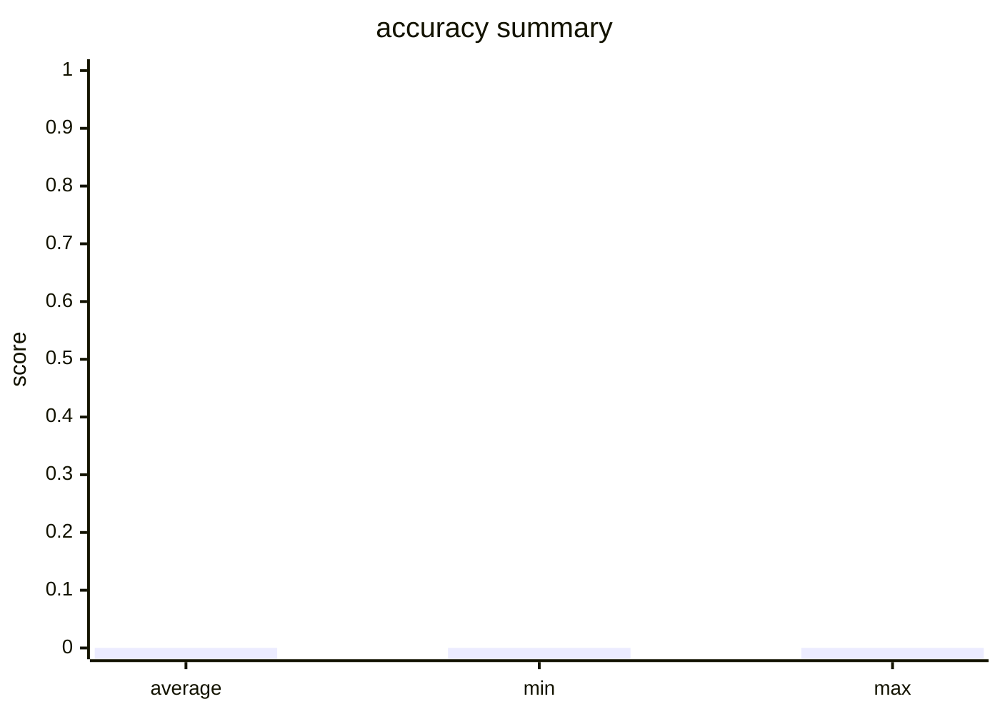

Running workflow...

Initializing dataset inlet...

Executing workflows for each question...

Initialized PoeClient with API key from env var 'POE_KEY'

All workflows executed. Starting evaluation...

=== Evaluation Results ===

=============== 📊 Evaluator: accuracy ===============

Average Score: 0.0000

Summary:

  - hit_count: 0

  - hit_rate: 0.0

==========================================

Evaluation Report Generated:
# Evaluation Report

- Total Evaluators: 1
- Total Samples: 1

## Evaluator: accuracy

- Metric: accuracy
- Total Samples: 1
- Average Score: 0.0000
- Min Score: 0.0000
- Max Score: 0.0000

### Summary

- hit_count: 0
- hit_rate: 0.0

### Score Distribution

### Details

**Sample 1** (Score: 0.0)
- **Question**: Question:  A 28-year-old male presents to trauma surgery clinic after undergoing an exploratory laparotomy, femoral intramedullary nail, and femoral artery vascular repair 3 months ago. He suffered multiple gunshot wounds as a victim of a drive-by shooting. He is progressing well with well-healed surgical incisions on examination. He states during his clinic visit that he has been experiencing 6 weeks of nightmares where he "relives the day he was shot." The patient also endorses 6 weeks of flashbacks to "the shooter pointing the gun at him" during the daytime as well. He states that he has had difficulty sleeping and cannot concentrate when performing tasks. Which of the following is the most likely diagnosis? A. Acute stress disorder B. Normal reaction to trauma C. Post-traumatic stress disorder (PTSD) D. Schizophrenia E. Schizophreniform disorder 
- **LLM Prediction**: {'success': False, 'answer': ''}
- **Ground Truth**: {'answer': 'C'}

Final evaluation report generated: evaluation_report.md

🌟🌟🌟🌟🌟🌟🌟🌟🌟🌟🌟🌟🌟🌟🌟🌟🌟🌟🌟🌟🌟🌟🌟🌟🌟🌟🌟🌟🌟🌟 WORKFLOW EXECUTION RECORDS 🌟🌟🌟🌟🌟🌟🌟🌟🌟🌟🌟🌟🌟🌟🌟🌟🌟🌟🌟🌟🌟🌟🌟🌟🌟🌟🌟🌟🌟🌟

🌀🌀🌀🌀🌀🌀🌀🌀🌀🌀🌀🌀🌀🌀🌀🌀🌀🌀🌀🌀 WORKFLOW '8c6e674f-c9b4-4f69-8bde-ce98bae0d69a' BEGIN 🌀🌀🌀🌀🌀🌀🌀🌀🌀🌀🌀🌀🌀🌀🌀🌀🌀🌀🌀🌀

🔽🔽🔽🔽🔽🔽🔽🔽🔽🔽🔽🔽🔽🔽🔽🔽🔽🔽🔽🔽🔽🔽🔽🔽🔽🔽🔽🔽🔽🔽 NEW TASK 🔽🔽🔽🔽🔽🔽🔽🔽🔽🔽🔽🔽🔽🔽🔽🔽🔽🔽🔽🔽🔽🔽🔽🔽🔽🔽🔽🔽🔽🔽

🚀 Task ID: question_task  |  Type: [plain_text]

========================================================================

🟢🟢🟢🟢🟢🟢🟢🟢🟢🟢🟢🟢🟢🟢🟢🟢🟢🟢🟢🟢 TASK INPUT MESSAGES 🟢🟢🟢🟢🟢🟢🟢🟢🟢🟢🟢🟢🟢🟢🟢🟢🟢🟢🟢🟢

🔵🔵🔵🔵🔵🔵🔵🔵🔵🔵🔵🔵🔵🔵🔵🔵🔵🔵🔵🔵 TASK OUTPUT MESSAGES 🔵🔵🔵🔵🔵🔵🔵🔵🔵🔵🔵🔵🔵🔵🔵🔵🔵🔵🔵🔵

━━━━━━━━━━━━━━━━━━━━ [Output Message 1: USER] ━━━━━━━━━━━━━━━━━━━━
Question: 
A 28-year-old male presents to trauma surgery clinic after undergoing an exploratory laparotomy, femoral intramedullary nail, and femoral artery vascular repair 3 months ago. He suffered multiple gunshot wounds as a victim of a drive-by shooting. He is progressing well with well-healed surgical incisions on examination. He states during his clinic visit that he has been experiencing 6 weeks of nightmares where he "relives the day he was shot." The patient also endorses 6 weeks of flashbacks to "the shooter pointing the gun at him" during the daytime as well. He states that he has had difficulty sleeping and cannot concentrate when performing tasks. Which of the following is the most likely diagnosis?
A. Acute stress disorder
B. Normal reaction to trauma
C. Post-traumatic stress disorder (PTSD)
D. Schizophrenia
E. Schizophreniform disorder

🔼🔼🔼🔼🔼🔼🔼🔼🔼🔼🔼🔼🔼🔼🔼🔼🔼🔼🔼🔼🔼🔼🔼🔼🔼🔼🔼🔼🔼🔼 TASK END 🔼🔼🔼🔼🔼🔼🔼🔼🔼🔼🔼🔼🔼🔼🔼🔼🔼🔼🔼🔼🔼🔼🔼🔼🔼🔼🔼🔼🔼🔼

🔽🔽🔽🔽🔽🔽🔽🔽🔽🔽🔽🔽🔽🔽🔽🔽🔽🔽🔽🔽🔽🔽🔽🔽🔽🔽🔽🔽🔽🔽 NEW TASK 🔽🔽🔽🔽🔽🔽🔽🔽🔽🔽🔽🔽🔽🔽🔽🔽🔽🔽🔽🔽🔽🔽🔽🔽🔽🔽🔽🔽🔽🔽

🚀 Task ID: Problem Representation Task  |  Type: [single_agent]

========================================================================

🟢🟢🟢🟢🟢🟢🟢🟢🟢🟢🟢🟢🟢🟢🟢🟢🟢🟢🟢🟢 TASK INPUT MESSAGES 🟢🟢🟢🟢🟢🟢🟢🟢🟢🟢🟢🟢🟢🟢🟢🟢🟢🟢🟢🟢

━━━━━━━━━━━━━━━━━━━━ [Input Message 1: USER] ━━━━━━━━━━━━━━━━━━━━
You are the “Clue Representation” agent in a clinical reasoning workflow.
Your job is not to answer the question directly, but to convert the input patient case (in form of medical question) into a structured clinical clue representation for downstream agents.

Patient Case:
Question: 
A 28-year-old male presents to trauma surgery clinic after undergoing an exploratory laparotomy, femoral intramedullary nail, and femoral artery vascular repair 3 months ago. He suffered multiple gunshot wounds as a victim of a drive-by shooting. He is progressing well with well-healed surgical incisions on examination. He states during his clinic visit that he has been experiencing 6 weeks of nightmares where he "relives the day he was shot." The patient also endorses 6 weeks of flashbacks to "the shooter pointing the gun at him" during the daytime as well. He states that he has had difficulty sleeping and cannot concentrate when performing tasks. Which of the following is the most likely diagnosis?
A. Acute stress disorder
B. Normal reaction to trauma
C. Post-traumatic stress disorder (PTSD)
D. Schizophrenia
E. Schizophreniform disorder

🔵🔵🔵🔵🔵🔵🔵🔵🔵🔵🔵🔵🔵🔵🔵🔵🔵🔵🔵🔵 TASK OUTPUT MESSAGES 🔵🔵🔵🔵🔵🔵🔵🔵🔵🔵🔵🔵🔵🔵🔵🔵🔵🔵🔵🔵

━━━━━━━━━━━━━━━━━━━━ [Output Message 1: USER] ━━━━━━━━━━━━━━━━━━━━
This is a fake response.

🔼🔼🔼🔼🔼🔼🔼🔼🔼🔼🔼🔼🔼🔼🔼🔼🔼🔼🔼🔼🔼🔼🔼🔼🔼🔼🔼🔼🔼🔼 TASK END 🔼🔼🔼🔼🔼🔼🔼🔼🔼🔼🔼🔼🔼🔼🔼🔼🔼🔼🔼🔼🔼🔼🔼🔼🔼🔼🔼🔼🔼🔼

🔽🔽🔽🔽🔽🔽🔽🔽🔽🔽🔽🔽🔽🔽🔽🔽🔽🔽🔽🔽🔽🔽🔽🔽🔽🔽🔽🔽🔽🔽 NEW TASK 🔽🔽🔽🔽🔽🔽🔽🔽🔽🔽🔽🔽🔽🔽🔽🔽🔽🔽🔽🔽🔽🔽🔽🔽🔽🔽🔽🔽🔽🔽

🚀 Task ID: Hypothesis Generation Task  |  Type: [single_agent]

========================================================================

🟢🟢🟢🟢🟢🟢🟢🟢🟢🟢🟢🟢🟢🟢🟢🟢🟢🟢🟢🟢 TASK INPUT MESSAGES 🟢🟢🟢🟢🟢🟢🟢🟢🟢🟢🟢🟢🟢🟢🟢🟢🟢🟢🟢🟢

━━━━━━━━━━━━━━━━━━━━ [Input Message 1: USER] ━━━━━━━━━━━━━━━━━━━━
You are the “Hypothesis Generation” agent in a clinical reasoning workflow.
Based on the previous Problem Representation result, you must propose 3–5 plausible diagnostic/mechanistic hypotheses and provide key supporting and contradicting evidence for each, producing a candidate list for downstream evaluation.

Problem Representation:
This is a fake response.

🔵🔵🔵🔵🔵🔵🔵🔵🔵🔵🔵🔵🔵🔵🔵🔵🔵🔵🔵🔵 TASK OUTPUT MESSAGES 🔵🔵🔵🔵🔵🔵🔵🔵🔵🔵🔵🔵🔵🔵🔵🔵🔵🔵🔵🔵

━━━━━━━━━━━━━━━━━━━━ [Output Message 1: USER] ━━━━━━━━━━━━━━━━━━━━
This is a fake response.

🔼🔼🔼🔼🔼🔼🔼🔼🔼🔼🔼🔼🔼🔼🔼🔼🔼🔼🔼🔼🔼🔼🔼🔼🔼🔼🔼🔼🔼🔼 TASK END 🔼🔼🔼🔼🔼🔼🔼🔼🔼🔼🔼🔼🔼🔼🔼🔼🔼🔼🔼🔼🔼🔼🔼🔼🔼🔼🔼🔼🔼🔼

🔽🔽🔽🔽🔽🔽🔽🔽🔽🔽🔽🔽🔽🔽🔽🔽🔽🔽🔽🔽🔽🔽🔽🔽🔽🔽🔽🔽🔽🔽 NEW TASK 🔽🔽🔽🔽🔽🔽🔽🔽🔽🔽🔽🔽🔽🔽🔽🔽🔽🔽🔽🔽🔽🔽🔽🔽🔽🔽🔽🔽🔽🔽

🚀 Task ID: Hypothesis Evaluation Task  |  Type: [single_agent]

========================================================================

🟢🟢🟢🟢🟢🟢🟢🟢🟢🟢🟢🟢🟢🟢🟢🟢🟢🟢🟢🟢 TASK INPUT MESSAGES 🟢🟢🟢🟢🟢🟢🟢🟢🟢🟢🟢🟢🟢🟢🟢🟢🟢🟢🟢🟢

━━━━━━━━━━━━━━━━━━━━ [Input Message 1: USER] ━━━━━━━━━━━━━━━━━━━━
You are the “Hypothesis Evaluation” agent in a clinical reasoning workflow. 
Your job is to compare and evaluate the candidate hypotheses and map them to the provided answer options, then select the final best answer. 
Make sure that the final answer you output strictly follows the provided answer options text. 
Problem Representation: 
This is a fake response.

Hypothesis Generation: 
This is a fake response.

🔵🔵🔵🔵🔵🔵🔵🔵🔵🔵🔵🔵🔵🔵🔵🔵🔵🔵🔵🔵 TASK OUTPUT MESSAGES 🔵🔵🔵🔵🔵🔵🔵🔵🔵🔵🔵🔵🔵🔵🔵🔵🔵🔵🔵🔵

━━━━━━━━━━━━━━━━━━━━ [Output Message 1: USER] ━━━━━━━━━━━━━━━━━━━━
This is a fake response.

🔼🔼🔼🔼🔼🔼🔼🔼🔼🔼🔼🔼🔼🔼🔼🔼🔼🔼🔼🔼🔼🔼🔼🔼🔼🔼🔼🔼🔼🔼 TASK END 🔼🔼🔼🔼🔼🔼🔼🔼🔼🔼🔼🔼🔼🔼🔼🔼🔼🔼🔼🔼🔼🔼🔼🔼🔼🔼🔼🔼🔼🔼

🔽🔽🔽🔽🔽🔽🔽🔽🔽🔽🔽🔽🔽🔽🔽🔽🔽🔽🔽🔽🔽🔽🔽🔽🔽🔽🔽🔽🔽🔽 NEW TASK 🔽🔽🔽🔽🔽🔽🔽🔽🔽🔽🔽🔽🔽🔽🔽🔽🔽🔽🔽🔽🔽🔽🔽🔽🔽🔽🔽🔽🔽🔽

🚀 Task ID: smart_extractor  |  Type: [smart_extractor]

========================================================================

🟢🟢🟢🟢🟢🟢🟢🟢🟢🟢🟢🟢🟢🟢🟢🟢🟢🟢🟢🟢 TASK INPUT MESSAGES 🟢🟢🟢🟢🟢🟢🟢🟢🟢🟢🟢🟢🟢🟢🟢🟢🟢🟢🟢🟢

━━━━━━━━━━━━━━━━━━━━ [Input Message 1: USER] ━━━━━━━━━━━━━━━━━━━━
Question: 
A 28-year-old male presents to trauma surgery clinic after undergoing an exploratory laparotomy, femoral intramedullary nail, and femoral artery vascular repair 3 months ago. He suffered multiple gunshot wounds as a victim of a drive-by shooting. He is progressing well with well-healed surgical incisions on examination. He states during his clinic visit that he has been experiencing 6 weeks of nightmares where he "relives the day he was shot." The patient also endorses 6 weeks of flashbacks to "the shooter pointing the gun at him" during the daytime as well. He states that he has had difficulty sleeping and cannot concentrate when performing tasks. Which of the following is the most likely diagnosis?
A. Acute stress disorder
B. Normal reaction to trauma
C. Post-traumatic stress disorder (PTSD)
D. Schizophrenia
E. Schizophreniform disorder

━━━━━━━━━━━━━━━━━━━━ [Input Message 2: USER] ━━━━━━━━━━━━━━━━━━━━
Extract the final answer from the previous assistant response.Output ONLY valid JSON without markdown and without additional text.
Expected JSON schema:
{
  "answer": "<The exact option letter/index of the final answer, e.g. 'A' or '1'>"
}

🔵🔵🔵🔵🔵🔵🔵🔵🔵🔵🔵🔵🔵🔵🔵🔵🔵🔵🔵🔵 TASK OUTPUT MESSAGES 🔵🔵🔵🔵🔵🔵🔵🔵🔵🔵🔵🔵🔵🔵🔵🔵🔵🔵🔵🔵

━━━━━━━━━━━━━━━━━━━━ [Output Message 1: USER] ━━━━━━━━━━━━━━━━━━━━
This is a fake response.

🔼🔼🔼🔼🔼🔼🔼🔼🔼🔼🔼🔼🔼🔼🔼🔼🔼🔼🔼🔼🔼🔼🔼🔼🔼🔼🔼🔼🔼🔼 TASK END 🔼🔼🔼🔼🔼🔼🔼🔼🔼🔼🔼🔼🔼🔼🔼🔼🔼🔼🔼🔼🔼🔼🔼🔼🔼🔼🔼🔼🔼🔼

🛑🛑🛑🛑🛑🛑🛑🛑🛑🛑🛑🛑🛑🛑🛑🛑🛑🛑🛑🛑 WORKFLOW '8c6e674f-c9b4-4f69-8bde-ce98bae0d69a' END 🛑🛑🛑🛑🛑🛑🛑🛑🛑🛑🛑🛑🛑🛑🛑🛑🛑🛑🛑🛑

