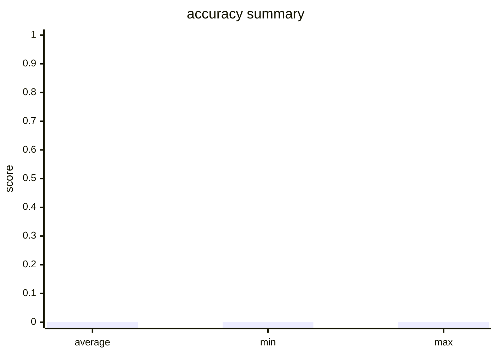

Running workflow...

Initializing dataset inlet...

Executing workflows for each question...

Initialized PoeClient with API key from env var 'POE_KEY'

All workflows executed. Starting evaluation...

=== Evaluation Results ===

=============== 📊 Evaluator: accuracy ===============

Average Score: 0.0000

Summary:

  - hit_count: 0

  - hit_rate: 0.0

==========================================

Evaluation Report Generated:
# Evaluation Report

- Total Evaluators: 1
- Total Samples: 4

## Evaluator: accuracy

- Metric: accuracy
- Total Samples: 4
- Average Score: 0.0000
- Min Score: 0.0000
- Max Score: 0.0000

### Summary

- hit_count: 0
- hit_rate: 0.0

### Score Distribution

### Details

**Sample 1** (Score: 0.0)
- **Question**: Question:  A 47-year-old African-American woman presents to her primary care physician for a general checkup appointment. She works as a middle school teacher and has a 25 pack-year smoking history. She has a body mass index (BMI) of 22 kg/m^2 and is a vegetarian. Her last menstrual period was 1 week ago. Her current medications include oral contraceptive pills. Which of the following is a risk factor for osteoporosis in this patient? A. Age B. Body mass index C. Estrogen therapy D. Race E. Smoking history 
- **LLM Prediction**: {'success': False, 'answer': ''}
- **Ground Truth**: {'answer': 'E'}

**Sample 2** (Score: 0.0)
- **Question**: Question:  A previously healthy 25-year-old man is brought to the emergency department 30 minutes after collapsing during soccer practice. His father died of sudden cardiac arrest at the age of 36 years. The patient appears well. His pulse is 73/min and blood pressure is 125/78 mm Hg. Cardiac examination is shown. An ECG shows large R waves in the lateral leads and deep S waves in V1 and V2. Further evaluation is most likely to show which of the following? A. Monoclonal light chain deposition in the myocardium B. Aortic root dilatation C. Eccentric left ventricular dilation D. Asymmetric septal hypertrophy E. Mitral valve fibrinoid necrosis 
- **LLM Prediction**: {'success': False, 'answer': ''}
- **Ground Truth**: {'answer': 'D'}

**Sample 3** (Score: 0.0)
- **Question**: Question:  A 25-day-old newborn is brought to the pediatrician for lethargy, poor muscle tone, and feeding difficulty with occasional regurgitation that recently turned into projectile vomiting. The child was born via vaginal delivery without complications. On examination, the vital signs include: pulse 130/min, respiratory rate 30/min, blood pressure 96/60 mm Hg, and temperature 36.5°C (97.7°F). The physical examination shows a broad nasal bridge, oral thrush, hepatosplenomegaly, and generalized hypotonia. Further tests of blood and urine samples help the pediatrician to diagnose the child with an enzyme deficiency. More extensive laboratory testing reveals normal levels of citrulline and hypoglycemia. There are also elevated levels of ketone bodies, glycine, and methylmalonic acid. Which of the following is the product of the reaction catalyzed by the deficient enzyme in this patient? A. Pyruvate B. Succinyl-CoA C. Methylmalonyl-CoA D. Acetyl-CoA E. Enoyl-CoA 
- **LLM Prediction**: {'success': False, 'answer': ''}
- **Ground Truth**: {'answer': 'B'}

**Sample 4** (Score: 0.0)
- **Question**: Question:  A 19-year-old man is brought to the emergency department by the resident assistant of his dormitory for strange behavior. He was found locked out of his room, where the patient admitted to attending a fraternity party before becoming paranoid that the resident assistant would report him to the police. The patient appears anxious. His pulse is 105/min, and blood pressure is 142/85 mm Hg. Examination shows dry mucous membranes and bilateral conjunctival injection. Further evaluation is most likely to show which of the following? A. Tactile hallucinations B. Pupillary constriction C. Synesthesia D. Sense of closeness to others E. Impaired reaction time 
- **LLM Prediction**: {'success': False, 'answer': ''}
- **Ground Truth**: {'answer': 'E'}

Final evaluation report generated: evaluation_report.md

🌟🌟🌟🌟🌟🌟🌟🌟🌟🌟🌟🌟🌟🌟🌟🌟🌟🌟🌟🌟🌟🌟🌟🌟🌟🌟🌟🌟🌟🌟 WORKFLOW EXECUTION RECORDS 🌟🌟🌟🌟🌟🌟🌟🌟🌟🌟🌟🌟🌟🌟🌟🌟🌟🌟🌟🌟🌟🌟🌟🌟🌟🌟🌟🌟🌟🌟

🌀🌀🌀🌀🌀🌀🌀🌀🌀🌀🌀🌀🌀🌀🌀🌀🌀🌀🌀🌀 WORKFLOW 'f86f77f2-2834-4f55-ad41-e44d7adff363' BEGIN 🌀🌀🌀🌀🌀🌀🌀🌀🌀🌀🌀🌀🌀🌀🌀🌀🌀🌀🌀🌀

🔽🔽🔽🔽🔽🔽🔽🔽🔽🔽🔽🔽🔽🔽🔽🔽🔽🔽🔽🔽🔽🔽🔽🔽🔽🔽🔽🔽🔽🔽 NEW TASK 🔽🔽🔽🔽🔽🔽🔽🔽🔽🔽🔽🔽🔽🔽🔽🔽🔽🔽🔽🔽🔽🔽🔽🔽🔽🔽🔽🔽🔽🔽

🚀 Task ID: 6cafa033-7161-477f-ac8f-0a8ae968c3ca  |  Type: [plain_text]

========================================================================

🟢🟢🟢🟢🟢🟢🟢🟢🟢🟢🟢🟢🟢🟢🟢🟢🟢🟢🟢🟢 TASK INPUT MESSAGES 🟢🟢🟢🟢🟢🟢🟢🟢🟢🟢🟢🟢🟢🟢🟢🟢🟢🟢🟢🟢

🔵🔵🔵🔵🔵🔵🔵🔵🔵🔵🔵🔵🔵🔵🔵🔵🔵🔵🔵🔵 TASK OUTPUT MESSAGES 🔵🔵🔵🔵🔵🔵🔵🔵🔵🔵🔵🔵🔵🔵🔵🔵🔵🔵🔵🔵

━━━━━━━━━━━━━━━━━━━━ [Output Message 1: USER] ━━━━━━━━━━━━━━━━━━━━
Question: 
A 47-year-old African-American woman presents to her primary care physician for a general checkup appointment. She works as a middle school teacher and has a 25 pack-year smoking history. She has a body mass index (BMI) of 22 kg/m^2 and is a vegetarian. Her last menstrual period was 1 week ago. Her current medications include oral contraceptive pills. Which of the following is a risk factor for osteoporosis in this patient?
A. Age
B. Body mass index
C. Estrogen therapy
D. Race
E. Smoking history

🔼🔼🔼🔼🔼🔼🔼🔼🔼🔼🔼🔼🔼🔼🔼🔼🔼🔼🔼🔼🔼🔼🔼🔼🔼🔼🔼🔼🔼🔼 TASK END 🔼🔼🔼🔼🔼🔼🔼🔼🔼🔼🔼🔼🔼🔼🔼🔼🔼🔼🔼🔼🔼🔼🔼🔼🔼🔼🔼🔼🔼🔼

🔽🔽🔽🔽🔽🔽🔽🔽🔽🔽🔽🔽🔽🔽🔽🔽🔽🔽🔽🔽🔽🔽🔽🔽🔽🔽🔽🔽🔽🔽 NEW TASK 🔽🔽🔽🔽🔽🔽🔽🔽🔽🔽🔽🔽🔽🔽🔽🔽🔽🔽🔽🔽🔽🔽🔽🔽🔽🔽🔽🔽🔽🔽

🚀 Task ID: 2415e111-9656-4b83-b671-9a1d5591b719  |  Type: [single_agent]

========================================================================

🟢🟢🟢🟢🟢🟢🟢🟢🟢🟢🟢🟢🟢🟢🟢🟢🟢🟢🟢🟢 TASK INPUT MESSAGES 🟢🟢🟢🟢🟢🟢🟢🟢🟢🟢🟢🟢🟢🟢🟢🟢🟢🟢🟢🟢

━━━━━━━━━━━━━━━━━━━━ [Input Message 1: USER] ━━━━━━━━━━━━━━━━━━━━
Question: 
A 47-year-old African-American woman presents to her primary care physician for a general checkup appointment. She works as a middle school teacher and has a 25 pack-year smoking history. She has a body mass index (BMI) of 22 kg/m^2 and is a vegetarian. Her last menstrual period was 1 week ago. Her current medications include oral contraceptive pills. Which of the following is a risk factor for osteoporosis in this patient?
A. Age
B. Body mass index
C. Estrogen therapy
D. Race
E. Smoking history

━━━━━━━━━━━━━━━━━━━━ [Input Message 2: USER] ━━━━━━━━━━━━━━━━━━━━
You are the “Clue Representation” agent in a clinical reasoning workflow.Your job is not to answer the question directly, but to convert the input patient case (in form of medical question) into a structured clinical clue representation for downstream agents.You can find the input patient case in previous messages.

🔵🔵🔵🔵🔵🔵🔵🔵🔵🔵🔵🔵🔵🔵🔵🔵🔵🔵🔵🔵 TASK OUTPUT MESSAGES 🔵🔵🔵🔵🔵🔵🔵🔵🔵🔵🔵🔵🔵🔵🔵🔵🔵🔵🔵🔵

━━━━━━━━━━━━━━━━━━━━ [Output Message 1: USER] ━━━━━━━━━━━━━━━━━━━━
This is a fake response.

🔼🔼🔼🔼🔼🔼🔼🔼🔼🔼🔼🔼🔼🔼🔼🔼🔼🔼🔼🔼🔼🔼🔼🔼🔼🔼🔼🔼🔼🔼 TASK END 🔼🔼🔼🔼🔼🔼🔼🔼🔼🔼🔼🔼🔼🔼🔼🔼🔼🔼🔼🔼🔼🔼🔼🔼🔼🔼🔼🔼🔼🔼

🔽🔽🔽🔽🔽🔽🔽🔽🔽🔽🔽🔽🔽🔽🔽🔽🔽🔽🔽🔽🔽🔽🔽🔽🔽🔽🔽🔽🔽🔽 NEW TASK 🔽🔽🔽🔽🔽🔽🔽🔽🔽🔽🔽🔽🔽🔽🔽🔽🔽🔽🔽🔽🔽🔽🔽🔽🔽🔽🔽🔽🔽🔽

🚀 Task ID: 190c1af1-b58b-42bb-b8d5-72fa7fc5e6a4  |  Type: [single_agent]

========================================================================

🟢🟢🟢🟢🟢🟢🟢🟢🟢🟢🟢🟢🟢🟢🟢🟢🟢🟢🟢🟢 TASK INPUT MESSAGES 🟢🟢🟢🟢🟢🟢🟢🟢🟢🟢🟢🟢🟢🟢🟢🟢🟢🟢🟢🟢

━━━━━━━━━━━━━━━━━━━━ [Input Message 1: USER] ━━━━━━━━━━━━━━━━━━━━
This is a fake response.

━━━━━━━━━━━━━━━━━━━━ [Input Message 2: USER] ━━━━━━━━━━━━━━━━━━━━
You are the “Hypothesis Generation” agent in a clinical reasoning workflow. Based on the previous Problem Representation result, you must propose 3–6 plausible diagnostic/mechanistic hypotheses and provide key supporting and contradicting evidence for each, producing a candidate list for downstream evaluation.
You can find the input patient case and Problem Representation result in previous messages

🔵🔵🔵🔵🔵🔵🔵🔵🔵🔵🔵🔵🔵🔵🔵🔵🔵🔵🔵🔵 TASK OUTPUT MESSAGES 🔵🔵🔵🔵🔵🔵🔵🔵🔵🔵🔵🔵🔵🔵🔵🔵🔵🔵🔵🔵

━━━━━━━━━━━━━━━━━━━━ [Output Message 1: USER] ━━━━━━━━━━━━━━━━━━━━
This is a fake response.

🔼🔼🔼🔼🔼🔼🔼🔼🔼🔼🔼🔼🔼🔼🔼🔼🔼🔼🔼🔼🔼🔼🔼🔼🔼🔼🔼🔼🔼🔼 TASK END 🔼🔼🔼🔼🔼🔼🔼🔼🔼🔼🔼🔼🔼🔼🔼🔼🔼🔼🔼🔼🔼🔼🔼🔼🔼🔼🔼🔼🔼🔼

🔽🔽🔽🔽🔽🔽🔽🔽🔽🔽🔽🔽🔽🔽🔽🔽🔽🔽🔽🔽🔽🔽🔽🔽🔽🔽🔽🔽🔽🔽 NEW TASK 🔽🔽🔽🔽🔽🔽🔽🔽🔽🔽🔽🔽🔽🔽🔽🔽🔽🔽🔽🔽🔽🔽🔽🔽🔽🔽🔽🔽🔽🔽

🚀 Task ID: 6f59e097-bb2b-497a-9c7b-4b289e08e299  |  Type: [single_agent]

========================================================================

🟢🟢🟢🟢🟢🟢🟢🟢🟢🟢🟢🟢🟢🟢🟢🟢🟢🟢🟢🟢 TASK INPUT MESSAGES 🟢🟢🟢🟢🟢🟢🟢🟢🟢🟢🟢🟢🟢🟢🟢🟢🟢🟢🟢🟢

━━━━━━━━━━━━━━━━━━━━ [Input Message 1: USER] ━━━━━━━━━━━━━━━━━━━━
This is a fake response.

━━━━━━━━━━━━━━━━━━━━ [Input Message 2: USER] ━━━━━━━━━━━━━━━━━━━━
This is a fake response.

━━━━━━━━━━━━━━━━━━━━ [Input Message 3: USER] ━━━━━━━━━━━━━━━━━━━━
You are the “Hypothesis Evaluation” agent in a clinical reasoning workflow. Your job is to compare and evaluate the candidate hypotheses and map them to the provided answer options, then select the final best answer. Make sure that the final answer you output strictly follows the provided answer options text. You can find the Problem Representation result and Hypothesis Generation result in previous messages.

🔵🔵🔵🔵🔵🔵🔵🔵🔵🔵🔵🔵🔵🔵🔵🔵🔵🔵🔵🔵 TASK OUTPUT MESSAGES 🔵🔵🔵🔵🔵🔵🔵🔵🔵🔵🔵🔵🔵🔵🔵🔵🔵🔵🔵🔵

━━━━━━━━━━━━━━━━━━━━ [Output Message 1: USER] ━━━━━━━━━━━━━━━━━━━━
This is a fake response.

🔼🔼🔼🔼🔼🔼🔼🔼🔼🔼🔼🔼🔼🔼🔼🔼🔼🔼🔼🔼🔼🔼🔼🔼🔼🔼🔼🔼🔼🔼 TASK END 🔼🔼🔼🔼🔼🔼🔼🔼🔼🔼🔼🔼🔼🔼🔼🔼🔼🔼🔼🔼🔼🔼🔼🔼🔼🔼🔼🔼🔼🔼

🔽🔽🔽🔽🔽🔽🔽🔽🔽🔽🔽🔽🔽🔽🔽🔽🔽🔽🔽🔽🔽🔽🔽🔽🔽🔽🔽🔽🔽🔽 NEW TASK 🔽🔽🔽🔽🔽🔽🔽🔽🔽🔽🔽🔽🔽🔽🔽🔽🔽🔽🔽🔽🔽🔽🔽🔽🔽🔽🔽🔽🔽🔽

🚀 Task ID: 823ec224-e718-40d6-a520-ffa9e75bef0b  |  Type: [smart_extractor]

========================================================================

🟢🟢🟢🟢🟢🟢🟢🟢🟢🟢🟢🟢🟢🟢🟢🟢🟢🟢🟢🟢 TASK INPUT MESSAGES 🟢🟢🟢🟢🟢🟢🟢🟢🟢🟢🟢🟢🟢🟢🟢🟢🟢🟢🟢🟢

━━━━━━━━━━━━━━━━━━━━ [Input Message 1: USER] ━━━━━━━━━━━━━━━━━━━━
Question: 
A 47-year-old African-American woman presents to her primary care physician for a general checkup appointment. She works as a middle school teacher and has a 25 pack-year smoking history. She has a body mass index (BMI) of 22 kg/m^2 and is a vegetarian. Her last menstrual period was 1 week ago. Her current medications include oral contraceptive pills. Which of the following is a risk factor for osteoporosis in this patient?
A. Age
B. Body mass index
C. Estrogen therapy
D. Race
E. Smoking history

━━━━━━━━━━━━━━━━━━━━ [Input Message 2: USER] ━━━━━━━━━━━━━━━━━━━━
This is a fake response.

━━━━━━━━━━━━━━━━━━━━ [Input Message 3: USER] ━━━━━━━━━━━━━━━━━━━━
Extract the final answer from the previous assistant response.Output ONLY valid JSON without markdown and without additional text.
Expected JSON schema:
{
  "answer": "<The exact option letter/index of the final answer, e.g. 'A' or '1'>"
}

🔵🔵🔵🔵🔵🔵🔵🔵🔵🔵🔵🔵🔵🔵🔵🔵🔵🔵🔵🔵 TASK OUTPUT MESSAGES 🔵🔵🔵🔵🔵🔵🔵🔵🔵🔵🔵🔵🔵🔵🔵🔵🔵🔵🔵🔵

━━━━━━━━━━━━━━━━━━━━ [Output Message 1: USER] ━━━━━━━━━━━━━━━━━━━━
This is a fake response.

🔼🔼🔼🔼🔼🔼🔼🔼🔼🔼🔼🔼🔼🔼🔼🔼🔼🔼🔼🔼🔼🔼🔼🔼🔼🔼🔼🔼🔼🔼 TASK END 🔼🔼🔼🔼🔼🔼🔼🔼🔼🔼🔼🔼🔼🔼🔼🔼🔼🔼🔼🔼🔼🔼🔼🔼🔼🔼🔼🔼🔼🔼

🛑🛑🛑🛑🛑🛑🛑🛑🛑🛑🛑🛑🛑🛑🛑🛑🛑🛑🛑🛑 WORKFLOW 'f86f77f2-2834-4f55-ad41-e44d7adff363' END 🛑🛑🛑🛑🛑🛑🛑🛑🛑🛑🛑🛑🛑🛑🛑🛑🛑🛑🛑🛑

🌀🌀🌀🌀🌀🌀🌀🌀🌀🌀🌀🌀🌀🌀🌀🌀🌀🌀🌀🌀 WORKFLOW 'f86f77f2-2834-4f55-ad41-e44d7adff363' BEGIN 🌀🌀🌀🌀🌀🌀🌀🌀🌀🌀🌀🌀🌀🌀🌀🌀🌀🌀🌀🌀

🔽🔽🔽🔽🔽🔽🔽🔽🔽🔽🔽🔽🔽🔽🔽🔽🔽🔽🔽🔽🔽🔽🔽🔽🔽🔽🔽🔽🔽🔽 NEW TASK 🔽🔽🔽🔽🔽🔽🔽🔽🔽🔽🔽🔽🔽🔽🔽🔽🔽🔽🔽🔽🔽🔽🔽🔽🔽🔽🔽🔽🔽🔽

🚀 Task ID: 8313030e-5e5d-4be7-8023-2d6dd20cf218  |  Type: [plain_text]

========================================================================

🟢🟢🟢🟢🟢🟢🟢🟢🟢🟢🟢🟢🟢🟢🟢🟢🟢🟢🟢🟢 TASK INPUT MESSAGES 🟢🟢🟢🟢🟢🟢🟢🟢🟢🟢🟢🟢🟢🟢🟢🟢🟢🟢🟢🟢

🔵🔵🔵🔵🔵🔵🔵🔵🔵🔵🔵🔵🔵🔵🔵🔵🔵🔵🔵🔵 TASK OUTPUT MESSAGES 🔵🔵🔵🔵🔵🔵🔵🔵🔵🔵🔵🔵🔵🔵🔵🔵🔵🔵🔵🔵

━━━━━━━━━━━━━━━━━━━━ [Output Message 1: USER] ━━━━━━━━━━━━━━━━━━━━
Question: 
A previously healthy 25-year-old man is brought to the emergency department 30 minutes after collapsing during soccer practice. His father died of sudden cardiac arrest at the age of 36 years. The patient appears well. His pulse is 73/min and blood pressure is 125/78 mm Hg. Cardiac examination is shown. An ECG shows large R waves in the lateral leads and deep S waves in V1 and V2. Further evaluation is most likely to show which of the following?
A. Monoclonal light chain deposition in the myocardium
B. Aortic root dilatation
C. Eccentric left ventricular dilation
D. Asymmetric septal hypertrophy
E. Mitral valve fibrinoid necrosis

🔼🔼🔼🔼🔼🔼🔼🔼🔼🔼🔼🔼🔼🔼🔼🔼🔼🔼🔼🔼🔼🔼🔼🔼🔼🔼🔼🔼🔼🔼 TASK END 🔼🔼🔼🔼🔼🔼🔼🔼🔼🔼🔼🔼🔼🔼🔼🔼🔼🔼🔼🔼🔼🔼🔼🔼🔼🔼🔼🔼🔼🔼

🔽🔽🔽🔽🔽🔽🔽🔽🔽🔽🔽🔽🔽🔽🔽🔽🔽🔽🔽🔽🔽🔽🔽🔽🔽🔽🔽🔽🔽🔽 NEW TASK 🔽🔽🔽🔽🔽🔽🔽🔽🔽🔽🔽🔽🔽🔽🔽🔽🔽🔽🔽🔽🔽🔽🔽🔽🔽🔽🔽🔽🔽🔽

🚀 Task ID: 2415e111-9656-4b83-b671-9a1d5591b719  |  Type: [single_agent]

========================================================================

🟢🟢🟢🟢🟢🟢🟢🟢🟢🟢🟢🟢🟢🟢🟢🟢🟢🟢🟢🟢 TASK INPUT MESSAGES 🟢🟢🟢🟢🟢🟢🟢🟢🟢🟢🟢🟢🟢🟢🟢🟢🟢🟢🟢🟢

━━━━━━━━━━━━━━━━━━━━ [Input Message 1: USER] ━━━━━━━━━━━━━━━━━━━━
Question: 
A previously healthy 25-year-old man is brought to the emergency department 30 minutes after collapsing during soccer practice. His father died of sudden cardiac arrest at the age of 36 years. The patient appears well. His pulse is 73/min and blood pressure is 125/78 mm Hg. Cardiac examination is shown. An ECG shows large R waves in the lateral leads and deep S waves in V1 and V2. Further evaluation is most likely to show which of the following?
A. Monoclonal light chain deposition in the myocardium
B. Aortic root dilatation
C. Eccentric left ventricular dilation
D. Asymmetric septal hypertrophy
E. Mitral valve fibrinoid necrosis

━━━━━━━━━━━━━━━━━━━━ [Input Message 2: USER] ━━━━━━━━━━━━━━━━━━━━
You are the “Clue Representation” agent in a clinical reasoning workflow.Your job is not to answer the question directly, but to convert the input patient case (in form of medical question) into a structured clinical clue representation for downstream agents.You can find the input patient case in previous messages.

🔵🔵🔵🔵🔵🔵🔵🔵🔵🔵🔵🔵🔵🔵🔵🔵🔵🔵🔵🔵 TASK OUTPUT MESSAGES 🔵🔵🔵🔵🔵🔵🔵🔵🔵🔵🔵🔵🔵🔵🔵🔵🔵🔵🔵🔵

━━━━━━━━━━━━━━━━━━━━ [Output Message 1: USER] ━━━━━━━━━━━━━━━━━━━━
This is a fake response.

🔼🔼🔼🔼🔼🔼🔼🔼🔼🔼🔼🔼🔼🔼🔼🔼🔼🔼🔼🔼🔼🔼🔼🔼🔼🔼🔼🔼🔼🔼 TASK END 🔼🔼🔼🔼🔼🔼🔼🔼🔼🔼🔼🔼🔼🔼🔼🔼🔼🔼🔼🔼🔼🔼🔼🔼🔼🔼🔼🔼🔼🔼

🔽🔽🔽🔽🔽🔽🔽🔽🔽🔽🔽🔽🔽🔽🔽🔽🔽🔽🔽🔽🔽🔽🔽🔽🔽🔽🔽🔽🔽🔽 NEW TASK 🔽🔽🔽🔽🔽🔽🔽🔽🔽🔽🔽🔽🔽🔽🔽🔽🔽🔽🔽🔽🔽🔽🔽🔽🔽🔽🔽🔽🔽🔽

🚀 Task ID: 190c1af1-b58b-42bb-b8d5-72fa7fc5e6a4  |  Type: [single_agent]

========================================================================

🟢🟢🟢🟢🟢🟢🟢🟢🟢🟢🟢🟢🟢🟢🟢🟢🟢🟢🟢🟢 TASK INPUT MESSAGES 🟢🟢🟢🟢🟢🟢🟢🟢🟢🟢🟢🟢🟢🟢🟢🟢🟢🟢🟢🟢

━━━━━━━━━━━━━━━━━━━━ [Input Message 1: USER] ━━━━━━━━━━━━━━━━━━━━
This is a fake response.

━━━━━━━━━━━━━━━━━━━━ [Input Message 2: USER] ━━━━━━━━━━━━━━━━━━━━
You are the “Hypothesis Generation” agent in a clinical reasoning workflow. Based on the previous Problem Representation result, you must propose 3–6 plausible diagnostic/mechanistic hypotheses and provide key supporting and contradicting evidence for each, producing a candidate list for downstream evaluation.
You can find the input patient case and Problem Representation result in previous messages

🔵🔵🔵🔵🔵🔵🔵🔵🔵🔵🔵🔵🔵🔵🔵🔵🔵🔵🔵🔵 TASK OUTPUT MESSAGES 🔵🔵🔵🔵🔵🔵🔵🔵🔵🔵🔵🔵🔵🔵🔵🔵🔵🔵🔵🔵

━━━━━━━━━━━━━━━━━━━━ [Output Message 1: USER] ━━━━━━━━━━━━━━━━━━━━
This is a fake response.

🔼🔼🔼🔼🔼🔼🔼🔼🔼🔼🔼🔼🔼🔼🔼🔼🔼🔼🔼🔼🔼🔼🔼🔼🔼🔼🔼🔼🔼🔼 TASK END 🔼🔼🔼🔼🔼🔼🔼🔼🔼🔼🔼🔼🔼🔼🔼🔼🔼🔼🔼🔼🔼🔼🔼🔼🔼🔼🔼🔼🔼🔼

🔽🔽🔽🔽🔽🔽🔽🔽🔽🔽🔽🔽🔽🔽🔽🔽🔽🔽🔽🔽🔽🔽🔽🔽🔽🔽🔽🔽🔽🔽 NEW TASK 🔽🔽🔽🔽🔽🔽🔽🔽🔽🔽🔽🔽🔽🔽🔽🔽🔽🔽🔽🔽🔽🔽🔽🔽🔽🔽🔽🔽🔽🔽

🚀 Task ID: 6f59e097-bb2b-497a-9c7b-4b289e08e299  |  Type: [single_agent]

========================================================================

🟢🟢🟢🟢🟢🟢🟢🟢🟢🟢🟢🟢🟢🟢🟢🟢🟢🟢🟢🟢 TASK INPUT MESSAGES 🟢🟢🟢🟢🟢🟢🟢🟢🟢🟢🟢🟢🟢🟢🟢🟢🟢🟢🟢🟢

━━━━━━━━━━━━━━━━━━━━ [Input Message 1: USER] ━━━━━━━━━━━━━━━━━━━━
This is a fake response.

━━━━━━━━━━━━━━━━━━━━ [Input Message 2: USER] ━━━━━━━━━━━━━━━━━━━━
This is a fake response.

━━━━━━━━━━━━━━━━━━━━ [Input Message 3: USER] ━━━━━━━━━━━━━━━━━━━━
You are the “Hypothesis Evaluation” agent in a clinical reasoning workflow. Your job is to compare and evaluate the candidate hypotheses and map them to the provided answer options, then select the final best answer. Make sure that the final answer you output strictly follows the provided answer options text. You can find the Problem Representation result and Hypothesis Generation result in previous messages.

🔵🔵🔵🔵🔵🔵🔵🔵🔵🔵🔵🔵🔵🔵🔵🔵🔵🔵🔵🔵 TASK OUTPUT MESSAGES 🔵🔵🔵🔵🔵🔵🔵🔵🔵🔵🔵🔵🔵🔵🔵🔵🔵🔵🔵🔵

━━━━━━━━━━━━━━━━━━━━ [Output Message 1: USER] ━━━━━━━━━━━━━━━━━━━━
This is a fake response.

🔼🔼🔼🔼🔼🔼🔼🔼🔼🔼🔼🔼🔼🔼🔼🔼🔼🔼🔼🔼🔼🔼🔼🔼🔼🔼🔼🔼🔼🔼 TASK END 🔼🔼🔼🔼🔼🔼🔼🔼🔼🔼🔼🔼🔼🔼🔼🔼🔼🔼🔼🔼🔼🔼🔼🔼🔼🔼🔼🔼🔼🔼

🔽🔽🔽🔽🔽🔽🔽🔽🔽🔽🔽🔽🔽🔽🔽🔽🔽🔽🔽🔽🔽🔽🔽🔽🔽🔽🔽🔽🔽🔽 NEW TASK 🔽🔽🔽🔽🔽🔽🔽🔽🔽🔽🔽🔽🔽🔽🔽🔽🔽🔽🔽🔽🔽🔽🔽🔽🔽🔽🔽🔽🔽🔽

🚀 Task ID: 823ec224-e718-40d6-a520-ffa9e75bef0b  |  Type: [smart_extractor]

========================================================================

🟢🟢🟢🟢🟢🟢🟢🟢🟢🟢🟢🟢🟢🟢🟢🟢🟢🟢🟢🟢 TASK INPUT MESSAGES 🟢🟢🟢🟢🟢🟢🟢🟢🟢🟢🟢🟢🟢🟢🟢🟢🟢🟢🟢🟢

━━━━━━━━━━━━━━━━━━━━ [Input Message 1: USER] ━━━━━━━━━━━━━━━━━━━━
Question: 
A previously healthy 25-year-old man is brought to the emergency department 30 minutes after collapsing during soccer practice. His father died of sudden cardiac arrest at the age of 36 years. The patient appears well. His pulse is 73/min and blood pressure is 125/78 mm Hg. Cardiac examination is shown. An ECG shows large R waves in the lateral leads and deep S waves in V1 and V2. Further evaluation is most likely to show which of the following?
A. Monoclonal light chain deposition in the myocardium
B. Aortic root dilatation
C. Eccentric left ventricular dilation
D. Asymmetric septal hypertrophy
E. Mitral valve fibrinoid necrosis

━━━━━━━━━━━━━━━━━━━━ [Input Message 2: USER] ━━━━━━━━━━━━━━━━━━━━
This is a fake response.

━━━━━━━━━━━━━━━━━━━━ [Input Message 3: USER] ━━━━━━━━━━━━━━━━━━━━
Extract the final answer from the previous assistant response.Output ONLY valid JSON without markdown and without additional text.
Expected JSON schema:
{
  "answer": "<The exact option letter/index of the final answer, e.g. 'A' or '1'>"
}

🔵🔵🔵🔵🔵🔵🔵🔵🔵🔵🔵🔵🔵🔵🔵🔵🔵🔵🔵🔵 TASK OUTPUT MESSAGES 🔵🔵🔵🔵🔵🔵🔵🔵🔵🔵🔵🔵🔵🔵🔵🔵🔵🔵🔵🔵

━━━━━━━━━━━━━━━━━━━━ [Output Message 1: USER] ━━━━━━━━━━━━━━━━━━━━
This is a fake response.

🔼🔼🔼🔼🔼🔼🔼🔼🔼🔼🔼🔼🔼🔼🔼🔼🔼🔼🔼🔼🔼🔼🔼🔼🔼🔼🔼🔼🔼🔼 TASK END 🔼🔼🔼🔼🔼🔼🔼🔼🔼🔼🔼🔼🔼🔼🔼🔼🔼🔼🔼🔼🔼🔼🔼🔼🔼🔼🔼🔼🔼🔼

🛑🛑🛑🛑🛑🛑🛑🛑🛑🛑🛑🛑🛑🛑🛑🛑🛑🛑🛑🛑 WORKFLOW 'f86f77f2-2834-4f55-ad41-e44d7adff363' END 🛑🛑🛑🛑🛑🛑🛑🛑🛑🛑🛑🛑🛑🛑🛑🛑🛑🛑🛑🛑

🌀🌀🌀🌀🌀🌀🌀🌀🌀🌀🌀🌀🌀🌀🌀🌀🌀🌀🌀🌀 WORKFLOW 'f86f77f2-2834-4f55-ad41-e44d7adff363' BEGIN 🌀🌀🌀🌀🌀🌀🌀🌀🌀🌀🌀🌀🌀🌀🌀🌀🌀🌀🌀🌀

🔽🔽🔽🔽🔽🔽🔽🔽🔽🔽🔽🔽🔽🔽🔽🔽🔽🔽🔽🔽🔽🔽🔽🔽🔽🔽🔽🔽🔽🔽 NEW TASK 🔽🔽🔽🔽🔽🔽🔽🔽🔽🔽🔽🔽🔽🔽🔽🔽🔽🔽🔽🔽🔽🔽🔽🔽🔽🔽🔽🔽🔽🔽

🚀 Task ID: 134d367f-bf3a-4766-8f6c-cebb326720f0  |  Type: [plain_text]

========================================================================

🟢🟢🟢🟢🟢🟢🟢🟢🟢🟢🟢🟢🟢🟢🟢🟢🟢🟢🟢🟢 TASK INPUT MESSAGES 🟢🟢🟢🟢🟢🟢🟢🟢🟢🟢🟢🟢🟢🟢🟢🟢🟢🟢🟢🟢

🔵🔵🔵🔵🔵🔵🔵🔵🔵🔵🔵🔵🔵🔵🔵🔵🔵🔵🔵🔵 TASK OUTPUT MESSAGES 🔵🔵🔵🔵🔵🔵🔵🔵🔵🔵🔵🔵🔵🔵🔵🔵🔵🔵🔵🔵

━━━━━━━━━━━━━━━━━━━━ [Output Message 1: USER] ━━━━━━━━━━━━━━━━━━━━
Question: 
A 25-day-old newborn is brought to the pediatrician for lethargy, poor muscle tone, and feeding difficulty with occasional regurgitation that recently turned into projectile vomiting. The child was born via vaginal delivery without complications. On examination, the vital signs include: pulse 130/min, respiratory rate 30/min, blood pressure 96/60 mm Hg, and temperature 36.5°C (97.7°F). The physical examination shows a broad nasal bridge, oral thrush, hepatosplenomegaly, and generalized hypotonia. Further tests of blood and urine samples help the pediatrician to diagnose the child with an enzyme deficiency. More extensive laboratory testing reveals normal levels of citrulline and hypoglycemia. There are also elevated levels of ketone bodies, glycine, and methylmalonic acid. Which of the following is the product of the reaction catalyzed by the deficient enzyme in this patient?
A. Pyruvate
B. Succinyl-CoA
C. Methylmalonyl-CoA
D. Acetyl-CoA
E. Enoyl-CoA

🔼🔼🔼🔼🔼🔼🔼🔼🔼🔼🔼🔼🔼🔼🔼🔼🔼🔼🔼🔼🔼🔼🔼🔼🔼🔼🔼🔼🔼🔼 TASK END 🔼🔼🔼🔼🔼🔼🔼🔼🔼🔼🔼🔼🔼🔼🔼🔼🔼🔼🔼🔼🔼🔼🔼🔼🔼🔼🔼🔼🔼🔼

🔽🔽🔽🔽🔽🔽🔽🔽🔽🔽🔽🔽🔽🔽🔽🔽🔽🔽🔽🔽🔽🔽🔽🔽🔽🔽🔽🔽🔽🔽 NEW TASK 🔽🔽🔽🔽🔽🔽🔽🔽🔽🔽🔽🔽🔽🔽🔽🔽🔽🔽🔽🔽🔽🔽🔽🔽🔽🔽🔽🔽🔽🔽

🚀 Task ID: 2415e111-9656-4b83-b671-9a1d5591b719  |  Type: [single_agent]

========================================================================

🟢🟢🟢🟢🟢🟢🟢🟢🟢🟢🟢🟢🟢🟢🟢🟢🟢🟢🟢🟢 TASK INPUT MESSAGES 🟢🟢🟢🟢🟢🟢🟢🟢🟢🟢🟢🟢🟢🟢🟢🟢🟢🟢🟢🟢

━━━━━━━━━━━━━━━━━━━━ [Input Message 1: USER] ━━━━━━━━━━━━━━━━━━━━
Question: 
A 25-day-old newborn is brought to the pediatrician for lethargy, poor muscle tone, and feeding difficulty with occasional regurgitation that recently turned into projectile vomiting. The child was born via vaginal delivery without complications. On examination, the vital signs include: pulse 130/min, respiratory rate 30/min, blood pressure 96/60 mm Hg, and temperature 36.5°C (97.7°F). The physical examination shows a broad nasal bridge, oral thrush, hepatosplenomegaly, and generalized hypotonia. Further tests of blood and urine samples help the pediatrician to diagnose the child with an enzyme deficiency. More extensive laboratory testing reveals normal levels of citrulline and hypoglycemia. There are also elevated levels of ketone bodies, glycine, and methylmalonic acid. Which of the following is the product of the reaction catalyzed by the deficient enzyme in this patient?
A. Pyruvate
B. Succinyl-CoA
C. Methylmalonyl-CoA
D. Acetyl-CoA
E. Enoyl-CoA

━━━━━━━━━━━━━━━━━━━━ [Input Message 2: USER] ━━━━━━━━━━━━━━━━━━━━
You are the “Clue Representation” agent in a clinical reasoning workflow.Your job is not to answer the question directly, but to convert the input patient case (in form of medical question) into a structured clinical clue representation for downstream agents.You can find the input patient case in previous messages.

🔵🔵🔵🔵🔵🔵🔵🔵🔵🔵🔵🔵🔵🔵🔵🔵🔵🔵🔵🔵 TASK OUTPUT MESSAGES 🔵🔵🔵🔵🔵🔵🔵🔵🔵🔵🔵🔵🔵🔵🔵🔵🔵🔵🔵🔵

━━━━━━━━━━━━━━━━━━━━ [Output Message 1: USER] ━━━━━━━━━━━━━━━━━━━━
This is a fake response.

🔼🔼🔼🔼🔼🔼🔼🔼🔼🔼🔼🔼🔼🔼🔼🔼🔼🔼🔼🔼🔼🔼🔼🔼🔼🔼🔼🔼🔼🔼 TASK END 🔼🔼🔼🔼🔼🔼🔼🔼🔼🔼🔼🔼🔼🔼🔼🔼🔼🔼🔼🔼🔼🔼🔼🔼🔼🔼🔼🔼🔼🔼

🔽🔽🔽🔽🔽🔽🔽🔽🔽🔽🔽🔽🔽🔽🔽🔽🔽🔽🔽🔽🔽🔽🔽🔽🔽🔽🔽🔽🔽🔽 NEW TASK 🔽🔽🔽🔽🔽🔽🔽🔽🔽🔽🔽🔽🔽🔽🔽🔽🔽🔽🔽🔽🔽🔽🔽🔽🔽🔽🔽🔽🔽🔽

🚀 Task ID: 190c1af1-b58b-42bb-b8d5-72fa7fc5e6a4  |  Type: [single_agent]

========================================================================

🟢🟢🟢🟢🟢🟢🟢🟢🟢🟢🟢🟢🟢🟢🟢🟢🟢🟢🟢🟢 TASK INPUT MESSAGES 🟢🟢🟢🟢🟢🟢🟢🟢🟢🟢🟢🟢🟢🟢🟢🟢🟢🟢🟢🟢

━━━━━━━━━━━━━━━━━━━━ [Input Message 1: USER] ━━━━━━━━━━━━━━━━━━━━
This is a fake response.

━━━━━━━━━━━━━━━━━━━━ [Input Message 2: USER] ━━━━━━━━━━━━━━━━━━━━
You are the “Hypothesis Generation” agent in a clinical reasoning workflow. Based on the previous Problem Representation result, you must propose 3–6 plausible diagnostic/mechanistic hypotheses and provide key supporting and contradicting evidence for each, producing a candidate list for downstream evaluation.
You can find the input patient case and Problem Representation result in previous messages

🔵🔵🔵🔵🔵🔵🔵🔵🔵🔵🔵🔵🔵🔵🔵🔵🔵🔵🔵🔵 TASK OUTPUT MESSAGES 🔵🔵🔵🔵🔵🔵🔵🔵🔵🔵🔵🔵🔵🔵🔵🔵🔵🔵🔵🔵

━━━━━━━━━━━━━━━━━━━━ [Output Message 1: USER] ━━━━━━━━━━━━━━━━━━━━
This is a fake response.

🔼🔼🔼🔼🔼🔼🔼🔼🔼🔼🔼🔼🔼🔼🔼🔼🔼🔼🔼🔼🔼🔼🔼🔼🔼🔼🔼🔼🔼🔼 TASK END 🔼🔼🔼🔼🔼🔼🔼🔼🔼🔼🔼🔼🔼🔼🔼🔼🔼🔼🔼🔼🔼🔼🔼🔼🔼🔼🔼🔼🔼🔼

🔽🔽🔽🔽🔽🔽🔽🔽🔽🔽🔽🔽🔽🔽🔽🔽🔽🔽🔽🔽🔽🔽🔽🔽🔽🔽🔽🔽🔽🔽 NEW TASK 🔽🔽🔽🔽🔽🔽🔽🔽🔽🔽🔽🔽🔽🔽🔽🔽🔽🔽🔽🔽🔽🔽🔽🔽🔽🔽🔽🔽🔽🔽

🚀 Task ID: 6f59e097-bb2b-497a-9c7b-4b289e08e299  |  Type: [single_agent]

========================================================================

🟢🟢🟢🟢🟢🟢🟢🟢🟢🟢🟢🟢🟢🟢🟢🟢🟢🟢🟢🟢 TASK INPUT MESSAGES 🟢🟢🟢🟢🟢🟢🟢🟢🟢🟢🟢🟢🟢🟢🟢🟢🟢🟢🟢🟢

━━━━━━━━━━━━━━━━━━━━ [Input Message 1: USER] ━━━━━━━━━━━━━━━━━━━━
This is a fake response.

━━━━━━━━━━━━━━━━━━━━ [Input Message 2: USER] ━━━━━━━━━━━━━━━━━━━━
This is a fake response.

━━━━━━━━━━━━━━━━━━━━ [Input Message 3: USER] ━━━━━━━━━━━━━━━━━━━━
You are the “Hypothesis Evaluation” agent in a clinical reasoning workflow. Your job is to compare and evaluate the candidate hypotheses and map them to the provided answer options, then select the final best answer. Make sure that the final answer you output strictly follows the provided answer options text. You can find the Problem Representation result and Hypothesis Generation result in previous messages.

🔵🔵🔵🔵🔵🔵🔵🔵🔵🔵🔵🔵🔵🔵🔵🔵🔵🔵🔵🔵 TASK OUTPUT MESSAGES 🔵🔵🔵🔵🔵🔵🔵🔵🔵🔵🔵🔵🔵🔵🔵🔵🔵🔵🔵🔵

━━━━━━━━━━━━━━━━━━━━ [Output Message 1: USER] ━━━━━━━━━━━━━━━━━━━━
This is a fake response.

🔼🔼🔼🔼🔼🔼🔼🔼🔼🔼🔼🔼🔼🔼🔼🔼🔼🔼🔼🔼🔼🔼🔼🔼🔼🔼🔼🔼🔼🔼 TASK END 🔼🔼🔼🔼🔼🔼🔼🔼🔼🔼🔼🔼🔼🔼🔼🔼🔼🔼🔼🔼🔼🔼🔼🔼🔼🔼🔼🔼🔼🔼

🔽🔽🔽🔽🔽🔽🔽🔽🔽🔽🔽🔽🔽🔽🔽🔽🔽🔽🔽🔽🔽🔽🔽🔽🔽🔽🔽🔽🔽🔽 NEW TASK 🔽🔽🔽🔽🔽🔽🔽🔽🔽🔽🔽🔽🔽🔽🔽🔽🔽🔽🔽🔽🔽🔽🔽🔽🔽🔽🔽🔽🔽🔽

🚀 Task ID: 823ec224-e718-40d6-a520-ffa9e75bef0b  |  Type: [smart_extractor]

========================================================================

🟢🟢🟢🟢🟢🟢🟢🟢🟢🟢🟢🟢🟢🟢🟢🟢🟢🟢🟢🟢 TASK INPUT MESSAGES 🟢🟢🟢🟢🟢🟢🟢🟢🟢🟢🟢🟢🟢🟢🟢🟢🟢🟢🟢🟢

━━━━━━━━━━━━━━━━━━━━ [Input Message 1: USER] ━━━━━━━━━━━━━━━━━━━━
Question: 
A 25-day-old newborn is brought to the pediatrician for lethargy, poor muscle tone, and feeding difficulty with occasional regurgitation that recently turned into projectile vomiting. The child was born via vaginal delivery without complications. On examination, the vital signs include: pulse 130/min, respiratory rate 30/min, blood pressure 96/60 mm Hg, and temperature 36.5°C (97.7°F). The physical examination shows a broad nasal bridge, oral thrush, hepatosplenomegaly, and generalized hypotonia. Further tests of blood and urine samples help the pediatrician to diagnose the child with an enzyme deficiency. More extensive laboratory testing reveals normal levels of citrulline and hypoglycemia. There are also elevated levels of ketone bodies, glycine, and methylmalonic acid. Which of the following is the product of the reaction catalyzed by the deficient enzyme in this patient?
A. Pyruvate
B. Succinyl-CoA
C. Methylmalonyl-CoA
D. Acetyl-CoA
E. Enoyl-CoA

━━━━━━━━━━━━━━━━━━━━ [Input Message 2: USER] ━━━━━━━━━━━━━━━━━━━━
This is a fake response.

━━━━━━━━━━━━━━━━━━━━ [Input Message 3: USER] ━━━━━━━━━━━━━━━━━━━━
Extract the final answer from the previous assistant response.Output ONLY valid JSON without markdown and without additional text.
Expected JSON schema:
{
  "answer": "<The exact option letter/index of the final answer, e.g. 'A' or '1'>"
}

🔵🔵🔵🔵🔵🔵🔵🔵🔵🔵🔵🔵🔵🔵🔵🔵🔵🔵🔵🔵 TASK OUTPUT MESSAGES 🔵🔵🔵🔵🔵🔵🔵🔵🔵🔵🔵🔵🔵🔵🔵🔵🔵🔵🔵🔵

━━━━━━━━━━━━━━━━━━━━ [Output Message 1: USER] ━━━━━━━━━━━━━━━━━━━━
This is a fake response.

🔼🔼🔼🔼🔼🔼🔼🔼🔼🔼🔼🔼🔼🔼🔼🔼🔼🔼🔼🔼🔼🔼🔼🔼🔼🔼🔼🔼🔼🔼 TASK END 🔼🔼🔼🔼🔼🔼🔼🔼🔼🔼🔼🔼🔼🔼🔼🔼🔼🔼🔼🔼🔼🔼🔼🔼🔼🔼🔼🔼🔼🔼

🛑🛑🛑🛑🛑🛑🛑🛑🛑🛑🛑🛑🛑🛑🛑🛑🛑🛑🛑🛑 WORKFLOW 'f86f77f2-2834-4f55-ad41-e44d7adff363' END 🛑🛑🛑🛑🛑🛑🛑🛑🛑🛑🛑🛑🛑🛑🛑🛑🛑🛑🛑🛑

🌀🌀🌀🌀🌀🌀🌀🌀🌀🌀🌀🌀🌀🌀🌀🌀🌀🌀🌀🌀 WORKFLOW 'f86f77f2-2834-4f55-ad41-e44d7adff363' BEGIN 🌀🌀🌀🌀🌀🌀🌀🌀🌀🌀🌀🌀🌀🌀🌀🌀🌀🌀🌀🌀

🔽🔽🔽🔽🔽🔽🔽🔽🔽🔽🔽🔽🔽🔽🔽🔽🔽🔽🔽🔽🔽🔽🔽🔽🔽🔽🔽🔽🔽🔽 NEW TASK 🔽🔽🔽🔽🔽🔽🔽🔽🔽🔽🔽🔽🔽🔽🔽🔽🔽🔽🔽🔽🔽🔽🔽🔽🔽🔽🔽🔽🔽🔽

🚀 Task ID: 5a158b91-b6b9-454d-83dd-686bcaea6962  |  Type: [plain_text]

========================================================================

🟢🟢🟢🟢🟢🟢🟢🟢🟢🟢🟢🟢🟢🟢🟢🟢🟢🟢🟢🟢 TASK INPUT MESSAGES 🟢🟢🟢🟢🟢🟢🟢🟢🟢🟢🟢🟢🟢🟢🟢🟢🟢🟢🟢🟢

🔵🔵🔵🔵🔵🔵🔵🔵🔵🔵🔵🔵🔵🔵🔵🔵🔵🔵🔵🔵 TASK OUTPUT MESSAGES 🔵🔵🔵🔵🔵🔵🔵🔵🔵🔵🔵🔵🔵🔵🔵🔵🔵🔵🔵🔵

━━━━━━━━━━━━━━━━━━━━ [Output Message 1: USER] ━━━━━━━━━━━━━━━━━━━━
Question: 
A 19-year-old man is brought to the emergency department by the resident assistant of his dormitory for strange behavior. He was found locked out of his room, where the patient admitted to attending a fraternity party before becoming paranoid that the resident assistant would report him to the police. The patient appears anxious. His pulse is 105/min, and blood pressure is 142/85 mm Hg. Examination shows dry mucous membranes and bilateral conjunctival injection. Further evaluation is most likely to show which of the following?
A. Tactile hallucinations
B. Pupillary constriction
C. Synesthesia
D. Sense of closeness to others
E. Impaired reaction time

🔼🔼🔼🔼🔼🔼🔼🔼🔼🔼🔼🔼🔼🔼🔼🔼🔼🔼🔼🔼🔼🔼🔼🔼🔼🔼🔼🔼🔼🔼 TASK END 🔼🔼🔼🔼🔼🔼🔼🔼🔼🔼🔼🔼🔼🔼🔼🔼🔼🔼🔼🔼🔼🔼🔼🔼🔼🔼🔼🔼🔼🔼

🔽🔽🔽🔽🔽🔽🔽🔽🔽🔽🔽🔽🔽🔽🔽🔽🔽🔽🔽🔽🔽🔽🔽🔽🔽🔽🔽🔽🔽🔽 NEW TASK 🔽🔽🔽🔽🔽🔽🔽🔽🔽🔽🔽🔽🔽🔽🔽🔽🔽🔽🔽🔽🔽🔽🔽🔽🔽🔽🔽🔽🔽🔽

🚀 Task ID: 2415e111-9656-4b83-b671-9a1d5591b719  |  Type: [single_agent]

========================================================================

🟢🟢🟢🟢🟢🟢🟢🟢🟢🟢🟢🟢🟢🟢🟢🟢🟢🟢🟢🟢 TASK INPUT MESSAGES 🟢🟢🟢🟢🟢🟢🟢🟢🟢🟢🟢🟢🟢🟢🟢🟢🟢🟢🟢🟢

━━━━━━━━━━━━━━━━━━━━ [Input Message 1: USER] ━━━━━━━━━━━━━━━━━━━━
Question: 
A 19-year-old man is brought to the emergency department by the resident assistant of his dormitory for strange behavior. He was found locked out of his room, where the patient admitted to attending a fraternity party before becoming paranoid that the resident assistant would report him to the police. The patient appears anxious. His pulse is 105/min, and blood pressure is 142/85 mm Hg. Examination shows dry mucous membranes and bilateral conjunctival injection. Further evaluation is most likely to show which of the following?
A. Tactile hallucinations
B. Pupillary constriction
C. Synesthesia
D. Sense of closeness to others
E. Impaired reaction time

━━━━━━━━━━━━━━━━━━━━ [Input Message 2: USER] ━━━━━━━━━━━━━━━━━━━━
You are the “Clue Representation” agent in a clinical reasoning workflow.Your job is not to answer the question directly, but to convert the input patient case (in form of medical question) into a structured clinical clue representation for downstream agents.You can find the input patient case in previous messages.

🔵🔵🔵🔵🔵🔵🔵🔵🔵🔵🔵🔵🔵🔵🔵🔵🔵🔵🔵🔵 TASK OUTPUT MESSAGES 🔵🔵🔵🔵🔵🔵🔵🔵🔵🔵🔵🔵🔵🔵🔵🔵🔵🔵🔵🔵

━━━━━━━━━━━━━━━━━━━━ [Output Message 1: USER] ━━━━━━━━━━━━━━━━━━━━
This is a fake response.

🔼🔼🔼🔼🔼🔼🔼🔼🔼🔼🔼🔼🔼🔼🔼🔼🔼🔼🔼🔼🔼🔼🔼🔼🔼🔼🔼🔼🔼🔼 TASK END 🔼🔼🔼🔼🔼🔼🔼🔼🔼🔼🔼🔼🔼🔼🔼🔼🔼🔼🔼🔼🔼🔼🔼🔼🔼🔼🔼🔼🔼🔼

🔽🔽🔽🔽🔽🔽🔽🔽🔽🔽🔽🔽🔽🔽🔽🔽🔽🔽🔽🔽🔽🔽🔽🔽🔽🔽🔽🔽🔽🔽 NEW TASK 🔽🔽🔽🔽🔽🔽🔽🔽🔽🔽🔽🔽🔽🔽🔽🔽🔽🔽🔽🔽🔽🔽🔽🔽🔽🔽🔽🔽🔽🔽

🚀 Task ID: 190c1af1-b58b-42bb-b8d5-72fa7fc5e6a4  |  Type: [single_agent]

========================================================================

🟢🟢🟢🟢🟢🟢🟢🟢🟢🟢🟢🟢🟢🟢🟢🟢🟢🟢🟢🟢 TASK INPUT MESSAGES 🟢🟢🟢🟢🟢🟢🟢🟢🟢🟢🟢🟢🟢🟢🟢🟢🟢🟢🟢🟢

━━━━━━━━━━━━━━━━━━━━ [Input Message 1: USER] ━━━━━━━━━━━━━━━━━━━━
This is a fake response.

━━━━━━━━━━━━━━━━━━━━ [Input Message 2: USER] ━━━━━━━━━━━━━━━━━━━━
You are the “Hypothesis Generation” agent in a clinical reasoning workflow. Based on the previous Problem Representation result, you must propose 3–6 plausible diagnostic/mechanistic hypotheses and provide key supporting and contradicting evidence for each, producing a candidate list for downstream evaluation.
You can find the input patient case and Problem Representation result in previous messages

🔵🔵🔵🔵🔵🔵🔵🔵🔵🔵🔵🔵🔵🔵🔵🔵🔵🔵🔵🔵 TASK OUTPUT MESSAGES 🔵🔵🔵🔵🔵🔵🔵🔵🔵🔵🔵🔵🔵🔵🔵🔵🔵🔵🔵🔵

━━━━━━━━━━━━━━━━━━━━ [Output Message 1: USER] ━━━━━━━━━━━━━━━━━━━━
This is a fake response.

🔼🔼🔼🔼🔼🔼🔼🔼🔼🔼🔼🔼🔼🔼🔼🔼🔼🔼🔼🔼🔼🔼🔼🔼🔼🔼🔼🔼🔼🔼 TASK END 🔼🔼🔼🔼🔼🔼🔼🔼🔼🔼🔼🔼🔼🔼🔼🔼🔼🔼🔼🔼🔼🔼🔼🔼🔼🔼🔼🔼🔼🔼

🔽🔽🔽🔽🔽🔽🔽🔽🔽🔽🔽🔽🔽🔽🔽🔽🔽🔽🔽🔽🔽🔽🔽🔽🔽🔽🔽🔽🔽🔽 NEW TASK 🔽🔽🔽🔽🔽🔽🔽🔽🔽🔽🔽🔽🔽🔽🔽🔽🔽🔽🔽🔽🔽🔽🔽🔽🔽🔽🔽🔽🔽🔽

🚀 Task ID: 6f59e097-bb2b-497a-9c7b-4b289e08e299  |  Type: [single_agent]

========================================================================

🟢🟢🟢🟢🟢🟢🟢🟢🟢🟢🟢🟢🟢🟢🟢🟢🟢🟢🟢🟢 TASK INPUT MESSAGES 🟢🟢🟢🟢🟢🟢🟢🟢🟢🟢🟢🟢🟢🟢🟢🟢🟢🟢🟢🟢

━━━━━━━━━━━━━━━━━━━━ [Input Message 1: USER] ━━━━━━━━━━━━━━━━━━━━
This is a fake response.

━━━━━━━━━━━━━━━━━━━━ [Input Message 2: USER] ━━━━━━━━━━━━━━━━━━━━
This is a fake response.

━━━━━━━━━━━━━━━━━━━━ [Input Message 3: USER] ━━━━━━━━━━━━━━━━━━━━
You are the “Hypothesis Evaluation” agent in a clinical reasoning workflow. Your job is to compare and evaluate the candidate hypotheses and map them to the provided answer options, then select the final best answer. Make sure that the final answer you output strictly follows the provided answer options text. You can find the Problem Representation result and Hypothesis Generation result in previous messages.

🔵🔵🔵🔵🔵🔵🔵🔵🔵🔵🔵🔵🔵🔵🔵🔵🔵🔵🔵🔵 TASK OUTPUT MESSAGES 🔵🔵🔵🔵🔵🔵🔵🔵🔵🔵🔵🔵🔵🔵🔵🔵🔵🔵🔵🔵

━━━━━━━━━━━━━━━━━━━━ [Output Message 1: USER] ━━━━━━━━━━━━━━━━━━━━
This is a fake response.

🔼🔼🔼🔼🔼🔼🔼🔼🔼🔼🔼🔼🔼🔼🔼🔼🔼🔼🔼🔼🔼🔼🔼🔼🔼🔼🔼🔼🔼🔼 TASK END 🔼🔼🔼🔼🔼🔼🔼🔼🔼🔼🔼🔼🔼🔼🔼🔼🔼🔼🔼🔼🔼🔼🔼🔼🔼🔼🔼🔼🔼🔼

🔽🔽🔽🔽🔽🔽🔽🔽🔽🔽🔽🔽🔽🔽🔽🔽🔽🔽🔽🔽🔽🔽🔽🔽🔽🔽🔽🔽🔽🔽 NEW TASK 🔽🔽🔽🔽🔽🔽🔽🔽🔽🔽🔽🔽🔽🔽🔽🔽🔽🔽🔽🔽🔽🔽🔽🔽🔽🔽🔽🔽🔽🔽

🚀 Task ID: 823ec224-e718-40d6-a520-ffa9e75bef0b  |  Type: [smart_extractor]

========================================================================

🟢🟢🟢🟢🟢🟢🟢🟢🟢🟢🟢🟢🟢🟢🟢🟢🟢🟢🟢🟢 TASK INPUT MESSAGES 🟢🟢🟢🟢🟢🟢🟢🟢🟢🟢🟢🟢🟢🟢🟢🟢🟢🟢🟢🟢

━━━━━━━━━━━━━━━━━━━━ [Input Message 1: USER] ━━━━━━━━━━━━━━━━━━━━
Question: 
A 19-year-old man is brought to the emergency department by the resident assistant of his dormitory for strange behavior. He was found locked out of his room, where the patient admitted to attending a fraternity party before becoming paranoid that the resident assistant would report him to the police. The patient appears anxious. His pulse is 105/min, and blood pressure is 142/85 mm Hg. Examination shows dry mucous membranes and bilateral conjunctival injection. Further evaluation is most likely to show which of the following?
A. Tactile hallucinations
B. Pupillary constriction
C. Synesthesia
D. Sense of closeness to others
E. Impaired reaction time

━━━━━━━━━━━━━━━━━━━━ [Input Message 2: USER] ━━━━━━━━━━━━━━━━━━━━
This is a fake response.

━━━━━━━━━━━━━━━━━━━━ [Input Message 3: USER] ━━━━━━━━━━━━━━━━━━━━
Extract the final answer from the previous assistant response.Output ONLY valid JSON without markdown and without additional text.
Expected JSON schema:
{
  "answer": "<The exact option letter/index of the final answer, e.g. 'A' or '1'>"
}

🔵🔵🔵🔵🔵🔵🔵🔵🔵🔵🔵🔵🔵🔵🔵🔵🔵🔵🔵🔵 TASK OUTPUT MESSAGES 🔵🔵🔵🔵🔵🔵🔵🔵🔵🔵🔵🔵🔵🔵🔵🔵🔵🔵🔵🔵

━━━━━━━━━━━━━━━━━━━━ [Output Message 1: USER] ━━━━━━━━━━━━━━━━━━━━
This is a fake response.

🔼🔼🔼🔼🔼🔼🔼🔼🔼🔼🔼🔼🔼🔼🔼🔼🔼🔼🔼🔼🔼🔼🔼🔼🔼🔼🔼🔼🔼🔼 TASK END 🔼🔼🔼🔼🔼🔼🔼🔼🔼🔼🔼🔼🔼🔼🔼🔼🔼🔼🔼🔼🔼🔼🔼🔼🔼🔼🔼🔼🔼🔼

🛑🛑🛑🛑🛑🛑🛑🛑🛑🛑🛑🛑🛑🛑🛑🛑🛑🛑🛑🛑 WORKFLOW 'f86f77f2-2834-4f55-ad41-e44d7adff363' END 🛑🛑🛑🛑🛑🛑🛑🛑🛑🛑🛑🛑🛑🛑🛑🛑🛑🛑🛑🛑

