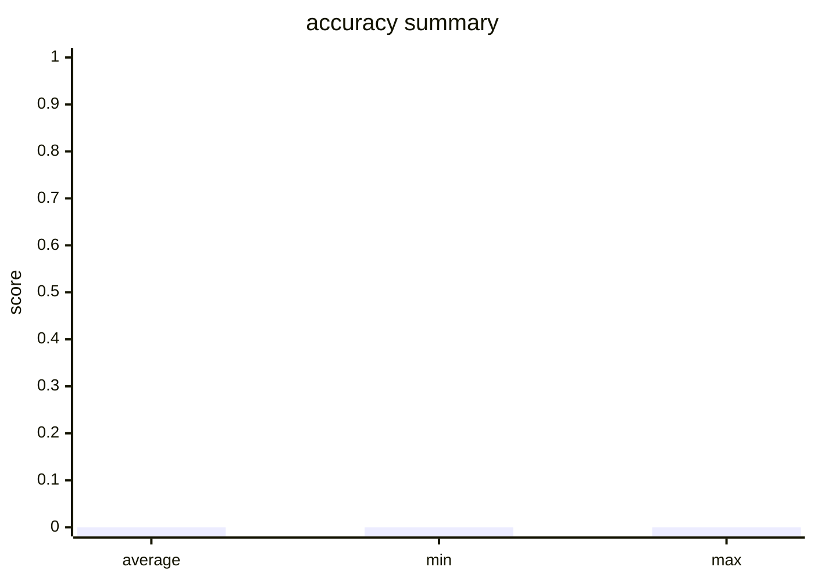

Running workflow...

Initializing dataset inlet...

Executing workflows for each question...

Initialized PoeClient with API key from env var 'POE_KEY'

Calling Poe API...

Calling Poe API...

Calling Poe API...

Calling Poe API...

Calling Poe API...

Calling Poe API...

Calling Poe API...

Calling Poe API...

All workflows executed. Starting evaluation...

=== Evaluation Results ===


=============== 📊 Evaluator: accuracy ===============

Average Score: 0.0000

Summary:

  - hit_count: 0

  - hit_rate: 0.0

==========================================


Evaluation Report Generated:
# Evaluation Report

- Total Evaluators: 1
- Total Samples: 2

## Evaluator: accuracy

- Metric: accuracy
- Total Samples: 2
- Average Score: 0.0000
- Min Score: 0.0000
- Max Score: 0.0000

### Summary

- hit_count: 0
- hit_rate: 0.0

### Score Distribution



### Details

**Sample 1** (Score: 0.0)
- **Question**: Question:  A 30-year-old woman, gravida 1, para 0, at 30 weeks' gestation is brought to the emergency department because of progressive upper abdominal pain for the past hour. The patient vomited once on her way to the hospital. She said she initially had dull, generalized stomach pain about 6 hours prior, but now the pain is located in the upper abdomen and is more severe. There is no personal or family history of any serious illnesses. She is sexually active with her husband. She does not smoke or drink alcohol. Medications include folic acid and a multivitamin. Her temperature is 38.5°C (101.3°F), pulse is 100/min, and blood pressure is 130/80 mm Hg. Physical examination shows right upper quadrant tenderness. The remainder of the examination shows no abnormalities. Laboratory studies show a leukocyte count of 12,000/mm3. Urinalysis shows mild pyuria. Which of the following is the most appropriate definitive treatment in the management of this patient? A. Appendectomy B. Cefoxitin and azithromycin C. Biliary drainage D. Intramuscular ceftriaxone followed by cephalexin E. Laparoscopic removal of ovarian cysts 
- **LLM Prediction**: {'answer': 'C', 'success': True}
- **Ground Truth**: {'answer': 'A'}

**Sample 2** (Score: 0.0)
- **Question**: Question:  A 34-year-old man comes to the physician for a follow-up examination. He has a 3-month history of a nonproductive cough. He has been treated with diphenhydramine since his last visit 2 weeks ago, but his symptoms have persisted. He does not smoke. He drinks 3 beers on the weekends. He is 177 cm (5 ft 10 in) tall and weighs 100 kg (220.46 lbs); BMI is 35.1 kg/m2. His temperature is 37.1°C (98.8°F), pulse is 78/min, respirations are 14/min, and blood pressure is 130/80 mm Hg. Pulse oximetry on room air shows an oxygen saturation of 97%. Physical examination and an x-ray of the chest show no abnormalities. Which of the following is the most appropriate next step in management? A. Azithromycin therapy B. Pulmonary function testing C. Omeprazole therapy D. Oral corticosteroid therapy E. CT scan of the chest 
- **LLM Prediction**: {'answer': 'C', 'success': True}
- **Ground Truth**: {'answer': 'B'}


Final evaluation report generated: evaluation_report.md


🌟🌟🌟🌟🌟🌟🌟🌟🌟🌟🌟🌟🌟🌟🌟🌟🌟🌟🌟🌟🌟🌟🌟🌟🌟🌟🌟🌟🌟🌟 WORKFLOW EXECUTION RECORDS 🌟🌟🌟🌟🌟🌟🌟🌟🌟🌟🌟🌟🌟🌟🌟🌟🌟🌟🌟🌟🌟🌟🌟🌟🌟🌟🌟🌟🌟🌟


🌀🌀🌀🌀🌀🌀🌀🌀🌀🌀🌀🌀🌀🌀🌀🌀🌀🌀🌀🌀 WORKFLOW '39f42ab3-e541-48fc-b6cc-718d213b2e51' BEGIN 🌀🌀🌀🌀🌀🌀🌀🌀🌀🌀🌀🌀🌀🌀🌀🌀🌀🌀🌀🌀


🔽🔽🔽🔽🔽🔽🔽🔽🔽🔽🔽🔽🔽🔽🔽🔽🔽🔽🔽🔽🔽🔽🔽🔽🔽🔽🔽🔽🔽🔽 NEW TASK 🔽🔽🔽🔽🔽🔽🔽🔽🔽🔽🔽🔽🔽🔽🔽🔽🔽🔽🔽🔽🔽🔽🔽🔽🔽🔽🔽🔽🔽🔽

🚀 Task ID: 0422ae27-09b0-45b3-ac98-8079b0856bc1  |  Type: [plain_text]

========================================================================


🟢🟢🟢🟢🟢🟢🟢🟢🟢🟢🟢🟢🟢🟢🟢🟢🟢🟢🟢🟢 TASK INPUT MESSAGES 🟢🟢🟢🟢🟢🟢🟢🟢🟢🟢🟢🟢🟢🟢🟢🟢🟢🟢🟢🟢


🔵🔵🔵🔵🔵🔵🔵🔵🔵🔵🔵🔵🔵🔵🔵🔵🔵🔵🔵🔵 TASK OUTPUT MESSAGES 🔵🔵🔵🔵🔵🔵🔵🔵🔵🔵🔵🔵🔵🔵🔵🔵🔵🔵🔵🔵

━━━━━━━━━━━━━━━━━━━━ [Output Message 1: USER] ━━━━━━━━━━━━━━━━━━━━
Question: 
A 30-year-old woman, gravida 1, para 0, at 30 weeks' gestation is brought to the emergency department because of progressive upper abdominal pain for the past hour. The patient vomited once on her way to the hospital. She said she initially had dull, generalized stomach pain about 6 hours prior, but now the pain is located in the upper abdomen and is more severe. There is no personal or family history of any serious illnesses. She is sexually active with her husband. She does not smoke or drink alcohol. Medications include folic acid and a multivitamin. Her temperature is 38.5°C (101.3°F), pulse is 100/min, and blood pressure is 130/80 mm Hg. Physical examination shows right upper quadrant tenderness. The remainder of the examination shows no abnormalities. Laboratory studies show a leukocyte count of 12,000/mm3. Urinalysis shows mild pyuria. Which of the following is the most appropriate definitive treatment in the management of this patient?
A. Appendectomy
B. Cefoxitin and azithromycin
C. Biliary drainage
D. Intramuscular ceftriaxone followed by cephalexin
E. Laparoscopic removal of ovarian cysts


🔼🔼🔼🔼🔼🔼🔼🔼🔼🔼🔼🔼🔼🔼🔼🔼🔼🔼🔼🔼🔼🔼🔼🔼🔼🔼🔼🔼🔼🔼 TASK END 🔼🔼🔼🔼🔼🔼🔼🔼🔼🔼🔼🔼🔼🔼🔼🔼🔼🔼🔼🔼🔼🔼🔼🔼🔼🔼🔼🔼🔼🔼


🔽🔽🔽🔽🔽🔽🔽🔽🔽🔽🔽🔽🔽🔽🔽🔽🔽🔽🔽🔽🔽🔽🔽🔽🔽🔽🔽🔽🔽🔽 NEW TASK 🔽🔽🔽🔽🔽🔽🔽🔽🔽🔽🔽🔽🔽🔽🔽🔽🔽🔽🔽🔽🔽🔽🔽🔽🔽🔽🔽🔽🔽🔽

🚀 Task ID: d9ff50a4-a138-44be-b0d5-c09bc3dca285  |  Type: [single_agent]

========================================================================


🟢🟢🟢🟢🟢🟢🟢🟢🟢🟢🟢🟢🟢🟢🟢🟢🟢🟢🟢🟢 TASK INPUT MESSAGES 🟢🟢🟢🟢🟢🟢🟢🟢🟢🟢🟢🟢🟢🟢🟢🟢🟢🟢🟢🟢

━━━━━━━━━━━━━━━━━━━━ [Input Message 1: USER] ━━━━━━━━━━━━━━━━━━━━
Question: 
A 30-year-old woman, gravida 1, para 0, at 30 weeks' gestation is brought to the emergency department because of progressive upper abdominal pain for the past hour. The patient vomited once on her way to the hospital. She said she initially had dull, generalized stomach pain about 6 hours prior, but now the pain is located in the upper abdomen and is more severe. There is no personal or family history of any serious illnesses. She is sexually active with her husband. She does not smoke or drink alcohol. Medications include folic acid and a multivitamin. Her temperature is 38.5°C (101.3°F), pulse is 100/min, and blood pressure is 130/80 mm Hg. Physical examination shows right upper quadrant tenderness. The remainder of the examination shows no abnormalities. Laboratory studies show a leukocyte count of 12,000/mm3. Urinalysis shows mild pyuria. Which of the following is the most appropriate definitive treatment in the management of this patient?
A. Appendectomy
B. Cefoxitin and azithromycin
C. Biliary drainage
D. Intramuscular ceftriaxone followed by cephalexin
E. Laparoscopic removal of ovarian cysts


━━━━━━━━━━━━━━━━━━━━ [Input Message 2: USER] ━━━━━━━━━━━━━━━━━━━━
You are the “Clue Representation” agent in a clinical reasoning workflow.Your job is not to answer the question directly, but to convert the input patient case (in form of medical question) into a structured clinical clue representation for downstream agents.You can find the input patient case in previous messages.


🔵🔵🔵🔵🔵🔵🔵🔵🔵🔵🔵🔵🔵🔵🔵🔵🔵🔵🔵🔵 TASK OUTPUT MESSAGES 🔵🔵🔵🔵🔵🔵🔵🔵🔵🔵🔵🔵🔵🔵🔵🔵🔵🔵🔵🔵

━━━━━━━━━━━━━━━━━━━━ [Output Message 1: USER] ━━━━━━━━━━━━━━━━━━━━
```yaml
patient:
  demographics:
    age: 30
    gravidity_parity: "G1P0"
    pregnancy_status: "30 weeks gestation"
  chief_complaint:
    - "progressive upper abdominal pain for 1 hour"
  history_of_present_illness:
    timeline:
      - time_ago: "6 hours prior"
        description: "dull, generalized stomach pain"
      - time_ago: "1 hour prior to ED"
        description: "pain localized to upper abdomen; more severe"
    associated_symptoms:
      - "vomited once en route"
    pain_characteristics:
      location: "upper abdomen"
      current_emphasis: "right upper quadrant (RUQ) tenderness on exam"
    infectious_illness_risks:
      - "mild pyuria on urinalysis (nonspecific)"
  past_history:
    personal_history: "no significant PMH"
    family_history: "no significant FHx"
  social_history:
    smoking: false
    alcohol: false
    drugs: "not reported"
  medications:
    - "folic acid"
    - "multivitamin"
  sexual_history:
    sexually_active: true
    partner: "husband"
  vitals:
    temperature_c: 38.5
    pulse_per_min: 100
    blood_pressure_mmHg: "130/80"
  exam:
    abdomen:
      - finding: "right upper quadrant tenderness"
    other_systems: "unremarkable"
  labs:
    leukocyte_count_per_mm3: 12000
    urinalysis:
      pyuria: "mild"
  differential_context_clues:
    - "Pregnant patient with RUQ tenderness, fever, leukocytosis, and acute worsening upper abdominal pain suggests hepatobiliary/infectious etiology over gynecologic or appendiceal causes."
    - "Pyuria may be incidental or suggest urinary tract involvement but primary localization is RUQ."
  answer_choices:
    A: "Appendectomy"
    B: "Cefoxitin and azithromycin"
    C: "Biliary drainage"
    D: "IM ceftriaxone followed by cephalexin"
    E: "Laparoscopic removal of ovarian cysts"
```


🔼🔼🔼🔼🔼🔼🔼🔼🔼🔼🔼🔼🔼🔼🔼🔼🔼🔼🔼🔼🔼🔼🔼🔼🔼🔼🔼🔼🔼🔼 TASK END 🔼🔼🔼🔼🔼🔼🔼🔼🔼🔼🔼🔼🔼🔼🔼🔼🔼🔼🔼🔼🔼🔼🔼🔼🔼🔼🔼🔼🔼🔼


🔽🔽🔽🔽🔽🔽🔽🔽🔽🔽🔽🔽🔽🔽🔽🔽🔽🔽🔽🔽🔽🔽🔽🔽🔽🔽🔽🔽🔽🔽 NEW TASK 🔽🔽🔽🔽🔽🔽🔽🔽🔽🔽🔽🔽🔽🔽🔽🔽🔽🔽🔽🔽🔽🔽🔽🔽🔽🔽🔽🔽🔽🔽

🚀 Task ID: 843d27a3-2e89-48ac-91c9-3c1e3e32188c  |  Type: [single_agent]

========================================================================


🟢🟢🟢🟢🟢🟢🟢🟢🟢🟢🟢🟢🟢🟢🟢🟢🟢🟢🟢🟢 TASK INPUT MESSAGES 🟢🟢🟢🟢🟢🟢🟢🟢🟢🟢🟢🟢🟢🟢🟢🟢🟢🟢🟢🟢

━━━━━━━━━━━━━━━━━━━━ [Input Message 1: USER] ━━━━━━━━━━━━━━━━━━━━
```yaml
patient:
  demographics:
    age: 30
    gravidity_parity: "G1P0"
    pregnancy_status: "30 weeks gestation"
  chief_complaint:
    - "progressive upper abdominal pain for 1 hour"
  history_of_present_illness:
    timeline:
      - time_ago: "6 hours prior"
        description: "dull, generalized stomach pain"
      - time_ago: "1 hour prior to ED"
        description: "pain localized to upper abdomen; more severe"
    associated_symptoms:
      - "vomited once en route"
    pain_characteristics:
      location: "upper abdomen"
      current_emphasis: "right upper quadrant (RUQ) tenderness on exam"
    infectious_illness_risks:
      - "mild pyuria on urinalysis (nonspecific)"
  past_history:
    personal_history: "no significant PMH"
    family_history: "no significant FHx"
  social_history:
    smoking: false
    alcohol: false
    drugs: "not reported"
  medications:
    - "folic acid"
    - "multivitamin"
  sexual_history:
    sexually_active: true
    partner: "husband"
  vitals:
    temperature_c: 38.5
    pulse_per_min: 100
    blood_pressure_mmHg: "130/80"
  exam:
    abdomen:
      - finding: "right upper quadrant tenderness"
    other_systems: "unremarkable"
  labs:
    leukocyte_count_per_mm3: 12000
    urinalysis:
      pyuria: "mild"
  differential_context_clues:
    - "Pregnant patient with RUQ tenderness, fever, leukocytosis, and acute worsening upper abdominal pain suggests hepatobiliary/infectious etiology over gynecologic or appendiceal causes."
    - "Pyuria may be incidental or suggest urinary tract involvement but primary localization is RUQ."
  answer_choices:
    A: "Appendectomy"
    B: "Cefoxitin and azithromycin"
    C: "Biliary drainage"
    D: "IM ceftriaxone followed by cephalexin"
    E: "Laparoscopic removal of ovarian cysts"
```

━━━━━━━━━━━━━━━━━━━━ [Input Message 2: USER] ━━━━━━━━━━━━━━━━━━━━
You are the “Hypothesis Generation” agent in a clinical reasoning workflow. Based on the previous Problem Representation result, you must propose 3–6 plausible diagnostic/mechanistic hypotheses and provide key supporting and contradicting evidence for each, producing a candidate list for downstream evaluation.
You can find the input patient case and Problem Representation result in previous messages


🔵🔵🔵🔵🔵🔵🔵🔵🔵🔵🔵🔵🔵🔵🔵🔵🔵🔵🔵🔵 TASK OUTPUT MESSAGES 🔵🔵🔵🔵🔵🔵🔵🔵🔵🔵🔵🔵🔵🔵🔵🔵🔵🔵🔵🔵

━━━━━━━━━━━━━━━━━━━━ [Output Message 1: USER] ━━━━━━━━━━━━━━━━━━━━
## Candidate diagnostic/mechanistic hypotheses (3–6)

### 1) **Acute cholecystitis (biliary infection/inflammation)**
**Why it fits (supporting evidence)**
- **RUQ tenderness** on exam with **acute localization/worsening** fits typical biliary colic progressing to inflammation.
- **Fever (38.5°C)** + **leukocytosis (WBC ~12,000)** supports an **infectious inflammatory** process.
- At **30 weeks gestation**, gallstone disease and cholecystitis risk is increased due to pregnancy-related biliary stasis.

**Why it might not fit (contradicting evidence / gaps)**
- No stated **Murphy sign**, **right-sided pain pattern to shoulder**, or **postprandial association**.
- No reported **LFT abnormalities** (AST/ALT/alk phos/bilirubin) or imaging findings (e.g., gallstones, wall thickening, pericholecystic fluid).
- “Vomited once en route” is nonspecific and could occur in many intra-abdominal etiologies.

---

### 2) **Ascending cholangitis**
**Why it fits (supporting evidence)**
- **Fever** + **leukocytosis** strongly support infection in the biliary tree.
- **RUQ pain** can be present.
- Mechanistically, ascending infection can occur if there is **biliary obstruction** (e.g., choledocholithiasis).

**Why it might not fit (contradicting evidence / gaps)**
- No reported **jaundice** or **dark urine/acholic stools**.
- No reported **cholestatic lab derangements** (elevated bilirubin/alk phos) or evidence of obstruction.
- Pain description is “upper abdomen” with RUQ emphasis, but there’s no “classic triad” documentation (Charcot triad).

---

### 3) **Pyelonephritis / upper urinary tract infection (pregnancy-associated)**
**Why it fits (supporting evidence)**
- **Fever (38.5°C)** and **mild pyuria** can indicate **UTI/pyelonephritis** in pregnancy.
- Abdominal pain can be present and may localize depending on individual anatomy.

**Why it might not fit (contradicting evidence / gaps)**
- Exam emphasis is **RUQ tenderness** rather than **CVA tenderness** (not mentioned).
- **Mild pyuria** is “nonspecific” in the representation; no mention of **bacteriuria, nitrites, or urine culture**.
- The differential clues explicitly state primary localization seems **RUQ/hepatobiliary**, not urinary.
- No dysuria, frequency, or flank pain reported (not necessarily absent, but missing).

---

### 4) **Eclampsia/HELLP or other pregnancy-related hypertensive liver disease**
**Why it fits (supporting evidence)**
- **Fever is not typical**, but severe **RUQ/epigastric pain** in pregnancy is a key red flag for **HELLP (Hemolysis, Elevated Liver enzymes, Low Platelets)** and related conditions.
- Pregnancy status (30 weeks) matches the gestational window where these disorders can occur.

**Why it might not fit (contradicting evidence / gaps)**
- Current vitals show **BP 130/80**, which is **not hypertensive** as documented.
- **Fever + leukocytosis** points more toward **infection** than a primary hematologic/hepatic syndrome.
- No mention of **headache/visual symptoms**, **edema**, **bleeding**, or **lab abnormalities** (platelets, AST/ALT, hemolysis markers).

---

### 5) **Acute appendicitis (atypical/shifted presentation)**
**Why it fits (supporting evidence)**
- Pregnancy can cause **atypical localization** of appendicitis pain, sometimes more **upper abdominal** than expected.
- **Fever** and **leukocytosis** are consistent with appendicitis.

**Why it might not fit (contradicting evidence / gaps)**
- Exam specifically notes **RUQ tenderness**, and the representation suggests hepatobiliary/infectious etiology over appendiceal causes.
- No mention of **periumbilical onset migrating** pattern, **guarding/rebound**, or **lower abdominal tenderness**.
- Vomiting can occur with appendicitis but is nonspecific.

---

### 6) **Septic thrombophlebitis / intra-abdominal infectious source with bacteremia (e.g., hepatic/splenic infection)**
**Why it fits (supporting evidence)**
- **Fever + leukocytosis** indicate systemic infection.
- RUQ pain could arise from **hepatic involvement** (e.g., hepatic abscess) or other upper abdominal infection.

**Why it might not fit (contradicting evidence / gaps)**
- No history suggesting predisposing factors (biliary obstruction, prior infection, liver disease) and no imaging/lab evidence provided.
- The case presentation more strongly resembles **acute localized RUQ process** without systemic shock or prolonged course.

---

## Summary candidate shortlist for downstream evaluation
1. **Acute cholecystitis**  
2. **Ascending cholangitis**  
3. **Pyelonephritis (upper UTI)**  
4. **HELLP/pregnancy-associated liver disease**  
5. **Atypical appendicitis**  
6. **Other upper-abdominal infectious focus (e.g., hepatic abscess) — lower probability given current data**

If you want, I can also map each hypothesis to the **most discriminating next data** (e.g., RUQ ultrasound findings, LFT pattern, urine culture/CVA tenderness, platelet count, BP trend).


🔼🔼🔼🔼🔼🔼🔼🔼🔼🔼🔼🔼🔼🔼🔼🔼🔼🔼🔼🔼🔼🔼🔼🔼🔼🔼🔼🔼🔼🔼 TASK END 🔼🔼🔼🔼🔼🔼🔼🔼🔼🔼🔼🔼🔼🔼🔼🔼🔼🔼🔼🔼🔼🔼🔼🔼🔼🔼🔼🔼🔼🔼


🔽🔽🔽🔽🔽🔽🔽🔽🔽🔽🔽🔽🔽🔽🔽🔽🔽🔽🔽🔽🔽🔽🔽🔽🔽🔽🔽🔽🔽🔽 NEW TASK 🔽🔽🔽🔽🔽🔽🔽🔽🔽🔽🔽🔽🔽🔽🔽🔽🔽🔽🔽🔽🔽🔽🔽🔽🔽🔽🔽🔽🔽🔽

🚀 Task ID: 0623ae7c-b6e2-46df-a454-607fae78d401  |  Type: [single_agent]

========================================================================


🟢🟢🟢🟢🟢🟢🟢🟢🟢🟢🟢🟢🟢🟢🟢🟢🟢🟢🟢🟢 TASK INPUT MESSAGES 🟢🟢🟢🟢🟢🟢🟢🟢🟢🟢🟢🟢🟢🟢🟢🟢🟢🟢🟢🟢

━━━━━━━━━━━━━━━━━━━━ [Input Message 1: USER] ━━━━━━━━━━━━━━━━━━━━
```yaml
patient:
  demographics:
    age: 30
    gravidity_parity: "G1P0"
    pregnancy_status: "30 weeks gestation"
  chief_complaint:
    - "progressive upper abdominal pain for 1 hour"
  history_of_present_illness:
    timeline:
      - time_ago: "6 hours prior"
        description: "dull, generalized stomach pain"
      - time_ago: "1 hour prior to ED"
        description: "pain localized to upper abdomen; more severe"
    associated_symptoms:
      - "vomited once en route"
    pain_characteristics:
      location: "upper abdomen"
      current_emphasis: "right upper quadrant (RUQ) tenderness on exam"
    infectious_illness_risks:
      - "mild pyuria on urinalysis (nonspecific)"
  past_history:
    personal_history: "no significant PMH"
    family_history: "no significant FHx"
  social_history:
    smoking: false
    alcohol: false
    drugs: "not reported"
  medications:
    - "folic acid"
    - "multivitamin"
  sexual_history:
    sexually_active: true
    partner: "husband"
  vitals:
    temperature_c: 38.5
    pulse_per_min: 100
    blood_pressure_mmHg: "130/80"
  exam:
    abdomen:
      - finding: "right upper quadrant tenderness"
    other_systems: "unremarkable"
  labs:
    leukocyte_count_per_mm3: 12000
    urinalysis:
      pyuria: "mild"
  differential_context_clues:
    - "Pregnant patient with RUQ tenderness, fever, leukocytosis, and acute worsening upper abdominal pain suggests hepatobiliary/infectious etiology over gynecologic or appendiceal causes."
    - "Pyuria may be incidental or suggest urinary tract involvement but primary localization is RUQ."
  answer_choices:
    A: "Appendectomy"
    B: "Cefoxitin and azithromycin"
    C: "Biliary drainage"
    D: "IM ceftriaxone followed by cephalexin"
    E: "Laparoscopic removal of ovarian cysts"
```

━━━━━━━━━━━━━━━━━━━━ [Input Message 2: USER] ━━━━━━━━━━━━━━━━━━━━
## Candidate diagnostic/mechanistic hypotheses (3–6)

### 1) **Acute cholecystitis (biliary infection/inflammation)**
**Why it fits (supporting evidence)**
- **RUQ tenderness** on exam with **acute localization/worsening** fits typical biliary colic progressing to inflammation.
- **Fever (38.5°C)** + **leukocytosis (WBC ~12,000)** supports an **infectious inflammatory** process.
- At **30 weeks gestation**, gallstone disease and cholecystitis risk is increased due to pregnancy-related biliary stasis.

**Why it might not fit (contradicting evidence / gaps)**
- No stated **Murphy sign**, **right-sided pain pattern to shoulder**, or **postprandial association**.
- No reported **LFT abnormalities** (AST/ALT/alk phos/bilirubin) or imaging findings (e.g., gallstones, wall thickening, pericholecystic fluid).
- “Vomited once en route” is nonspecific and could occur in many intra-abdominal etiologies.

---

### 2) **Ascending cholangitis**
**Why it fits (supporting evidence)**
- **Fever** + **leukocytosis** strongly support infection in the biliary tree.
- **RUQ pain** can be present.
- Mechanistically, ascending infection can occur if there is **biliary obstruction** (e.g., choledocholithiasis).

**Why it might not fit (contradicting evidence / gaps)**
- No reported **jaundice** or **dark urine/acholic stools**.
- No reported **cholestatic lab derangements** (elevated bilirubin/alk phos) or evidence of obstruction.
- Pain description is “upper abdomen” with RUQ emphasis, but there’s no “classic triad” documentation (Charcot triad).

---

### 3) **Pyelonephritis / upper urinary tract infection (pregnancy-associated)**
**Why it fits (supporting evidence)**
- **Fever (38.5°C)** and **mild pyuria** can indicate **UTI/pyelonephritis** in pregnancy.
- Abdominal pain can be present and may localize depending on individual anatomy.

**Why it might not fit (contradicting evidence / gaps)**
- Exam emphasis is **RUQ tenderness** rather than **CVA tenderness** (not mentioned).
- **Mild pyuria** is “nonspecific” in the representation; no mention of **bacteriuria, nitrites, or urine culture**.
- The differential clues explicitly state primary localization seems **RUQ/hepatobiliary**, not urinary.
- No dysuria, frequency, or flank pain reported (not necessarily absent, but missing).

---

### 4) **Eclampsia/HELLP or other pregnancy-related hypertensive liver disease**
**Why it fits (supporting evidence)**
- **Fever is not typical**, but severe **RUQ/epigastric pain** in pregnancy is a key red flag for **HELLP (Hemolysis, Elevated Liver enzymes, Low Platelets)** and related conditions.
- Pregnancy status (30 weeks) matches the gestational window where these disorders can occur.

**Why it might not fit (contradicting evidence / gaps)**
- Current vitals show **BP 130/80**, which is **not hypertensive** as documented.
- **Fever + leukocytosis** points more toward **infection** than a primary hematologic/hepatic syndrome.
- No mention of **headache/visual symptoms**, **edema**, **bleeding**, or **lab abnormalities** (platelets, AST/ALT, hemolysis markers).

---

### 5) **Acute appendicitis (atypical/shifted presentation)**
**Why it fits (supporting evidence)**
- Pregnancy can cause **atypical localization** of appendicitis pain, sometimes more **upper abdominal** than expected.
- **Fever** and **leukocytosis** are consistent with appendicitis.

**Why it might not fit (contradicting evidence / gaps)**
- Exam specifically notes **RUQ tenderness**, and the representation suggests hepatobiliary/infectious etiology over appendiceal causes.
- No mention of **periumbilical onset migrating** pattern, **guarding/rebound**, or **lower abdominal tenderness**.
- Vomiting can occur with appendicitis but is nonspecific.

---

### 6) **Septic thrombophlebitis / intra-abdominal infectious source with bacteremia (e.g., hepatic/splenic infection)**
**Why it fits (supporting evidence)**
- **Fever + leukocytosis** indicate systemic infection.
- RUQ pain could arise from **hepatic involvement** (e.g., hepatic abscess) or other upper abdominal infection.

**Why it might not fit (contradicting evidence / gaps)**
- No history suggesting predisposing factors (biliary obstruction, prior infection, liver disease) and no imaging/lab evidence provided.
- The case presentation more strongly resembles **acute localized RUQ process** without systemic shock or prolonged course.

---

## Summary candidate shortlist for downstream evaluation
1. **Acute cholecystitis**  
2. **Ascending cholangitis**  
3. **Pyelonephritis (upper UTI)**  
4. **HELLP/pregnancy-associated liver disease**  
5. **Atypical appendicitis**  
6. **Other upper-abdominal infectious focus (e.g., hepatic abscess) — lower probability given current data**

If you want, I can also map each hypothesis to the **most discriminating next data** (e.g., RUQ ultrasound findings, LFT pattern, urine culture/CVA tenderness, platelet count, BP trend).

━━━━━━━━━━━━━━━━━━━━ [Input Message 3: USER] ━━━━━━━━━━━━━━━━━━━━
You are the “Hypothesis Evaluation” agent in a clinical reasoning workflow. Your job is to compare and evaluate the candidate hypotheses and map them to the provided answer options, then select the final best answer. Make sure that the final answer you output strictly follows the provided answer options text. You can find the Problem Representation result and Hypothesis Generation result in previous messages.


🔵🔵🔵🔵🔵🔵🔵🔵🔵🔵🔵🔵🔵🔵🔵🔵🔵🔵🔵🔵 TASK OUTPUT MESSAGES 🔵🔵🔵🔵🔵🔵🔵🔵🔵🔵🔵🔵🔵🔵🔵🔵🔵🔵🔵🔵

━━━━━━━━━━━━━━━━━━━━ [Output Message 1: USER] ━━━━━━━━━━━━━━━━━━━━
## Hypothesis evaluation → map to answer choices

### 1) **Acute cholecystitis** (RUQ pain + fever + leukocytosis in pregnancy)
- **Key match to the stem:** RUQ tenderness, acute worsening, fever, leukocytosis.
- **What the answer options imply:**  
  - **C (Biliary drainage)** is the closest procedural action aimed at biliary source control **when infection is driven by obstruction** (often used/required in severe biliary infection/complications).  
  - **D (IM ceftriaxone followed by cephalexin)** is **antibiotics**, but it’s not specific enough for biliary source control and doesn’t address likely biliary obstruction if present.
  - **B (Cefoxitin and azithromycin)** is an antibiotic regimen, but again not biliary-specific source control.

**Best mapping from this hypothesis:** **C** (if we assume biliary infection with an obstructive/infected system needing drainage).

---

### 2) **Ascending cholangitis** (fever + leukocytosis + RUQ pain; obstruction-related infection)
- **Key match to the stem:** fever + leukocytosis strongly suggest **biliary infection**; RUQ pain supports hepatobiliary origin.
- **What’s missing:** jaundice/Charcot triad components are not mentioned, but the stem’s overall “hepatobiliary/infectious etiology” clue and RUQ localization still keep this high.
- **What the answer options imply:**  
  - **C (Biliary drainage)** is the **definitive management** concept for cholangitis (typically ERCP drainage + antibiotics).
  - Antibiotic-only choices (**B** or **D**) are incomplete if drainage is required.

**Best mapping from this hypothesis:** **C**.

---

### 3) **Pyelonephritis / upper UTI** (fever + mild pyuria)
- **Key match:** fever + mild pyuria can occur in pregnancy.
- **Contradictions:** exam emphasizes **RUQ tenderness** and the differential context says primary localization seems **hepatobiliary**.
- **Options:** antibiotic choices (**D** or **B**) could fit a UTI, but the stem’s localization (RUQ) makes this less likely as the primary diagnosis.

**Mapping:** weak/less preferred than biliary options.

---

### 4) **HELLP / hypertensive liver disease**
- **Contradictions:** BP is **130/80** (not hypertensive as documented) and fever/leukocytosis favor infection over a primary HELLP/hematologic syndrome.
- **Options:** none directly match HELLP management.

**Mapping:** none.

---

### 5) **Atypical appendicitis**
- **Contradictions:** RUQ tenderness and stem’s explicit hepatobiliary localization clue.
- **Options:** **A (Appendectomy)** would be correct if appendicitis were most likely, but it’s not the best fit given the hepatobiliary pattern.

**Mapping:** unlikely.

---

### 6) **Other upper abdominal infection (e.g., hepatic abscess)**
- Possible with fever/leukocytosis, but the stem’s **RUQ tenderness** is already maximally consistent with hepatobiliary disease; additionally, the provided answer options that align with a targeted infected-hepatobiliary source procedure is **biliary drainage** (**C**).  

**Mapping:** **C** still best among provided choices.

---

## Final best answer
**C: Biliary drainage**


🔼🔼🔼🔼🔼🔼🔼🔼🔼🔼🔼🔼🔼🔼🔼🔼🔼🔼🔼🔼🔼🔼🔼🔼🔼🔼🔼🔼🔼🔼 TASK END 🔼🔼🔼🔼🔼🔼🔼🔼🔼🔼🔼🔼🔼🔼🔼🔼🔼🔼🔼🔼🔼🔼🔼🔼🔼🔼🔼🔼🔼🔼


🔽🔽🔽🔽🔽🔽🔽🔽🔽🔽🔽🔽🔽🔽🔽🔽🔽🔽🔽🔽🔽🔽🔽🔽🔽🔽🔽🔽🔽🔽 NEW TASK 🔽🔽🔽🔽🔽🔽🔽🔽🔽🔽🔽🔽🔽🔽🔽🔽🔽🔽🔽🔽🔽🔽🔽🔽🔽🔽🔽🔽🔽🔽

🚀 Task ID: 8ccadee2-7aed-49d9-9619-d8d257fb3f38  |  Type: [smart_extractor]

========================================================================


🟢🟢🟢🟢🟢🟢🟢🟢🟢🟢🟢🟢🟢🟢🟢🟢🟢🟢🟢🟢 TASK INPUT MESSAGES 🟢🟢🟢🟢🟢🟢🟢🟢🟢🟢🟢🟢🟢🟢🟢🟢🟢🟢🟢🟢

━━━━━━━━━━━━━━━━━━━━ [Input Message 1: USER] ━━━━━━━━━━━━━━━━━━━━
Question: 
A 30-year-old woman, gravida 1, para 0, at 30 weeks' gestation is brought to the emergency department because of progressive upper abdominal pain for the past hour. The patient vomited once on her way to the hospital. She said she initially had dull, generalized stomach pain about 6 hours prior, but now the pain is located in the upper abdomen and is more severe. There is no personal or family history of any serious illnesses. She is sexually active with her husband. She does not smoke or drink alcohol. Medications include folic acid and a multivitamin. Her temperature is 38.5°C (101.3°F), pulse is 100/min, and blood pressure is 130/80 mm Hg. Physical examination shows right upper quadrant tenderness. The remainder of the examination shows no abnormalities. Laboratory studies show a leukocyte count of 12,000/mm3. Urinalysis shows mild pyuria. Which of the following is the most appropriate definitive treatment in the management of this patient?
A. Appendectomy
B. Cefoxitin and azithromycin
C. Biliary drainage
D. Intramuscular ceftriaxone followed by cephalexin
E. Laparoscopic removal of ovarian cysts


━━━━━━━━━━━━━━━━━━━━ [Input Message 2: USER] ━━━━━━━━━━━━━━━━━━━━
## Hypothesis evaluation → map to answer choices

### 1) **Acute cholecystitis** (RUQ pain + fever + leukocytosis in pregnancy)
- **Key match to the stem:** RUQ tenderness, acute worsening, fever, leukocytosis.
- **What the answer options imply:**  
  - **C (Biliary drainage)** is the closest procedural action aimed at biliary source control **when infection is driven by obstruction** (often used/required in severe biliary infection/complications).  
  - **D (IM ceftriaxone followed by cephalexin)** is **antibiotics**, but it’s not specific enough for biliary source control and doesn’t address likely biliary obstruction if present.
  - **B (Cefoxitin and azithromycin)** is an antibiotic regimen, but again not biliary-specific source control.

**Best mapping from this hypothesis:** **C** (if we assume biliary infection with an obstructive/infected system needing drainage).

---

### 2) **Ascending cholangitis** (fever + leukocytosis + RUQ pain; obstruction-related infection)
- **Key match to the stem:** fever + leukocytosis strongly suggest **biliary infection**; RUQ pain supports hepatobiliary origin.
- **What’s missing:** jaundice/Charcot triad components are not mentioned, but the stem’s overall “hepatobiliary/infectious etiology” clue and RUQ localization still keep this high.
- **What the answer options imply:**  
  - **C (Biliary drainage)** is the **definitive management** concept for cholangitis (typically ERCP drainage + antibiotics).
  - Antibiotic-only choices (**B** or **D**) are incomplete if drainage is required.

**Best mapping from this hypothesis:** **C**.

---

### 3) **Pyelonephritis / upper UTI** (fever + mild pyuria)
- **Key match:** fever + mild pyuria can occur in pregnancy.
- **Contradictions:** exam emphasizes **RUQ tenderness** and the differential context says primary localization seems **hepatobiliary**.
- **Options:** antibiotic choices (**D** or **B**) could fit a UTI, but the stem’s localization (RUQ) makes this less likely as the primary diagnosis.

**Mapping:** weak/less preferred than biliary options.

---

### 4) **HELLP / hypertensive liver disease**
- **Contradictions:** BP is **130/80** (not hypertensive as documented) and fever/leukocytosis favor infection over a primary HELLP/hematologic syndrome.
- **Options:** none directly match HELLP management.

**Mapping:** none.

---

### 5) **Atypical appendicitis**
- **Contradictions:** RUQ tenderness and stem’s explicit hepatobiliary localization clue.
- **Options:** **A (Appendectomy)** would be correct if appendicitis were most likely, but it’s not the best fit given the hepatobiliary pattern.

**Mapping:** unlikely.

---

### 6) **Other upper abdominal infection (e.g., hepatic abscess)**
- Possible with fever/leukocytosis, but the stem’s **RUQ tenderness** is already maximally consistent with hepatobiliary disease; additionally, the provided answer options that align with a targeted infected-hepatobiliary source procedure is **biliary drainage** (**C**).  

**Mapping:** **C** still best among provided choices.

---

## Final best answer
**C: Biliary drainage**

━━━━━━━━━━━━━━━━━━━━ [Input Message 3: USER] ━━━━━━━━━━━━━━━━━━━━
Extract the final answer from the previous assistant response.Output ONLY valid JSON without markdown and without additional text.
Expected JSON schema:
{
  "answer": "<The exact option letter/index of the final answer, e.g. 'A' or '1'>"
}


🔵🔵🔵🔵🔵🔵🔵🔵🔵🔵🔵🔵🔵🔵🔵🔵🔵🔵🔵🔵 TASK OUTPUT MESSAGES 🔵🔵🔵🔵🔵🔵🔵🔵🔵🔵🔵🔵🔵🔵🔵🔵🔵🔵🔵🔵

━━━━━━━━━━━━━━━━━━━━ [Output Message 1: USER] ━━━━━━━━━━━━━━━━━━━━
{"answer":"C"}


🔼🔼🔼🔼🔼🔼🔼🔼🔼🔼🔼🔼🔼🔼🔼🔼🔼🔼🔼🔼🔼🔼🔼🔼🔼🔼🔼🔼🔼🔼 TASK END 🔼🔼🔼🔼🔼🔼🔼🔼🔼🔼🔼🔼🔼🔼🔼🔼🔼🔼🔼🔼🔼🔼🔼🔼🔼🔼🔼🔼🔼🔼


🛑🛑🛑🛑🛑🛑🛑🛑🛑🛑🛑🛑🛑🛑🛑🛑🛑🛑🛑🛑 WORKFLOW '39f42ab3-e541-48fc-b6cc-718d213b2e51' END 🛑🛑🛑🛑🛑🛑🛑🛑🛑🛑🛑🛑🛑🛑🛑🛑🛑🛑🛑🛑


🌀🌀🌀🌀🌀🌀🌀🌀🌀🌀🌀🌀🌀🌀🌀🌀🌀🌀🌀🌀 WORKFLOW '39f42ab3-e541-48fc-b6cc-718d213b2e51' BEGIN 🌀🌀🌀🌀🌀🌀🌀🌀🌀🌀🌀🌀🌀🌀🌀🌀🌀🌀🌀🌀


🔽🔽🔽🔽🔽🔽🔽🔽🔽🔽🔽🔽🔽🔽🔽🔽🔽🔽🔽🔽🔽🔽🔽🔽🔽🔽🔽🔽🔽🔽 NEW TASK 🔽🔽🔽🔽🔽🔽🔽🔽🔽🔽🔽🔽🔽🔽🔽🔽🔽🔽🔽🔽🔽🔽🔽🔽🔽🔽🔽🔽🔽🔽

🚀 Task ID: 5a4f8066-8327-4858-803a-98005ac3de3f  |  Type: [plain_text]

========================================================================


🟢🟢🟢🟢🟢🟢🟢🟢🟢🟢🟢🟢🟢🟢🟢🟢🟢🟢🟢🟢 TASK INPUT MESSAGES 🟢🟢🟢🟢🟢🟢🟢🟢🟢🟢🟢🟢🟢🟢🟢🟢🟢🟢🟢🟢


🔵🔵🔵🔵🔵🔵🔵🔵🔵🔵🔵🔵🔵🔵🔵🔵🔵🔵🔵🔵 TASK OUTPUT MESSAGES 🔵🔵🔵🔵🔵🔵🔵🔵🔵🔵🔵🔵🔵🔵🔵🔵🔵🔵🔵🔵

━━━━━━━━━━━━━━━━━━━━ [Output Message 1: USER] ━━━━━━━━━━━━━━━━━━━━
Question: 
A 34-year-old man comes to the physician for a follow-up examination. He has a 3-month history of a nonproductive cough. He has been treated with diphenhydramine since his last visit 2 weeks ago, but his symptoms have persisted. He does not smoke. He drinks 3 beers on the weekends. He is 177 cm (5 ft 10 in) tall and weighs 100 kg (220.46 lbs); BMI is 35.1 kg/m2. His temperature is 37.1°C (98.8°F), pulse is 78/min, respirations are 14/min, and blood pressure is 130/80 mm Hg. Pulse oximetry on room air shows an oxygen saturation of 97%. Physical examination and an x-ray of the chest show no abnormalities. Which of the following is the most appropriate next step in management?
A. Azithromycin therapy
B. Pulmonary function testing
C. Omeprazole therapy
D. Oral corticosteroid therapy
E. CT scan of the chest


🔼🔼🔼🔼🔼🔼🔼🔼🔼🔼🔼🔼🔼🔼🔼🔼🔼🔼🔼🔼🔼🔼🔼🔼🔼🔼🔼🔼🔼🔼 TASK END 🔼🔼🔼🔼🔼🔼🔼🔼🔼🔼🔼🔼🔼🔼🔼🔼🔼🔼🔼🔼🔼🔼🔼🔼🔼🔼🔼🔼🔼🔼


🔽🔽🔽🔽🔽🔽🔽🔽🔽🔽🔽🔽🔽🔽🔽🔽🔽🔽🔽🔽🔽🔽🔽🔽🔽🔽🔽🔽🔽🔽 NEW TASK 🔽🔽🔽🔽🔽🔽🔽🔽🔽🔽🔽🔽🔽🔽🔽🔽🔽🔽🔽🔽🔽🔽🔽🔽🔽🔽🔽🔽🔽🔽

🚀 Task ID: d9ff50a4-a138-44be-b0d5-c09bc3dca285  |  Type: [single_agent]

========================================================================


🟢🟢🟢🟢🟢🟢🟢🟢🟢🟢🟢🟢🟢🟢🟢🟢🟢🟢🟢🟢 TASK INPUT MESSAGES 🟢🟢🟢🟢🟢🟢🟢🟢🟢🟢🟢🟢🟢🟢🟢🟢🟢🟢🟢🟢

━━━━━━━━━━━━━━━━━━━━ [Input Message 1: USER] ━━━━━━━━━━━━━━━━━━━━
Question: 
A 34-year-old man comes to the physician for a follow-up examination. He has a 3-month history of a nonproductive cough. He has been treated with diphenhydramine since his last visit 2 weeks ago, but his symptoms have persisted. He does not smoke. He drinks 3 beers on the weekends. He is 177 cm (5 ft 10 in) tall and weighs 100 kg (220.46 lbs); BMI is 35.1 kg/m2. His temperature is 37.1°C (98.8°F), pulse is 78/min, respirations are 14/min, and blood pressure is 130/80 mm Hg. Pulse oximetry on room air shows an oxygen saturation of 97%. Physical examination and an x-ray of the chest show no abnormalities. Which of the following is the most appropriate next step in management?
A. Azithromycin therapy
B. Pulmonary function testing
C. Omeprazole therapy
D. Oral corticosteroid therapy
E. CT scan of the chest


━━━━━━━━━━━━━━━━━━━━ [Input Message 2: USER] ━━━━━━━━━━━━━━━━━━━━
You are the “Clue Representation” agent in a clinical reasoning workflow.Your job is not to answer the question directly, but to convert the input patient case (in form of medical question) into a structured clinical clue representation for downstream agents.You can find the input patient case in previous messages.


🔵🔵🔵🔵🔵🔵🔵🔵🔵🔵🔵🔵🔵🔵🔵🔵🔵🔵🔵🔵 TASK OUTPUT MESSAGES 🔵🔵🔵🔵🔵🔵🔵🔵🔵🔵🔵🔵🔵🔵🔵🔵🔵🔵🔵🔵

━━━━━━━━━━━━━━━━━━━━ [Output Message 1: USER] ━━━━━━━━━━━━━━━━━━━━
## Structured Clinical Clue Representation

### Patient Context
- **Age/Sex:** 34-year-old man  
- **Chief concern:** Persistent **nonproductive (dry) cough**  
- **Duration:** **3 months** (subacute → chronic range depending on cutoff; here treated as chronic)
- **Tobacco/Exposure:** **Does not smoke**
- **Alcohol:** ~**3 beers on weekends**
- **BMI:** **35.1 kg/m²** (obesity)

### Symptom Details
- **Cough type:** **Nonproductive**
- **Response to initial therapy:** Treated with **diphenhydramine** since last visit (**2 weeks prior**), but **symptoms persist**
- **Associated symptoms:** *Not provided* (no fever, no dyspnea, no wheeze, etc. mentioned)

### Vitals & Objective Findings
- **Temperature:** 37.1°C (afebrile)
- **Oxygen saturation (room air):** **97%**
- **Pulse / RR:** 78/min, 14/min
- **Blood pressure:** 130/80 mm Hg
- **Physical exam:** **Normal**
- **Chest X-ray:** **Normal / no abnormalities**
- **Key negatives:** No documented abnormal lung exam; no systemic illness suggested; no abnormal imaging

### Clinical Reasoning Hooks (for downstream agents)
- **Chronic dry cough + normal CXR + normal exam**
- **Obesity present** → increased likelihood of **GERD / laryngopharyngeal reflux** among other causes
- **Diphenhydramine trial unsuccessful** → suggests antihistamine alone did not resolve (may argue against obvious postnasal drip/allergic rhinitis as sole cause, but not definitive)
- **Most appropriate next step likely requires evaluation of common chronic cough etiologies after normal CXR**, and/or empiric therapy targeting GERD vs further diagnostic testing.

### Answer Options (encoded)
- **A.** Azithromycin therapy  
- **B.** Pulmonary function testing  
- **C.** Omeprazole therapy  
- **D.** Oral corticosteroid therapy  
- **E.** CT scan of the chest  

### Notable Missing Data (may matter)
- No history given for:
  - **Heartburn/regurgitation**, sour taste, hoarseness (GERD clues)
  - **Rhinitis/sneezing/postnasal drip** (upper airway cough syndrome)
  - **Wheezing/exercise-induced symptoms** (asthma/cough-variant asthma)
  - **ACE inhibitor use** (medication-induced cough)
  - Environmental exposures
- No medication list besides diphenhydramine.
- No spirometry data yet.

**Clue Summary Tag:** *Chronic nonproductive cough (~3 months), normal CXR/exam, no smoking, afebrile, diphenhydramine ineffective; obesity present; consider next-step evaluation/empiric therapy among chronic cough causes; options include PFT vs GERD therapy vs CT vs antibiotics vs steroids.*


🔼🔼🔼🔼🔼🔼🔼🔼🔼🔼🔼🔼🔼🔼🔼🔼🔼🔼🔼🔼🔼🔼🔼🔼🔼🔼🔼🔼🔼🔼 TASK END 🔼🔼🔼🔼🔼🔼🔼🔼🔼🔼🔼🔼🔼🔼🔼🔼🔼🔼🔼🔼🔼🔼🔼🔼🔼🔼🔼🔼🔼🔼


🔽🔽🔽🔽🔽🔽🔽🔽🔽🔽🔽🔽🔽🔽🔽🔽🔽🔽🔽🔽🔽🔽🔽🔽🔽🔽🔽🔽🔽🔽 NEW TASK 🔽🔽🔽🔽🔽🔽🔽🔽🔽🔽🔽🔽🔽🔽🔽🔽🔽🔽🔽🔽🔽🔽🔽🔽🔽🔽🔽🔽🔽🔽

🚀 Task ID: 843d27a3-2e89-48ac-91c9-3c1e3e32188c  |  Type: [single_agent]

========================================================================


🟢🟢🟢🟢🟢🟢🟢🟢🟢🟢🟢🟢🟢🟢🟢🟢🟢🟢🟢🟢 TASK INPUT MESSAGES 🟢🟢🟢🟢🟢🟢🟢🟢🟢🟢🟢🟢🟢🟢🟢🟢🟢🟢🟢🟢

━━━━━━━━━━━━━━━━━━━━ [Input Message 1: USER] ━━━━━━━━━━━━━━━━━━━━
## Structured Clinical Clue Representation

### Patient Context
- **Age/Sex:** 34-year-old man  
- **Chief concern:** Persistent **nonproductive (dry) cough**  
- **Duration:** **3 months** (subacute → chronic range depending on cutoff; here treated as chronic)
- **Tobacco/Exposure:** **Does not smoke**
- **Alcohol:** ~**3 beers on weekends**
- **BMI:** **35.1 kg/m²** (obesity)

### Symptom Details
- **Cough type:** **Nonproductive**
- **Response to initial therapy:** Treated with **diphenhydramine** since last visit (**2 weeks prior**), but **symptoms persist**
- **Associated symptoms:** *Not provided* (no fever, no dyspnea, no wheeze, etc. mentioned)

### Vitals & Objective Findings
- **Temperature:** 37.1°C (afebrile)
- **Oxygen saturation (room air):** **97%**
- **Pulse / RR:** 78/min, 14/min
- **Blood pressure:** 130/80 mm Hg
- **Physical exam:** **Normal**
- **Chest X-ray:** **Normal / no abnormalities**
- **Key negatives:** No documented abnormal lung exam; no systemic illness suggested; no abnormal imaging

### Clinical Reasoning Hooks (for downstream agents)
- **Chronic dry cough + normal CXR + normal exam**
- **Obesity present** → increased likelihood of **GERD / laryngopharyngeal reflux** among other causes
- **Diphenhydramine trial unsuccessful** → suggests antihistamine alone did not resolve (may argue against obvious postnasal drip/allergic rhinitis as sole cause, but not definitive)
- **Most appropriate next step likely requires evaluation of common chronic cough etiologies after normal CXR**, and/or empiric therapy targeting GERD vs further diagnostic testing.

### Answer Options (encoded)
- **A.** Azithromycin therapy  
- **B.** Pulmonary function testing  
- **C.** Omeprazole therapy  
- **D.** Oral corticosteroid therapy  
- **E.** CT scan of the chest  

### Notable Missing Data (may matter)
- No history given for:
  - **Heartburn/regurgitation**, sour taste, hoarseness (GERD clues)
  - **Rhinitis/sneezing/postnasal drip** (upper airway cough syndrome)
  - **Wheezing/exercise-induced symptoms** (asthma/cough-variant asthma)
  - **ACE inhibitor use** (medication-induced cough)
  - Environmental exposures
- No medication list besides diphenhydramine.
- No spirometry data yet.

**Clue Summary Tag:** *Chronic nonproductive cough (~3 months), normal CXR/exam, no smoking, afebrile, diphenhydramine ineffective; obesity present; consider next-step evaluation/empiric therapy among chronic cough causes; options include PFT vs GERD therapy vs CT vs antibiotics vs steroids.*

━━━━━━━━━━━━━━━━━━━━ [Input Message 2: USER] ━━━━━━━━━━━━━━━━━━━━
You are the “Hypothesis Generation” agent in a clinical reasoning workflow. Based on the previous Problem Representation result, you must propose 3–6 plausible diagnostic/mechanistic hypotheses and provide key supporting and contradicting evidence for each, producing a candidate list for downstream evaluation.
You can find the input patient case and Problem Representation result in previous messages


🔵🔵🔵🔵🔵🔵🔵🔵🔵🔵🔵🔵🔵🔵🔵🔵🔵🔵🔵🔵 TASK OUTPUT MESSAGES 🔵🔵🔵🔵🔵🔵🔵🔵🔵🔵🔵🔵🔵🔵🔵🔵🔵🔵🔵🔵

━━━━━━━━━━━━━━━━━━━━ [Output Message 1: USER] ━━━━━━━━━━━━━━━━━━━━
## Candidate Diagnostic / Mechanistic Hypotheses (3–6)

### 1) Gastroesophageal reflux disease (GERD) / laryngopharyngeal reflux (LPR)–related chronic cough
**Supporting evidence**
- **Obesity (BMI 35.1)** increases risk of reflux due to higher intra-abdominal pressure and may promote GERD/LPR.
- **Chronic dry cough (3 months)** with **normal CXR** and **normal exam** fits the common pattern of reflux-related cough.
- **No smoking** and **afebrile** with normal vitals reduce likelihood of infection or malignancy.
- Lack of response to **diphenhydramine** doesn’t exclude reflux (antihistamine targets allergic/postnasal etiologies).

**Contradicting evidence / missing data**
- No reported **heartburn, regurgitation, sour taste**, or **hoarseness**—key reflux symptom clues are absent.
- No description of cough timing (e.g., **after meals, when supine, at night**) or response to prior acid suppression (none mentioned).
- Reflux is a “common” cause, but absence of classic symptoms lowers pre-test probability.

---

### 2) Upper airway cough syndrome (UACS) from rhinitis/postnasal drip (including allergic rhinitis or nonallergic rhinitis)
**Supporting evidence**
- **Chronic cough with normal CXR** is compatible with UACS, a leading cause of chronic cough.
- The fact that an **antihistamine trial occurred** (diphenhydramine) suggests the clinician considered a **histamine-mediated** or postnasal process initially.

**Contradicting evidence / missing data**
- The case provides **no rhinitis symptoms** (no sneezing, rhinorrhea, nasal congestion) and no mention of **postnasal drip** or throat clearing.
- **Diphenhydramine “trial unsuccessful”** argues against a straightforward allergic rhinitis response (though diphenhydramine is not the most effective first-line strategy for rhinitis compared with **intranasal corticosteroids** and/or **second-generation antihistamines**).
- If diphenhydramine was the only intervention and there were no nasal complaints, UACS becomes less certain.

---

### 3) Cough-variant asthma (or other noninfectious airway hyperreactivity)
**Supporting evidence**
- **Dry, persistent cough** can be the main (or only) manifestation of cough-variant asthma.
- Normal CXR and normal physical exam are common in asthma, especially between symptoms.
- Chronicity (3 months) fits asthma-related patterns.

**Contradicting evidence / missing data**
- No reported **wheeze**, **dyspnea**, **chest tightness**, or **exercise-triggered symptoms**.
- No seasonal/environmental triggers or variability is described.
- No **spirometry** yet; absence of known wheeze lowers (but does not eliminate) probability.

---

### 4) Medication-induced cough (ACE inhibitor) or other drug-related etiologies
**Supporting evidence**
- Medication-induced chronic cough is a classic consideration when CXR is normal.
- Dry cough is typical, and physical exam may be normal.

**Contradicting evidence / missing data**
- No medication history is provided **besides diphenhydramine**.
- No information on ACE inhibitor use; with an otherwise limited med list, this hypothesis currently has low support.
- Still plausible in real-world workflows because patients may not volunteer all meds, but in this case it’s largely missing-data dependent.

---

### 5) Less likely but important: interstitial lung disease / occult lung pathology (would typically show CXR abnormalities, but not always)
**Supporting evidence**
- Chronic cough with normal CXR can occasionally occur early in some parenchymal or airway diseases.
- Persistent symptoms despite initial empiric attempts can prompt reconsideration.

**Contradicting evidence**
- **Chest X-ray is normal** and physical exam is normal—this substantially lowers likelihood of parenchymal ILD or other structural lung disease.
- Vitals show **normal oxygen saturation (97%)** and no systemic signs.

---

### 6) Pertussis or other chronic/indolent infection (low probability given current data)
**Supporting evidence**
- Some infections can present as prolonged cough with minimal findings early on.
- Afebrile status does not exclude certain infections.

**Contradicting evidence**
- **No abnormal CXR**, **normal exam**, and **afebrile** reduce the likelihood of active bacterial pneumonia.
- Pertussis typically has distinctive features (paroxysms, post-tussive emesis, “whoop”); none are provided.
- Antibiotics/steroids are not clearly indicated based on the given evidence; this is mostly a “keep in mind” low-probability item.

---

## How this candidate list can be used downstream
- The highest-yield hypotheses given the data are **(1) reflux/LPR** and **(2) UACS**, with **(3) cough-variant asthma** as a key alternative to rule in/out.
- **Medication-induced cough** is a critical rule-out but currently unsupported due to missing med history.
- The remaining hypotheses (ILD/structural disease, chronic infection) are **lower probability** because **CXR and exam are normal** and there are no systemic/respiratory red flags provided.


🔼🔼🔼🔼🔼🔼🔼🔼🔼🔼🔼🔼🔼🔼🔼🔼🔼🔼🔼🔼🔼🔼🔼🔼🔼🔼🔼🔼🔼🔼 TASK END 🔼🔼🔼🔼🔼🔼🔼🔼🔼🔼🔼🔼🔼🔼🔼🔼🔼🔼🔼🔼🔼🔼🔼🔼🔼🔼🔼🔼🔼🔼


🔽🔽🔽🔽🔽🔽🔽🔽🔽🔽🔽🔽🔽🔽🔽🔽🔽🔽🔽🔽🔽🔽🔽🔽🔽🔽🔽🔽🔽🔽 NEW TASK 🔽🔽🔽🔽🔽🔽🔽🔽🔽🔽🔽🔽🔽🔽🔽🔽🔽🔽🔽🔽🔽🔽🔽🔽🔽🔽🔽🔽🔽🔽

🚀 Task ID: 0623ae7c-b6e2-46df-a454-607fae78d401  |  Type: [single_agent]

========================================================================


🟢🟢🟢🟢🟢🟢🟢🟢🟢🟢🟢🟢🟢🟢🟢🟢🟢🟢🟢🟢 TASK INPUT MESSAGES 🟢🟢🟢🟢🟢🟢🟢🟢🟢🟢🟢🟢🟢🟢🟢🟢🟢🟢🟢🟢

━━━━━━━━━━━━━━━━━━━━ [Input Message 1: USER] ━━━━━━━━━━━━━━━━━━━━
## Structured Clinical Clue Representation

### Patient Context
- **Age/Sex:** 34-year-old man  
- **Chief concern:** Persistent **nonproductive (dry) cough**  
- **Duration:** **3 months** (subacute → chronic range depending on cutoff; here treated as chronic)
- **Tobacco/Exposure:** **Does not smoke**
- **Alcohol:** ~**3 beers on weekends**
- **BMI:** **35.1 kg/m²** (obesity)

### Symptom Details
- **Cough type:** **Nonproductive**
- **Response to initial therapy:** Treated with **diphenhydramine** since last visit (**2 weeks prior**), but **symptoms persist**
- **Associated symptoms:** *Not provided* (no fever, no dyspnea, no wheeze, etc. mentioned)

### Vitals & Objective Findings
- **Temperature:** 37.1°C (afebrile)
- **Oxygen saturation (room air):** **97%**
- **Pulse / RR:** 78/min, 14/min
- **Blood pressure:** 130/80 mm Hg
- **Physical exam:** **Normal**
- **Chest X-ray:** **Normal / no abnormalities**
- **Key negatives:** No documented abnormal lung exam; no systemic illness suggested; no abnormal imaging

### Clinical Reasoning Hooks (for downstream agents)
- **Chronic dry cough + normal CXR + normal exam**
- **Obesity present** → increased likelihood of **GERD / laryngopharyngeal reflux** among other causes
- **Diphenhydramine trial unsuccessful** → suggests antihistamine alone did not resolve (may argue against obvious postnasal drip/allergic rhinitis as sole cause, but not definitive)
- **Most appropriate next step likely requires evaluation of common chronic cough etiologies after normal CXR**, and/or empiric therapy targeting GERD vs further diagnostic testing.

### Answer Options (encoded)
- **A.** Azithromycin therapy  
- **B.** Pulmonary function testing  
- **C.** Omeprazole therapy  
- **D.** Oral corticosteroid therapy  
- **E.** CT scan of the chest  

### Notable Missing Data (may matter)
- No history given for:
  - **Heartburn/regurgitation**, sour taste, hoarseness (GERD clues)
  - **Rhinitis/sneezing/postnasal drip** (upper airway cough syndrome)
  - **Wheezing/exercise-induced symptoms** (asthma/cough-variant asthma)
  - **ACE inhibitor use** (medication-induced cough)
  - Environmental exposures
- No medication list besides diphenhydramine.
- No spirometry data yet.

**Clue Summary Tag:** *Chronic nonproductive cough (~3 months), normal CXR/exam, no smoking, afebrile, diphenhydramine ineffective; obesity present; consider next-step evaluation/empiric therapy among chronic cough causes; options include PFT vs GERD therapy vs CT vs antibiotics vs steroids.*

━━━━━━━━━━━━━━━━━━━━ [Input Message 2: USER] ━━━━━━━━━━━━━━━━━━━━
## Candidate Diagnostic / Mechanistic Hypotheses (3–6)

### 1) Gastroesophageal reflux disease (GERD) / laryngopharyngeal reflux (LPR)–related chronic cough
**Supporting evidence**
- **Obesity (BMI 35.1)** increases risk of reflux due to higher intra-abdominal pressure and may promote GERD/LPR.
- **Chronic dry cough (3 months)** with **normal CXR** and **normal exam** fits the common pattern of reflux-related cough.
- **No smoking** and **afebrile** with normal vitals reduce likelihood of infection or malignancy.
- Lack of response to **diphenhydramine** doesn’t exclude reflux (antihistamine targets allergic/postnasal etiologies).

**Contradicting evidence / missing data**
- No reported **heartburn, regurgitation, sour taste**, or **hoarseness**—key reflux symptom clues are absent.
- No description of cough timing (e.g., **after meals, when supine, at night**) or response to prior acid suppression (none mentioned).
- Reflux is a “common” cause, but absence of classic symptoms lowers pre-test probability.

---

### 2) Upper airway cough syndrome (UACS) from rhinitis/postnasal drip (including allergic rhinitis or nonallergic rhinitis)
**Supporting evidence**
- **Chronic cough with normal CXR** is compatible with UACS, a leading cause of chronic cough.
- The fact that an **antihistamine trial occurred** (diphenhydramine) suggests the clinician considered a **histamine-mediated** or postnasal process initially.

**Contradicting evidence / missing data**
- The case provides **no rhinitis symptoms** (no sneezing, rhinorrhea, nasal congestion) and no mention of **postnasal drip** or throat clearing.
- **Diphenhydramine “trial unsuccessful”** argues against a straightforward allergic rhinitis response (though diphenhydramine is not the most effective first-line strategy for rhinitis compared with **intranasal corticosteroids** and/or **second-generation antihistamines**).
- If diphenhydramine was the only intervention and there were no nasal complaints, UACS becomes less certain.

---

### 3) Cough-variant asthma (or other noninfectious airway hyperreactivity)
**Supporting evidence**
- **Dry, persistent cough** can be the main (or only) manifestation of cough-variant asthma.
- Normal CXR and normal physical exam are common in asthma, especially between symptoms.
- Chronicity (3 months) fits asthma-related patterns.

**Contradicting evidence / missing data**
- No reported **wheeze**, **dyspnea**, **chest tightness**, or **exercise-triggered symptoms**.
- No seasonal/environmental triggers or variability is described.
- No **spirometry** yet; absence of known wheeze lowers (but does not eliminate) probability.

---

### 4) Medication-induced cough (ACE inhibitor) or other drug-related etiologies
**Supporting evidence**
- Medication-induced chronic cough is a classic consideration when CXR is normal.
- Dry cough is typical, and physical exam may be normal.

**Contradicting evidence / missing data**
- No medication history is provided **besides diphenhydramine**.
- No information on ACE inhibitor use; with an otherwise limited med list, this hypothesis currently has low support.
- Still plausible in real-world workflows because patients may not volunteer all meds, but in this case it’s largely missing-data dependent.

---

### 5) Less likely but important: interstitial lung disease / occult lung pathology (would typically show CXR abnormalities, but not always)
**Supporting evidence**
- Chronic cough with normal CXR can occasionally occur early in some parenchymal or airway diseases.
- Persistent symptoms despite initial empiric attempts can prompt reconsideration.

**Contradicting evidence**
- **Chest X-ray is normal** and physical exam is normal—this substantially lowers likelihood of parenchymal ILD or other structural lung disease.
- Vitals show **normal oxygen saturation (97%)** and no systemic signs.

---

### 6) Pertussis or other chronic/indolent infection (low probability given current data)
**Supporting evidence**
- Some infections can present as prolonged cough with minimal findings early on.
- Afebrile status does not exclude certain infections.

**Contradicting evidence**
- **No abnormal CXR**, **normal exam**, and **afebrile** reduce the likelihood of active bacterial pneumonia.
- Pertussis typically has distinctive features (paroxysms, post-tussive emesis, “whoop”); none are provided.
- Antibiotics/steroids are not clearly indicated based on the given evidence; this is mostly a “keep in mind” low-probability item.

---

## How this candidate list can be used downstream
- The highest-yield hypotheses given the data are **(1) reflux/LPR** and **(2) UACS**, with **(3) cough-variant asthma** as a key alternative to rule in/out.
- **Medication-induced cough** is a critical rule-out but currently unsupported due to missing med history.
- The remaining hypotheses (ILD/structural disease, chronic infection) are **lower probability** because **CXR and exam are normal** and there are no systemic/respiratory red flags provided.

━━━━━━━━━━━━━━━━━━━━ [Input Message 3: USER] ━━━━━━━━━━━━━━━━━━━━
You are the “Hypothesis Evaluation” agent in a clinical reasoning workflow. Your job is to compare and evaluate the candidate hypotheses and map them to the provided answer options, then select the final best answer. Make sure that the final answer you output strictly follows the provided answer options text. You can find the Problem Representation result and Hypothesis Generation result in previous messages.


🔵🔵🔵🔵🔵🔵🔵🔵🔵🔵🔵🔵🔵🔵🔵🔵🔵🔵🔵🔵 TASK OUTPUT MESSAGES 🔵🔵🔵🔵🔵🔵🔵🔵🔵🔵🔵🔵🔵🔵🔵🔵🔵🔵🔵🔵

━━━━━━━━━━━━━━━━━━━━ [Output Message 1: USER] ━━━━━━━━━━━━━━━━━━━━
### Compare + evaluate candidate hypotheses vs. answer options

**Patient facts driving the choice:** chronic *nonproductive* cough (~3 months), **normal chest X-ray and normal exam**, nonsmoker, afebrile, obesity (BMI 35.1), antihistamine trial with diphenhydramine **not effective**.

#### Hypothesis 1: GERD/LPR-related chronic cough
- **Fit:** Very plausible with normal CXR/exam and obesity; reflux cough is often nonproductive and may lack classic heartburn symptoms.
- **Next step mapping:** An empiric acid-suppression trial aligns directly with **Omeprazole therapy**.
- **Answer option match:** **C. Omeprazole therapy**

#### Hypothesis 2: Upper airway cough syndrome (rhinitis/postnasal drip)
- **Fit:** Also plausible given chronic cough + normal CXR/exam.
- **But:** The only given therapy tried was **diphenhydramine**, and it did **not** improve symptoms. That doesn’t fully exclude UACS, but it weakens this as the most supported “next-step” among the provided choices.
- **Answer option match:** None of the options specifically represent intranasal therapy; the closest would be **Pulmonary function testing** or non-directed imaging/antibiotics, which are not ideal next steps for UACS.

#### Hypothesis 3: Cough-variant asthma
- **Fit:** Plausible alternative; normal CXR is common in asthma.
- **Next step mapping:** The best “test” among the options is **Pulmonary function testing** (spirometry ± bronchodilator response).
- **Answer option match:** **B. Pulmonary function testing**
- **However:** There are no asthma symptom hooks provided (no wheeze, no dyspnea/exertional symptoms), making reflux empiric therapy slightly more compelling as the next best step given the obesity signal.

#### Hypotheses 4–6 (ACE inhibitor, ILD, infection)
- **Fit:** Currently lower probability due to missing medication history (ACEi) and normal CXR/exam (ILD/infection).
- **Answer option mapping:**  
  - **A. Azithromycin therapy** is not best without infection evidence.  
  - **D. Oral corticosteroid therapy** is not first-line without objective airway disease support.  
  - **E. CT scan of the chest** is usually reserved for red flags or abnormal CXR/exam.

---

### Best final answer (single option)
**C. Omeprazole therapy**


🔼🔼🔼🔼🔼🔼🔼🔼🔼🔼🔼🔼🔼🔼🔼🔼🔼🔼🔼🔼🔼🔼🔼🔼🔼🔼🔼🔼🔼🔼 TASK END 🔼🔼🔼🔼🔼🔼🔼🔼🔼🔼🔼🔼🔼🔼🔼🔼🔼🔼🔼🔼🔼🔼🔼🔼🔼🔼🔼🔼🔼🔼


🔽🔽🔽🔽🔽🔽🔽🔽🔽🔽🔽🔽🔽🔽🔽🔽🔽🔽🔽🔽🔽🔽🔽🔽🔽🔽🔽🔽🔽🔽 NEW TASK 🔽🔽🔽🔽🔽🔽🔽🔽🔽🔽🔽🔽🔽🔽🔽🔽🔽🔽🔽🔽🔽🔽🔽🔽🔽🔽🔽🔽🔽🔽

🚀 Task ID: 8ccadee2-7aed-49d9-9619-d8d257fb3f38  |  Type: [smart_extractor]

========================================================================


🟢🟢🟢🟢🟢🟢🟢🟢🟢🟢🟢🟢🟢🟢🟢🟢🟢🟢🟢🟢 TASK INPUT MESSAGES 🟢🟢🟢🟢🟢🟢🟢🟢🟢🟢🟢🟢🟢🟢🟢🟢🟢🟢🟢🟢

━━━━━━━━━━━━━━━━━━━━ [Input Message 1: USER] ━━━━━━━━━━━━━━━━━━━━
Question: 
A 34-year-old man comes to the physician for a follow-up examination. He has a 3-month history of a nonproductive cough. He has been treated with diphenhydramine since his last visit 2 weeks ago, but his symptoms have persisted. He does not smoke. He drinks 3 beers on the weekends. He is 177 cm (5 ft 10 in) tall and weighs 100 kg (220.46 lbs); BMI is 35.1 kg/m2. His temperature is 37.1°C (98.8°F), pulse is 78/min, respirations are 14/min, and blood pressure is 130/80 mm Hg. Pulse oximetry on room air shows an oxygen saturation of 97%. Physical examination and an x-ray of the chest show no abnormalities. Which of the following is the most appropriate next step in management?
A. Azithromycin therapy
B. Pulmonary function testing
C. Omeprazole therapy
D. Oral corticosteroid therapy
E. CT scan of the chest


━━━━━━━━━━━━━━━━━━━━ [Input Message 2: USER] ━━━━━━━━━━━━━━━━━━━━
### Compare + evaluate candidate hypotheses vs. answer options

**Patient facts driving the choice:** chronic *nonproductive* cough (~3 months), **normal chest X-ray and normal exam**, nonsmoker, afebrile, obesity (BMI 35.1), antihistamine trial with diphenhydramine **not effective**.

#### Hypothesis 1: GERD/LPR-related chronic cough
- **Fit:** Very plausible with normal CXR/exam and obesity; reflux cough is often nonproductive and may lack classic heartburn symptoms.
- **Next step mapping:** An empiric acid-suppression trial aligns directly with **Omeprazole therapy**.
- **Answer option match:** **C. Omeprazole therapy**

#### Hypothesis 2: Upper airway cough syndrome (rhinitis/postnasal drip)
- **Fit:** Also plausible given chronic cough + normal CXR/exam.
- **But:** The only given therapy tried was **diphenhydramine**, and it did **not** improve symptoms. That doesn’t fully exclude UACS, but it weakens this as the most supported “next-step” among the provided choices.
- **Answer option match:** None of the options specifically represent intranasal therapy; the closest would be **Pulmonary function testing** or non-directed imaging/antibiotics, which are not ideal next steps for UACS.

#### Hypothesis 3: Cough-variant asthma
- **Fit:** Plausible alternative; normal CXR is common in asthma.
- **Next step mapping:** The best “test” among the options is **Pulmonary function testing** (spirometry ± bronchodilator response).
- **Answer option match:** **B. Pulmonary function testing**
- **However:** There are no asthma symptom hooks provided (no wheeze, no dyspnea/exertional symptoms), making reflux empiric therapy slightly more compelling as the next best step given the obesity signal.

#### Hypotheses 4–6 (ACE inhibitor, ILD, infection)
- **Fit:** Currently lower probability due to missing medication history (ACEi) and normal CXR/exam (ILD/infection).
- **Answer option mapping:**  
  - **A. Azithromycin therapy** is not best without infection evidence.  
  - **D. Oral corticosteroid therapy** is not first-line without objective airway disease support.  
  - **E. CT scan of the chest** is usually reserved for red flags or abnormal CXR/exam.

---

### Best final answer (single option)
**C. Omeprazole therapy**

━━━━━━━━━━━━━━━━━━━━ [Input Message 3: USER] ━━━━━━━━━━━━━━━━━━━━
Extract the final answer from the previous assistant response.Output ONLY valid JSON without markdown and without additional text.
Expected JSON schema:
{
  "answer": "<The exact option letter/index of the final answer, e.g. 'A' or '1'>"
}


🔵🔵🔵🔵🔵🔵🔵🔵🔵🔵🔵🔵🔵🔵🔵🔵🔵🔵🔵🔵 TASK OUTPUT MESSAGES 🔵🔵🔵🔵🔵🔵🔵🔵🔵🔵🔵🔵🔵🔵🔵🔵🔵🔵🔵🔵

━━━━━━━━━━━━━━━━━━━━ [Output Message 1: USER] ━━━━━━━━━━━━━━━━━━━━
{
  "answer": "C"
}


🔼🔼🔼🔼🔼🔼🔼🔼🔼🔼🔼🔼🔼🔼🔼🔼🔼🔼🔼🔼🔼🔼🔼🔼🔼🔼🔼🔼🔼🔼 TASK END 🔼🔼🔼🔼🔼🔼🔼🔼🔼🔼🔼🔼🔼🔼🔼🔼🔼🔼🔼🔼🔼🔼🔼🔼🔼🔼🔼🔼🔼🔼


🛑🛑🛑🛑🛑🛑🛑🛑🛑🛑🛑🛑🛑🛑🛑🛑🛑🛑🛑🛑 WORKFLOW '39f42ab3-e541-48fc-b6cc-718d213b2e51' END 🛑🛑🛑🛑🛑🛑🛑🛑🛑🛑🛑🛑🛑🛑🛑🛑🛑🛑🛑🛑


